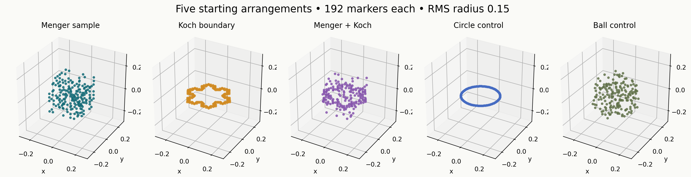
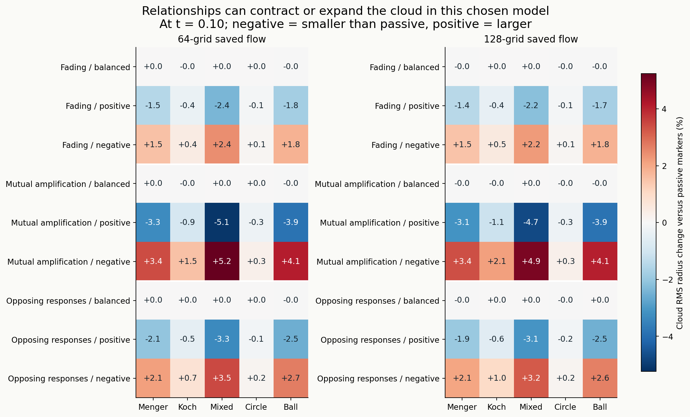
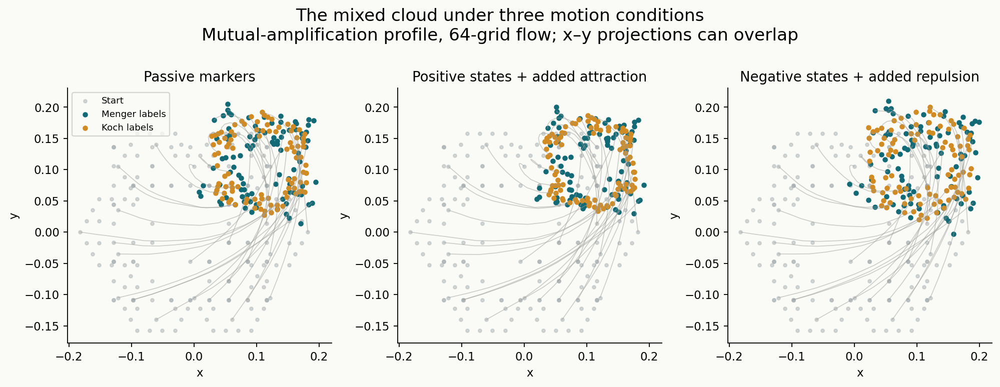
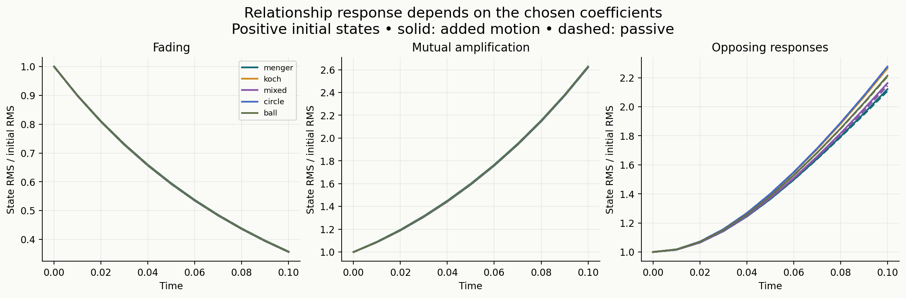
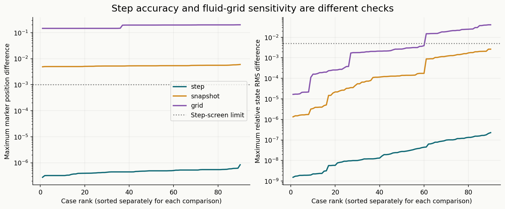

# Menger cheese, Koch snowflakes and Romeo–Juliet relationships

**Completed exploratory comparison: 90 cases under four numerical configurations, giving 360 case trajectories through model time 0.10. All 90 tracking-step screens pass. This does not demonstrate an improvement to Navier–Stokes or validate a molecular model of water.**

[Main study](../README.md) · [Full HTML report](report.html) · [Protocol](protocol.json) · [Verification](verification.json)

## What was tested

Each cloud has 192 individual fluid-marker labels, initial centroid zero and RMS radius 0.15. Five arrangements were compared: a Menger sponge sample, a Koch snowflake boundary, a mixture of both, a smooth circle and a filled ball. Each uses three relationship-response profiles, three initial-state conditions, and motion coupling off or on. These are 45 matched comparisons per configuration, not 360 independent statistical replicates.



The Menger cloud samples 192 of 400 depth-2 retained cell centers. Koch uses all 192 depth-3 vertices. The mixture has 96 labels from each. These finite point arrangements differ in geometry, embedding and neighbor graph; this is not an isolated comparison of fractal dimension. The empty regions are marker gaps, not solid porous walls.

## Main result: reversing states changes the cloud-size effect

For the mixed Menger–Koch cloud with mutually amplifying responses:

| Initial relationship states | Radius change versus passive markers, 64 grid | Radius change, 128 grid |
| --- | ---: | ---: |
| Positive, adding attraction | −5.11% | −4.72% |
| Reversed, adding repulsion | +5.24% | +4.94% |

These are changes in cloud RMS radius at time 0.10 relative to the matching passive cloud. They measure the consequence of the chosen attraction/repulsion rule, rather than establish a force law for real water. Smooth controls also respond; no special fractal advantage has been established.





The motion figure shows x–y projections. Only every sixth path is drawn; all final markers are shown. Projected crossings do not imply three-dimensional collisions.

## Equations

Each marker has position **xᵢ** and signed relationship state **zᵢ**:

```text
dzᵢ/dt = aᵢ zᵢ + bᵢ Σⱼ Pᵢⱼ(x) zⱼ

dxᵢ/dt = u_saved(xᵢ,t)
         + (μ/d̄₀) Σⱼ wᵢⱼ tanh((zᵢ + zⱼ)/2) rᵢⱼ

rᵢⱼ = shortest periodic displacement from marker i toward marker j
wᵢⱼ = exp(−min(|rᵢⱼ|²/(2 × 0.1²), 50)) on initial graph edges
Pᵢⱼ = wᵢⱼ / Σⱼ wᵢⱼ
d̄₀ = initial mean weighted degree
μ = 0 for passive motion, or 20 for added motion
```

The initial graph is the symmetric union of eight-nearest-neighbor sets, including distance ties. Its edges remain fixed; its weights change with separation. For two connected markers, the state equation is the linear Romeo–Juliet system.

| Profile | a | b | Isolated-pair classification |
| --- | ---: | --- | --- |
| Fading | −20 | 10 | Stable node; eigenvalues −10, −30 |
| Mutual amplification | −20 | 30 | Saddle; eigenvalues +10, −50 |
| Opposing responses | 0 | +20 and −20 | Opposite pair is a center; eigenvalues ±20i |

In the full opposed-response network, half the labels receive each sign. The pair's center classification does not automatically describe the entire network. Initial states are centered noise, +0.2 plus that noise, and the exact negative of the positive condition. Seeds and construction details are frozen in the protocol.



Positive pair states add attraction; negative states add repulsion. Added pair drifts sum to zero to rounding accuracy. This is an overdamped marker drift rule with no particle inertia, collision exclusion or feedback into the saved fluid. Zero total added drift does not establish momentum conservation or incompressibility. Coefficients are illustrative choices, not fitted water properties.

## Numerical checks and limits

- Four configurations: 64 grid with 32 RK4 steps per 0.01 saved interval; 64 grid with 64 steps; 128 grid with 64 steps; 64 grid with saved intervals coarsened to 0.02 and 128 steps per interval.
- RK4 integrates positions and states together. Velocity interpolation is trilinear in space and linear between snapshots. The original fluid was evolved with the approved Heun solver; no fluid evolution was repeated or changed.
- All 360 trajectories completed with finite saved values. All 90 cases pass the declared step screen: maximum position difference **8.34 × 10⁻⁷** and maximum relative state RMS difference **2.27 × 10⁻⁷**, below limits 0.001 and 0.005.
- Pair solutions match matrix exponentials. Label permutation, zero-state, passive position identity, sign-symmetry, uniform translation and independent velocity-interpolation checks pass. All 22 input fields and recorded source/result hashes verify.
- Grid sensitivity remains substantial: corresponding paths differ by up to **0.200** model-length units; coarsening snapshots changes them by up to **0.00597**. These are sensitivity comparisons, not a spatial-convergence result.
- Radius-effect signs agree across grids in **37/45** comparisons. The eight reversals occur in balanced-state cases with effects below 0.024% in magnitude; larger positive/negative-state effects retain their signs.



The original raw strain is not smooth across periodic joins, initial maxima lie outside the central tube, and the strongest gradients are unresolved. Those supplied starting fields were preserved. Passing marker-step checks cannot repair those fluid limitations.

This short finite-cloud experiment establishes neither a limiting fractal dimension nor asymptotic Lyapunov exponents. Minimum sampled separation does not establish collision-free motion between outputs. Geometry, graph and response coefficients all influence the result.

## Relevance to Navier–Stokes

Passive markers can measure how an existing flow rearranges structured neighborhoods. Adding relationship-driven motion creates a separate particle model. A physical improvement to a fluid model would require a justified coupling law, compatible conservation/stress relations, numerical convergence and independent validation. This pilot provides no such validation. The mathematical model remains under examination and testing.

## Data and reproduction

[Complete measurements](analysis.json) · [Run records and source hashes](results.json) · [Summary](summary.json) · [Initial geometry and graph](construction.npz)

[Base trajectories](base64.npz) · [Smaller-step trajectories](step64.npz) · [128-grid trajectories](grid128.npz) · [Coarser-snapshot trajectories](snapshot_coarse.npz)

Each trajectory archive contains time, positions with shape `(saved_times, 90, 192, 3)`, and states with shape `(saved_times, 90, 192)`. Cases are ordered in `results.json`. Positions are unwrapped; periodic distance calculations use a side-6 box.

Install `requirements.txt`, then run `python report.py` beside the saved JSON data to rebuild the HTML report and all figures. The supplied `study.py`, `analyze.py` and `verify.py` require the original study workspace and saved fluid inputs at the paths recorded in `results.json`; they do not download or reconstruct missing fluid data. The simulation's existing-state guard prevents accidental repeat execution. All runs here used `work/study-env/Scripts/python.exe`.

The protocol's initial local-only scope is retained as historical metadata. The user subsequently authorized publication of this completed study and report. This publication adds no speculative claim beyond the stated experiment.
