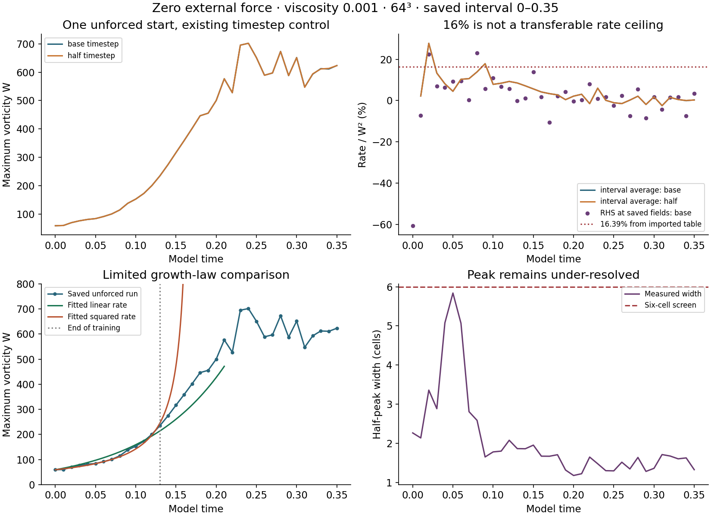

# Unforced growth-rate check

**The quoted 16.39% interval calculation reproduces. It is not a ceiling on the instantaneous growth rate or a prediction of blowup time.**

This check uses the agreed **unforced incompressible Navier–Stokes equation**, viscosity 0.001, periodic side length 6. It reuses one 64³ starting field and its already completed timestep-halving control through time 0.35. No new fluid evolution, breathing force or imposed cycle was introduced.

## Measured results

| Measurement | Original timestep | Half timestep |
|---|---:|---:|
| Starting maximum spin | 59.279954 | 59.279954 |
| Spin at time 0.35 | 623.367187 | 623.068684 |
| Largest saved interval rate / starting W² | 27.7406% | 27.7402% |
| Largest RHS rate / W² at saved fields | 23.0725% | 23.0767% |
| Accumulated maximum spin at 0.35 | 133.579798 | 133.605865 |

The W curves differ by 0.1024% in relative L2 norm over the saved times. The largest pointwise difference is 0.3337%.

The RHS measurement evaluates the unforced solver's velocity derivative, takes its curl, and projects it along vorticity at the grid maximum. It includes all terms of the numerical RHS. This is a derivative of the finite grid calculation. It is checked at saved times, not bounded between them. At maxima tied within relative 1e-12, the greatest derivative is used and the tied derivative range is recorded.

## What the earlier 16% means

The separate imported 16-sample table starts at 60.198351; this reproduced 64³ start is 59.279954. Its complete original generating settings were not supplied, so these are not claimed to be the same trajectory.

For the imported table, `ΔW / (Δt × W_start²)` reaches **16.394196%** on time 0.0747–0.0997. This is an interval average. The statement “fastest instantaneous growth was only 16%” is unsupported by those samples.

`1/60.198351 = 0.01661175` is the pole of the hypothetical equation `W'=W²`. A proven inequality `W'≤W²` would provide a comparison bound only before that time. It would not predict a failure there. That inequality has not been established for this fluid. A smaller positive coefficient in `W'=cW²` also still permits a finite pole; a small percentage alone does not establish linear growth.

## Linear versus squared growth

Apply the same rule to both records: use the first uninterrupted sampled rise; fit the first 60% of its samples with initial W fixed, then evaluate the remaining samples. The models are `W'=aW` and `W'=bW²`, fitted in W units with one nonnegative coefficient each.

For the reproduced unforced run, training ends at 0.13; the initial rising segment ends at 0.21. The linear model's error on 8 held-out samples is **17.97%**. The squared model has a pole at **0.171389**, inside the held-out interval, so it fails to predict the remaining finite values.

The imported table gives a linear-model held-out error of 19.01% and a squared-model pole at 0.180361. This is a limited comparison of two fixed growth laws. The rising segment was selected from the observed data; this is not cross-run validation. Neither law describes the later rises and falls as a constant positive growth rule.

## What remains unresolved

All 72 saved fields were finite. W and energy were remeasured using NumPy inverse transforms and agree with saved records within 1e-12 relative error. The initial peak is associated with the background join; the minimum measured peak width is 1.180 cells and fails the six-cell screen. High-band enstrophy reaches 63.01%. The timestep comparison cannot repair that spatial limitation.

**Result: the rate statistic can be checked, but it does not establish a resolved linear-growth law or rule out a later singularity.** A separate join-isolation experiment is testing whether growth persists after removing the central tube. The [initial-field comparison](../periodic-start-check/README.md) documents the original join and the periodic candidate.

## Files

[Results](results.json) · [Base measurements](base-measurements.json) · [Half-step measurements](half-measurements.json) · [Field verification](verification.json) · [Analysis code](analyze.py)

The local audit reads the original immutable fields in `../runs/baseline-n64-base` and `../runs/baseline-n64-half`. Those full arrays remain local; their hashes are listed in verification.json. Published measurements and the imported table contain the numerical evidence used in this report.
