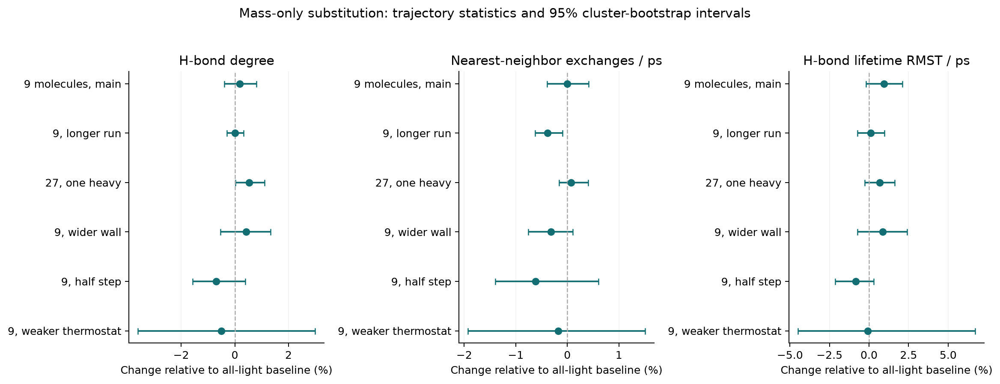
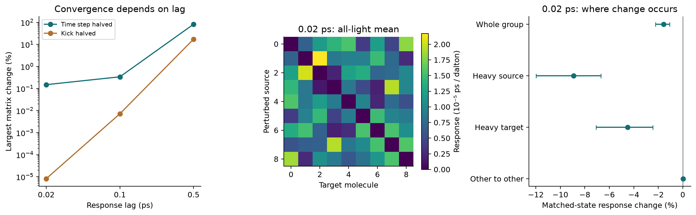

# One heavy water molecule: completed explicit-MD model test

**[Download the readable report](https://github.com/NousVolition/My-Sources-Project-ALL/releases/download/water-isotope-2026-10-09/report.html)** · [Full data and code downloads](https://github.com/NousVolition/My-Sources-Project-ALL/releases/tag/water-isotope-2026-10-09) · [Protocol](protocol.json) · [Statistics](analysis/statistics.json) · [Checks](validation.json)

The HTML report opens after downloading. This page gives the results directly in GitHub.

| Completed primary measurement | Result |
| --- | --- |
| Mean hydrogen-bond degree | +0.18%; 95% interval −0.39% to +0.80% |
| Nearest-neighbor exchange | No clear main-ensemble difference; a longer-run exploratory signal is reported separately |
| Refined 0.02 ps response at identical states | About 1.6% lower, mainly involving the heavy molecule |
| Original 0.5 ps influence response | **Failed numerical sensitivity checks; unreliable** |

The full 510 MB raw-data archive is a release asset, rather than part of the Git history. The smaller 3.3 MB archive contains code and compact results. [SHA-256 checksums](https://github.com/NousVolition/My-Sources-Project-ALL/releases/download/water-isotope-2026-10-09/delivery.json) accompany the frozen archives. Their provenance records the original local study; this GitHub summary was added for publication afterward.

Across all nine placements, the mean H-bond degree changed by 0.0029383 (0.18347%; 95% interval -0.0061886 to 0.012852). Nearest-neighbor exchange changed by -0.00028164 per ps (-0.0025246%; interval -0.043962 to 0.045787). Interpret these model estimates with the sensitivity tables below. The declared 0.5 ps response endpoint failed numerical checks.

The refined 0.02 ps matched-state response changes by -1.5633e-07 [-2.2324e-07, -1.0834e-07] ps/Da (-1.5607% relative). This demonstrates a small conditional inertial response in this confined classical model, not a persistent leader or evidence about real liquid water. The untagged-to-untagged response effect is 3.3866e-09 [1.1261e-09, 5.6927e-09] ps/Da.

## Completed

- 544 full trajectories: 16 random starting configurations x 2 velocity/noise seeds x (all-light + all nine heavy placements + label control), plus 192 sensitivity trajectories.
- Explicit rigid TIP3P interactions, changed isotope masses only, 300 K temperature control and 50–100 ps equilibration.
- Main production 100 ps; longer production 300 ps; N=27, confinement, timestep and friction checks.
- Hydrogen-bond networks, lifetimes with censoring, coordination, neighbor exchange, shell residence, structural centrality, label controls and cluster-bootstrap inference.
- 160 conditional mass-switch assays, 16 initial response checks and 72 refinement assays. The 0.5 ps response check failed and remains reported as unreliable.

## Reproduce

Python 3.12: install `requirements.txt`, then run `test_science.py`, `simulate.py --workers 4`, `switch_assay.py`, `refine_response.py`, `analyze.py`, `make_report.py`, `verify_results.py`. Windows: `./reproduce.ps1`. Reanalysis only: `python analyze.py` and `python make_report.py` on the extracted full archive.

Raw NPZ files are kept in the local research folder and full delivery archive; Git tracks scripts, metadata, compact results, plots and provenance. `verify_results.py --compact` validates tracked files without raw data. See `raw_manifest.json` for expected raw hashes. `protocol.json` was written before the ensemble execution; refinements and coarser-sampling checks are explicitly follow-ups.

## Limits

This is an exploratory **confined explicit-water MD model**, not a passive-tracer simulation or a validated bulk-water isotope calculation. A spherical oxygen wall is part of the Hamiltonian. With nine molecules there are major boundary effects. One heavy molecule among 27 also changes concentration. Classical mass substitution omits quantum nuclear/vibrational effects and isotope exchange chemistry. Same-potential classical equilibrium structure is mass independent; finite-time structural differences require sampling and convergence checks. A D2O molecule is about 11.2% heavier, not an infinitesimal change.

No persistent leader, new Navier–Stokes physics or evolutionary change in H2O is established. Proposed bulk, quantum, alternate-force-field and long-lag response validation is **not completed**.

## Project context

The [existing passive-marker study](../../matched-stretch/marker-stress/README.md) prescribes motion through a fluid field; its markers are not molecules. The preceding local 216-water TIP3P study is context only; its protocol and result hashes are recorded in `provenance.json`. This study was based on project commit `17c14e89940d4c96ec9df315b1a689430d8c5ddf` in an isolated local branch.
