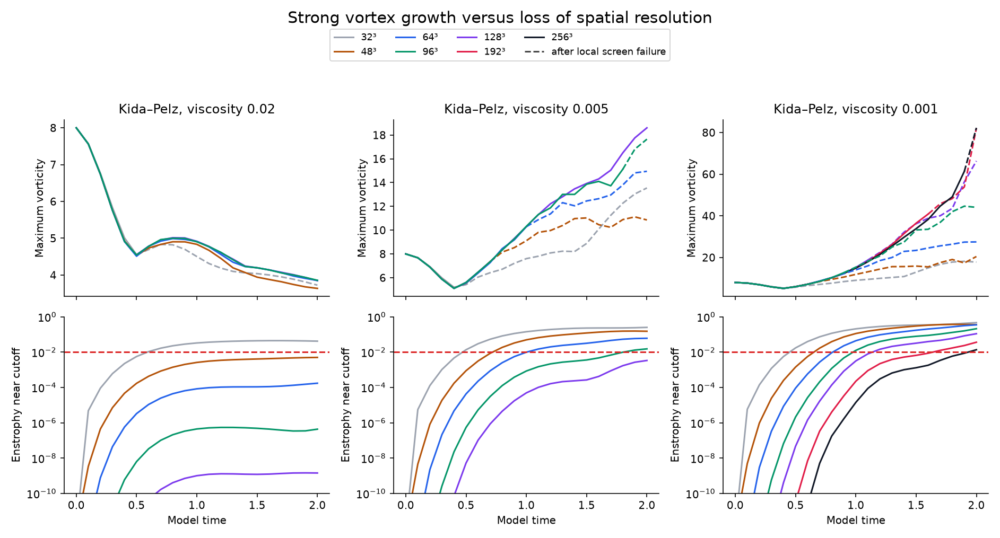
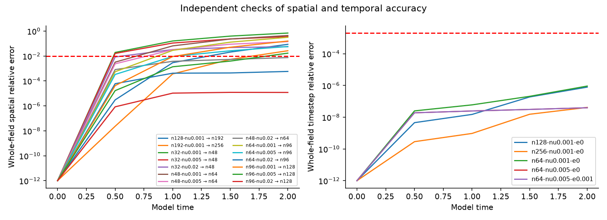

# Navier–Stokes stress: smooth starts, strong gradients, explicit failure checks

**39/39 runs completed; 195 raw fields verified. No breakdown of Navier–Stokes is established.**

[Readable report](https://github.com/NousVolition/My-Sources-Project-ALL/releases/download/navier-stokes-stress-2026-10-09/report.html) · [Full raw-data release](https://github.com/NousVolition/My-Sources-Project-ALL/releases/tag/navier-stokes-stress-2026-10-09) · [Protocol](protocol.json) · [All results](summary.json) · [Verification](verification.json)

This is a new continuum-fluid experiment. It does not simulate molecules or isotope substitution. Both vortex starts are smooth and identical across grids; viscosity is positive and forcing is zero.

## Finest-grid comparisons

| Comparison | Last contiguous checked pass time | Final field difference | Final peak difference |
| --- | --- | --- | --- |
| kida-n128-nu0.001 → n192 | 1 | 8.617% | 19.185% |
| kida-n192-nu0.001 → n256 | 1 | 2.641% | 0.225% |
| kida-n96-nu0.001 → n128 | 0.5 | 15.824% | 33.544% |
| kida-n96-nu0.005 → n128 | 1.5 | 1.688% | 5.140% |
| kida-n96-nu0.02 → n128 | 2 | 0.001% | 0.279% |

Pass times use saved checkpoints and predeclared descriptive screens, not rigorous continuum error bounds. Late, unresolved results are retained explicitly as diagnostics.

Maximum relative energy-budget residual: 2.97e-08. Maximum divergence RMS: 1.99e-16. Good conservation does not imply adequate spatial resolution.

## What ran

- Kida–Pelz: viscosity 0.02, 0.005, 0.001, up to 256³; model time 2, including six explicitly recorded follow-up cases.
- Taylor–Green: viscosity 0.01 and 0.001 on 32³, 64³ and 96³; model time 4.
- Four perturbation directions at 0.1%; one direction repeated at 0.0001%, 0.1% and 1%, with exactly matched initial total energy; selected fine-grid and smaller-step follow-ups.
- Smaller-step controls, exact-solution checks, raw-field hashes and recomputed energy/enstrophy.

Perturbations are broad velocity-field changes, not local molecular interventions. Their finite-time amplification does not establish an asymptotic Lyapunov exponent, a leader or a singularity.

## Reproduce

Install `requirements.txt` (CPU) or `requirements-gpu.txt` (GPU), then run `python reproduce.py --out NEW_DIRECTORY --backend cpu` (or `gpu`). The destination must not exist. This regenerates the 33 original cases and six refinements without confusing compact metadata with cached raw fields. For reanalysis of the full archive, run `analyze.py` and `report.py`. For reanalysis, extract the full release archive including `data-gpu/` and CPU controls in `data/`. Optional GPU execution: install `requirements-gpu.txt`, run `gpu_solver.py`, then `run_gpu.py` and `refine.py`. The extra six cases are recorded in `refinement-plan.json`. Raw NPZ arrays are release assets; compact JSON records remain in Git.

## Sources and context

- [Ohkitani (2018): smooth Kida–Pelz and Taylor–Green field definitions](https://eprints.whiterose.ac.uk/id/eprint/123303/1/non30.Ohkitani.au.pdf). Its inviscid conclusions are not applied to these viscous simulations.
- [Taylor–Green benchmark](https://how4.cenaero.be/content/bs1-dns-taylor-green-vortex-re1600). No reference-data validation is claimed.
- [Earlier spatial-resolution problems](../matched-stretch/README.md).
- [Separate molecular isotope study](../molecular/isotope-mass/README.md).

No artificial extreme-mass molecular experiment was run after the user selected this fluid-equation direction.

## Supplied network images

The supplied nine-node diagram describes saddle states of a whole system, and the phase-equation weight w_ij is coupling strength, not molecular mass. See the readable report for the source and the energy-decay constraint: this unforced zero-mean setup cannot sustain a nonzero recurrent cycle. Transient state-switching analysis and forced-flow experiments are proposed only, not completed tests.
