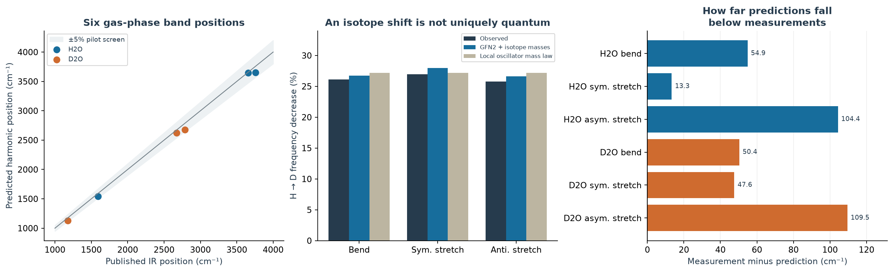
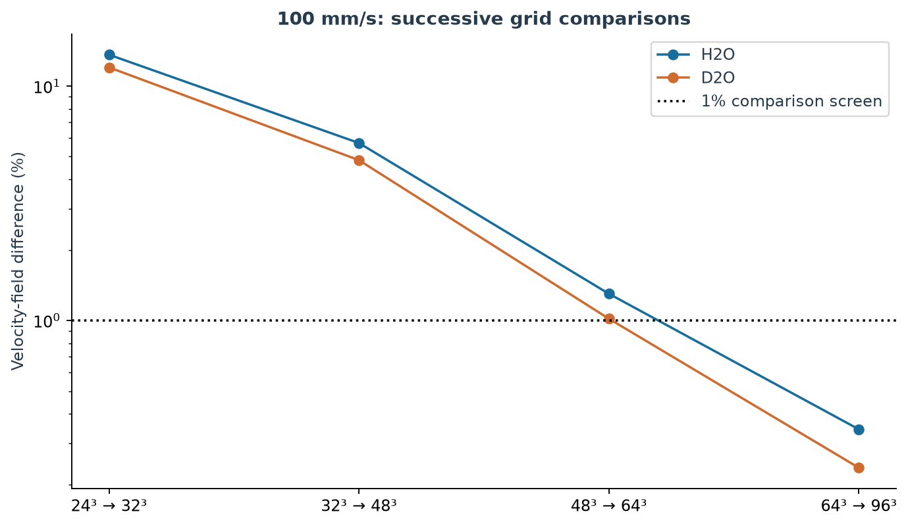
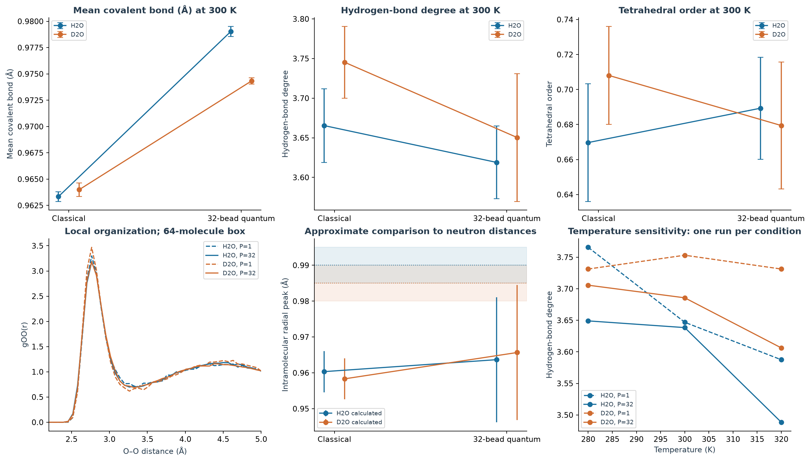
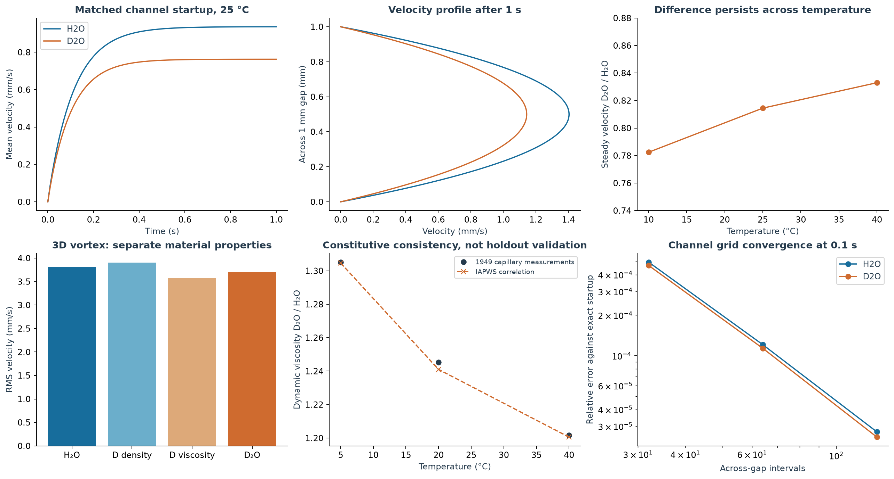

# Quantum water and observable fluid behavior

[Reports by topic](../README.md) · [Project home](../../README.md) · [Reproduction instructions](README.txt)

**Completed pilot and stress tests:** H₂O and D₂O vibrational predictions reproduce published gas-phase infrared band positions within the pilot's 5% tolerance. Measured density and viscosity differences produce quantitative changes in matched fluid simulations. The molecular calculations do **not** establish a reliable quantum prediction of bulk diffusion or viscosity, so the complete quantum-to-flow connection remains unvalidated.

The full [illustrated report](report.html) contains the experimental comparisons, uncertainty estimates, controls and source links. GitHub displays HTML source; download the repository and open this file in a browser to read it offline. The figures below are also readable directly on GitHub.

## Completed results

| Experiment | Executed calculations | Result and limit |
| --- | --- | --- |
| Quantum vibration | 12 primary xTB executions; HDO and harmonic-reference follow-ups | GFN2 maximum band-position error **4.275%**, RMSE **71.74 cm⁻¹**; isotope-shift error **1.039 percentage points**. The like-for-like H₂O harmonic comparison fails at **7.394%**, revealing error cancellation. |
| Molecular organization | 24 q-TIP4P/F classical and nuclear-quantum runs, including three independent main seeds and temperature, bead-count, timestep and size controls | **273 ps** aggregate trajectory time. Only **7/12** main diffusion-window screens and **3/12** energy-drift screens pass. Bulk diffusion is unvalidated and viscosity was not computed. |
| Fluid motion | 84 three-dimensional vortex runs, 36 channel cases, 10 channel-convergence runs and one exact-vortex check | At 25 °C in the matched 1 mm channel with a pressure gradient of 10 Pa/m, D₂O has **18.55% lower steady mean speed**. This uses measured-property correlations, independently of the molecular calculations. |

The saved [stress-test outcomes](stress_summary.json) retain failed and passed screens. [Verification](verification.json) records **148 passed execution-integrity and implementation checks**; this count does not mean that every research hypothesis passed.

## What the finer fluid grids establish

Here, a grid is the set of locations used to calculate fluid motion. Refining it means using more locations to resolve smaller features. The percentages below compare the **same material's velocity field on successive grids**; they are not H₂O-versus-D₂O differences or measured errors against the true flow.

| Initial velocity scale | Grids compared per axis | H₂O field change | D₂O field change |
| --- | --- | --- | --- |
| 50 mm/s | 32 → 48 | 0.482% | 0.396% |
| 100 mm/s | 32 → 48 | 5.712% | 4.827% |
| 100 mm/s | 48 → 64 | 1.300% | 1.017% |
| 100 mm/s | 64 → 96 | **0.343%** | **0.235%** |

The finer follow-up passes the same 1% whole-field screen that the earlier fast-flow comparison failed. Halving the timestep at 64 points changes the field negligibly in this test, supporting a spatial-resolution explanation for the earlier discrepancy.

**A finer grid is still an approximation.** Agreement between two grids supports numerical convergence but does not, by itself, bound their error against an exact solution or a physical experiment. At 100 mm/s, the smaller H₂O-minus-D₂O difference field changes by **3.612% of its own norm** between the 64 and 96 grids. Its spatial pattern therefore has not been established to 1% accuracy, even though the whole velocity fields pass that screen.

[Saved refinement comparisons](fluid-refinement/convergence.json) · [Material-difference comparison](fast-flow-material-comparison.json) · [Original stronger-flow tests](fluid-stress/)

## What quantum calculations add

The electronic-structure calculation supplies molecular force constants without fitting them to these observed bands. Quantum nuclear sampling includes zero-point motion and changes the sampled molecular structure. However, a classical oscillator using the same force constants also predicts the harmonic isotope frequency shift. Observing that shift alone does not demonstrate that quantum nuclear motion is essential.

The liquid model is unchanged between isotopes and treatments. In classical equilibrium at a fixed potential, volume and temperature, the positional distribution cannot depend on isotope mass. Apparent classical structural differences in these short trajectories expose sampling limitations. The runs do not demonstrate a robust improvement in collective transport from adding nuclear quantum effects.

## Connection to Navier–Stokes

The continuum calculations use measurement-based IAPWS density and viscosity correlations. Viscosity sets the steady pressure-driven channel speed; density also influences the transient response. Property-swap controls separate their contributions. GFN2-xTB and the liquid simulations do not supply those continuum coefficients in this study.

Analytic channel and vortex solutions check the numerical implementation. Published viscosity measurements check material-property comparisons, with calibration overlap and sample-purity limits recorded in the full report. An independent experimental benchmark of matched H₂O and D₂O velocity fields was not available. These finite simulations do not resolve the Navier–Stokes existence and smoothness problem.

## Reproduce and inspect

Follow [README.txt](README.txt) for environment setup, verification, chart regeneration and complete reruns. Python 3.12 and pinned dependencies are recorded in [requirements-lock.txt](requirements-lock.txt). xTB is downloaded separately through the supplied installer; its binary is not redistributed. GPU trajectories can vary across hardware and library builds.

| Material | Files |
| --- | --- |
| Methods, advance criteria and amendments | [Vibration protocol](protocol.json), [molecular protocol](molecular-protocol.json), [flow protocol](flow-protocol.json), [numerical repair](amendment.json), [follow-up amendments](followup-amendments.json) |
| Published reference sources | [Primary literature and measurements](sources.json), [later viscosity reference](later-viscosity-reference.json) |
| Raw calculations | [xTB logs and Hessians](vibration-final/), [diagnostic failures](diagnostics/), [molecular trajectories](molecular-data/), [fluid fields](fluid-data/), [stronger flows](fluid-stress/), [finer grids](fluid-refinement/) |
| Numerical tables | [Vibration](vibration_comparison.csv), [molecular results](molecular_results.csv), [mobility diagnostics](mobility_diagnostics.csv), [channel results](channel_results.csv), [vortex differences](vortex_velocity_differences.csv) |
| Integrity and provenance | [Verification code](verify_results.py), [verification result](verification.json), [SHA-256 manifest](checksums.json), [versions and reused source](provenance.json) |

This extends the repository's [isotope-mass](../molecular/isotope-mass/README.md), [water-influence](../water-molecule-influence/README.md), [fluid-organization](../fluid-organization-pilot/README.md) and [Navier–Stokes stress](../navier-stokes-stress/README.md) studies. The continuum solver is an unchanged, checksummed copy from the pinned commit in the provenance record; previous experiments are background and are not counted as new runs here.
