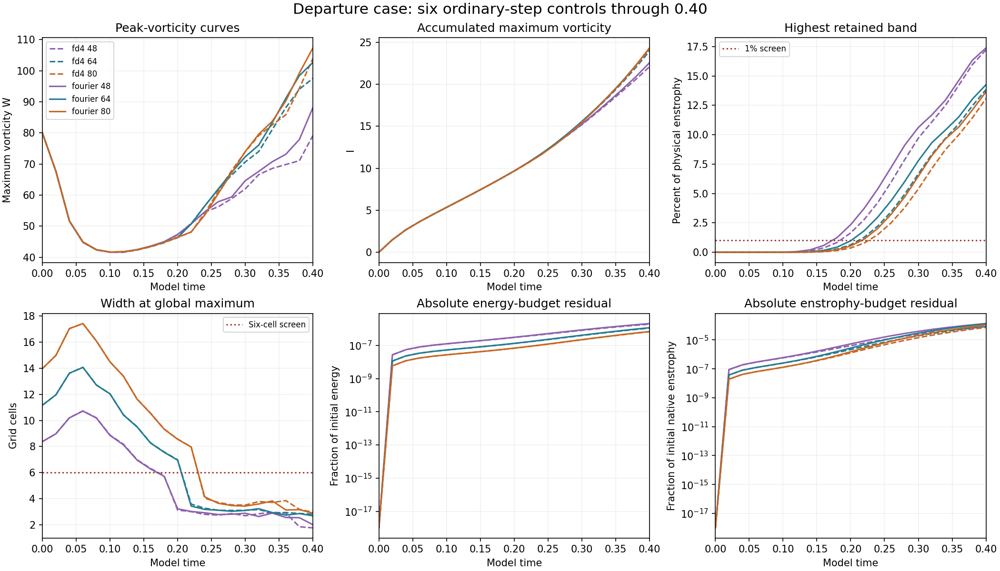

# Vortex comparison: current numerical results

Snapshot: 2026-10-09T14:50:15.711529+00:00. **44/48 runs completed locally; 44 verified completed records are published below.** All aligned and compressive runs, eight ordinary-step departure runs, both 80-grid and both 112-grid half-step controls are published. The remaining departure controls continue.

## Newly completed departure runs

[Both completed 112-grid half-step controls](completed-departure-112-half/README.md), with independent field comparisons and timestep-difference charts.

[Completed 112-grid ordinary-step results](completed-departure112-base/README.md), with saved-field checks and comparison against grid 80.

[Both 80-grid half-step controls](completed-departure-half80/README.md), with independent field comparisons and timestep-difference charts.

[Six verified runs at grids 48, 64 and 80](completed-departure-coarse/README.md), with field checks, comparisons and resolution warnings.

[All four completed 160-grid compressive controls](completed-compressive160-final/README.md) remain available.

| Run | Status | Time | Largest saved W | Last W | Last I |
| --- | --- | --- | --- | --- | --- |
| aligned-fd4-n112-base | complete | 0.40 | 135.35217 | 135.35217 | 31.74319 |
| aligned-fd4-n112-half | complete | 0.40 | 135.35301 | 135.35301 | 31.74339 |
| aligned-fd4-n160-base | complete | 0.40 | 142.05824 | 142.05824 | 31.94406 |
| aligned-fd4-n160-half | complete | 0.40 | 142.05894 | 142.05894 | 31.94420 |
| aligned-fd4-n48-base | complete | 0.40 | 112.24117 | 112.24117 | 29.71567 |
| aligned-fd4-n64-base | complete | 0.40 | 119.49260 | 119.49260 | 30.54212 |
| aligned-fd4-n80-base | complete | 0.40 | 123.02175 | 123.02175 | 31.01817 |
| aligned-fd4-n80-half | complete | 0.40 | 123.02229 | 123.02229 | 31.01846 |
| aligned-fourier-n112-base | complete | 0.40 | 145.38042 | 145.38042 | 31.49188 |
| aligned-fourier-n112-half | complete | 0.40 | 145.38365 | 145.38365 | 31.49219 |
| aligned-fourier-n160-base | complete | 0.40 | 146.86846 | 146.86846 | 31.46304 |
| aligned-fourier-n160-half | complete | 0.40 | 146.86959 | 146.86959 | 31.46325 |
| aligned-fourier-n48-base | complete | 0.40 | 110.52249 | 110.52249 | 29.78863 |
| aligned-fourier-n64-base | complete | 0.40 | 118.51513 | 116.06053 | 30.93910 |
| aligned-fourier-n80-base | complete | 0.40 | 128.00420 | 128.00420 | 31.25978 |
| aligned-fourier-n80-half | complete | 0.40 | 128.00341 | 128.00341 | 31.26015 |
| compressive-fd4-n112-base | complete | 0.40 | 111.79696 | 111.79696 | 23.67639 |
| compressive-fd4-n112-half | complete | 0.40 | 111.79747 | 111.79747 | 23.67643 |
| compressive-fd4-n160-base | complete | 0.40 | 118.31270 | 118.31270 | 23.46922 |
| compressive-fd4-n160-half | complete | 0.40 | 118.31269 | 118.31269 | 23.46924 |
| compressive-fd4-n48-base | complete | 0.40 | 104.78018 | 104.78018 | 24.11023 |
| compressive-fd4-n64-base | complete | 0.40 | 126.10391 | 126.10391 | 24.13016 |
| compressive-fd4-n80-base | complete | 0.40 | 124.57954 | 124.57954 | 24.05100 |
| compressive-fd4-n80-half | complete | 0.40 | 124.57928 | 124.57928 | 24.05102 |
| compressive-fourier-n112-base | complete | 0.40 | 114.48773 | 114.48773 | 23.73558 |
| compressive-fourier-n112-half | complete | 0.40 | 114.48874 | 114.48874 | 23.73561 |
| compressive-fourier-n160-base | complete | 0.40 | 130.91148 | 130.91148 | 23.40330 |
| compressive-fourier-n160-half | complete | 0.40 | 130.91285 | 130.91285 | 23.40331 |
| compressive-fourier-n48-base | complete | 0.40 | 119.61587 | 119.61587 | 25.84770 |
| compressive-fourier-n64-base | complete | 0.40 | 139.00289 | 139.00289 | 24.76587 |
| compressive-fourier-n80-base | complete | 0.40 | 134.73756 | 134.73756 | 24.45987 |
| compressive-fourier-n80-half | complete | 0.40 | 134.73793 | 134.73793 | 24.45991 |
| exodus-fd4-n48-base | complete | 0.40 | 79.99999 | 79.14726 | 22.08779 |
| exodus-fd4-n64-base | complete | 0.40 | 97.55390 | 97.55390 | 23.93819 |
| exodus-fd4-n80-base | complete | 0.40 | 103.95238 | 103.95238 | 24.13931 |
| exodus-fd4-n112-base | complete | 0.40 | 123.50449 | 123.50449 | 24.27022 |
| exodus-fd4-n112-half | complete | 0.40 | 123.50476 | 123.50476 | 24.27022 |
| exodus-fd4-n80-half | complete | 0.40 | 103.95315 | 103.95315 | 24.13934 |
| exodus-fourier-n48-base | complete | 0.40 | 88.15757 | 88.15757 | 22.56190 |
| exodus-fourier-n64-base | complete | 0.40 | 102.64848 | 102.64848 | 24.27390 |
| exodus-fourier-n80-base | complete | 0.40 | 107.31294 | 107.31294 | 24.33402 |
| exodus-fourier-n112-base | complete | 0.40 | 127.45301 | 127.45301 | 24.51191 |
| exodus-fourier-n112-half | complete | 0.40 | 127.45405 | 127.45405 | 24.51192 |
| exodus-fourier-n80-half | complete | 0.40 | 107.31353 | 107.31353 | 24.33409 |

These are different starting fields from the imported matched-stretch study. Both solvers use SSP RK3 and the same filtering; FD4 independently discretizes transport and viscosity but shares the FFT pressure infrastructure. Method agreement has that limitation.

W uses the shared Fourier-curl diagnostic; native FD curl is also saved. I is stage-integrated maximum spin. The spin ratio in this study uses RMS vorticity. Energy, both enstrophies, widths in model units and cells, fixed-threshold volumes, strain and divergence are in each result.

[Comparison tables and field errors](comparisons.json) · [Protocol](protocol.json) · [Initial checks](preflight.json) · [Earlier snapshot verification](../numerical-progress-verification.json) · [Earlier three-run verification](completed-compressive160/verification.json) · [Run files](runs/)

The existing [interactive viewer](../files/adversarial-vortex-study.html) retains its earlier published display snapshot. This page supplies the newer numerical measurements. Resolution flags remain in the result files and must be considered alongside grid, time-step and method comparisons.

[New FD4 verification and combined four-run audit](completed-compressive160-final/combined-verification.json).
