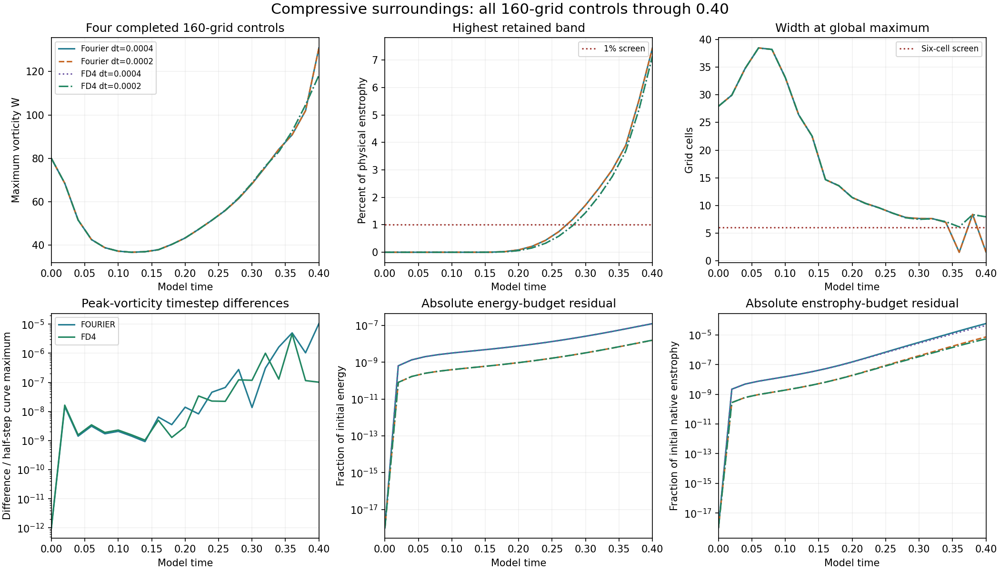

# Compressive vortex: all four 160-grid controls complete

All four controls reached model time **0.40**. This completes all **16 compressive-case runs** and brings the verified published matrix to **32/48** (16 aligned and 16 compressive). The separate departure case is progressing locally.

## Measured comparisons

- Halving the timestep changes the peak-vorticity curve by **0.001046% for Fourier** and **0.000463% for FD4**. Each percentage is the maximum absolute curve difference divided by its half-step curve maximum.
- The FD4 endpoint velocity L2 difference is **0.000295%** over the common retained modes.
- Both Fourier timesteps exceed the 1% high-band-enstrophy screen from **t=0.28**; both FD4 timesteps exceed it from **t=0.30**. Endpoint fractions are **7.4408%** and **7.1413%** respectively for the half-step runs.
- At the endpoint, the half-step methods differ in W by **9.6248%**, relative to Fourier. Their global maxima occur at different locations. Fourier's global width is **1.5816 cells** and FD4's is **7.9327 cells**. Their central-region widths are **8.3059** and **7.9327 cells**.
- The FD4 half-step absolute relative energy-budget residual is **1.59121e-08**; its native-enstrophy-budget residual is **5.46593e-06**.

| Method | Step | Final W | Final I | High-band enstrophy | Global width (cells) | Central width (cells) |
| --- | --- | --- | --- | --- | --- | --- |
| fourier | 0.0004 | 130.911479 | 23.403297 | 7.4398% | 1.5816 | 8.3059 |
| fourier | 0.0002 | 130.912848 | 23.403305 | 7.4408% | 1.5816 | 8.3059 |
| fd4 | 0.0004 | 118.312702 | 23.469222 | 7.1403% | 7.9327 | 7.9327 |
| fd4 | 0.0002 | 118.312690 | 23.469241 | 7.1413% | 7.9327 | 7.9327 |

Timestep agreement is strong, while the spatial-resolution screens fail. The difference in global peak locations matters when interpreting the width and W comparisons. These calculations do not establish spatial convergence, singularity formation, or central-core collapse. All recorded warnings remain in the result files.

## Verification

The new FD4 half-step result was checked against **five retained fields** at t=0, 0.1, 0.2, 0.3 and 0.4. Independent physical-space sums reproduce maximum vorticity, energy, native enstrophy and Fourier-curl enstrophy. Frozen diagnostics reproduce endpoint widths, strain and spectra. Source hashes, settings, finite arrays, zero mean, saved accumulators and budget gates were checked.

The earlier audit of the other **15 retained fields** is reused after confirming unchanged source and result hashes. The combined record covers **20 fields across four runs**. Recorded stage-integrated I and production/loss accumulations were checked against saved checkpoints; the trajectories were not rerun.

[New five-field verification](verification.json) · [Combined verification](combined-verification.json) · [Measurements](summary.json) · [Completed comparisons](../comparisons.json) · [Earlier three-run report](../completed-compressive160/README.md)

## Preserved model and scope

This separate study uses its prescribed smooth periodic vortex start, cube side 6, viscosity 0.001, zero force and SSP RK3. FD4 discretizes transport and viscosity separately while sharing FFT pressure/filter infrastructure and the reported Fourier-curl W diagnostic. The original matched-stretch study retains its supplied field, nonsmooth periodic joins and initial maxima outside the central tube.

[Solver](../solver.py) · [Initial construction](../initial_design.py) · [Protocol](../protocol.json) · [Runner](../run_study.py) · [Study index](../README.md)

## Reproduction

With Python 3.12, NumPy and SciPy, run the existing study runner from its directory:

    python run_study.py --case compressive --n 160 --method fd4 --half

The runner protects active work with a process lock. Full restart fields stay in the local workspace because of their size; SHA-256 hashes are retained in the verification records. With those fields available, the new audit is:

    python completed-compressive160-final/verify.py

The package builder uses the recorded remote-base files and local results; it performs no numerical evolution.
