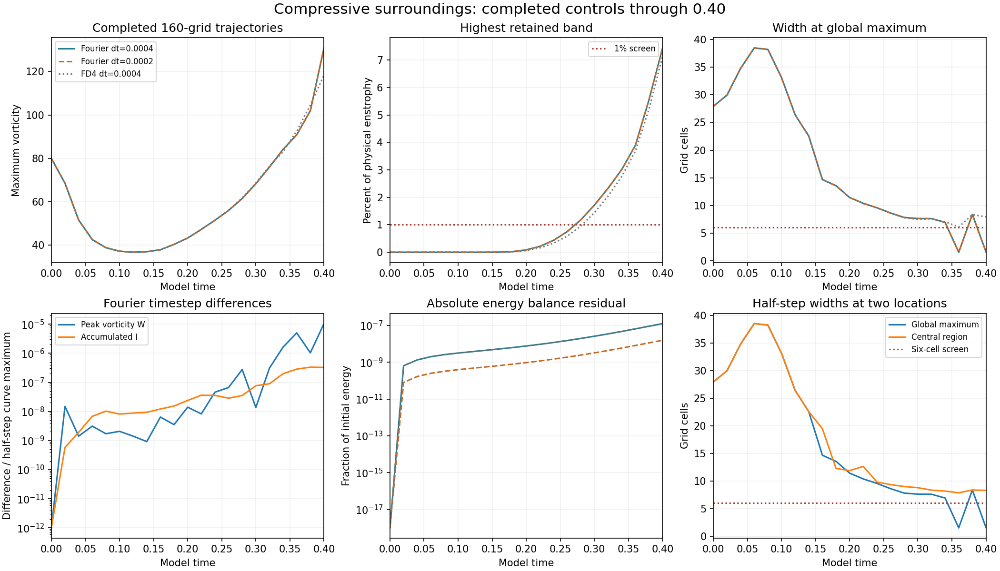

> Update: all four 160-grid controls are now complete. See the [verified four-run report](../completed-compressive160-final/README.md). The three-run report below preserves its earlier publication snapshot.

# Compressive vortex: completed 160-grid controls

Three completed runs through model time **0.40**: Fourier at dt=0.0004 and dt=0.0002, and FD4 at dt=0.0004. The FD4 half-step run is still in progress. These records bring the separate vortex matrix to **31/48 completed runs**.

## Measured results

- Fourier dt-halving changes the maximum-vorticity curve by **0.001046%**, measured as the maximum absolute difference divided by the half-step curve maximum. Endpoint velocity L2 difference is **0.000297%** over the common retained modes.
- The Fourier half-step endpoint is W=130.91284787, I=23.40330507. Its absolute relative energy-budget residual is 1.57263e-08.
- Both Fourier timesteps first exceed the **1% spectral screen at t=0.28**. At t=0.40, **7.4408%** of physical enstrophy lies in the highest retained band.
- Both first fail the global width screen at **t=0.36**. The sampled global maximum moves to a feature **1.51865 cells** wide; the central-region width remains **7.87093 cells**. The changing global maximum does not track one material core.

Timestep agreement is strong over this interval, while the spatial-resolution screens fail. These results do not establish spatial convergence, a singularity, or central-core collapse. The warnings are retained in every affected result row.

## Verification and scope

All **15 retained fields** from the three runs were checked at t=0, 0.1, 0.2, 0.3, 0.4. Physical-space sums independently reproduce W, energy and both enstrophies. Endpoint widths, strain and spectra were remeasured with the frozen diagnostic code. Source hashes, zero mean, finite arrays, source/settings provenance and energy-budget gates were checked. Integrated I and budget rates retain the saved RK-stage accumulations; no trajectory was rerun for this audit.

The calculation uses the prescribed smooth periodic vortex construction, cube side 6, viscosity 0.001, zero external force and SSP RK3. This is a separate starting field from matched-stretch. The matched-stretch study retains its original nonsmooth periodic joins and outside-tube initial maxima. FD4 and Fourier share the FFT pressure/filter infrastructure and the reported Fourier-curl W diagnostic.

[Verification](verification.json) · [Detailed measurements](summary.json) · [All completed comparisons](../comparisons.json) · [Study protocol](../protocol.json) · [Study index](../README.md)

## Reproduction

The unchanged [runner](../run_study.py), [solver](../solver.py) and [initial construction](../initial_design.py) reproduce each case using NumPy, SciPy and Python 3.12. Run from the study folder: `python run_study.py --case compressive --n 160 --method fourier` and append `--half` for its timestep control; choose `--method fd4` for the ordinary FD4 run. The runner protects active work with a process lock.

Full restart arrays remain in the local study workspace because of their size; their SHA-256 hashes are in the verification record. With those arrays present, run `python completed-compressive160/verify.py` to repeat the saved-field audit. The original local `package.py` builds this publication using its recorded remote-base snapshot.
