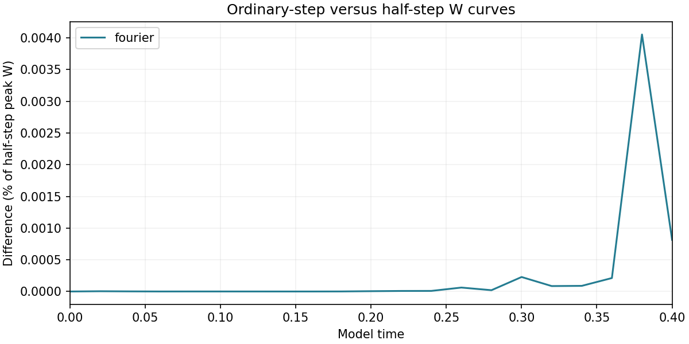
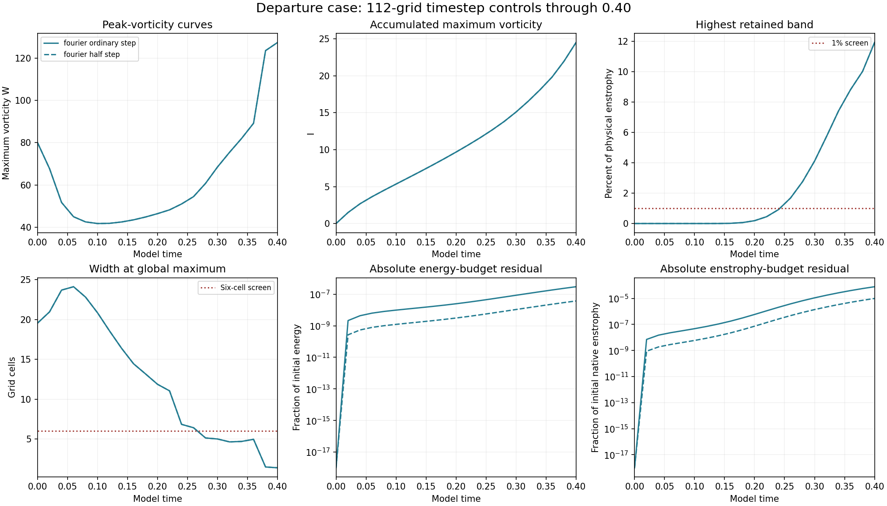

# Departure case: completed 112-grid Fourier half-step control

The Fourier half-step run completed through **model time 0.40**. The vortex matrix has **43/48 verified completed results published**. The FD4 half-step companion and the 160-grid departure controls remain in the existing queue or in progress.

## Timestep agreement

| Method | Maximum W-curve difference | Endpoint velocity L2 difference |
| --- | --- | --- |
| fourier | 0.0040535% | 0.0008226% |

The W percentage is the maximum saved curve difference divided by the half-step run's largest saved W. Velocity errors use the half-step field's L2 norm. Both fields have the same 112-grid retained modes. The ordinary step is 0.02/35 and the half step is 0.02/70.

## Endpoint and spatial limits

| Half-step run | Final W | Final I | High-band enstrophy | Global width (cells) | Maximum absolute relative energy-budget residual |
| --- | --- | --- | --- | --- | --- |
| fourier | 127.454050 | 24.511918 | 11.9231% | 1.3732 | 3.74296e-08 |

The timestep difference is small, while the endpoint fails the spatial-resolution screens: the global peak width is about **1.37 cells**, and **11.92%** of enstrophy is in the highest retained band. The earlier 80-to-112 W-curve difference was **19.10%**. Spatial convergence remains unestablished.

## Verification and preserved model

All **five newly retained fields** at t=0, 0.1, 0.2, 0.3 and 0.4 passed independent physical-space checks of W, energy and both enstrophies. Source/settings hashes, finite arrays, zero mean, CFL and budget consistency pass. Frozen diagnostics reproduce endpoint widths, strain and spectra. The earlier ordinary-step audit was reused after confirming its unchanged result and source hashes. Both initial arrays are identical. Four saved-time velocity comparisons were independently recomputed in physical space. No trajectory was rerun; I and budget rates retain recorded RK-stage accumulations.

The departure starting field, domain side 6, viscosity 0.001, zero force and SSP RK3 are unchanged. Fourier and FD4 share FFT pressure/filter infrastructure and the displayed Fourier-curl W diagnostic. The separate matched-stretch study retains nonsmooth periodic joins in its supplied raw strain and initial maxima outside the central tube.

[Measurements](measurements.json) · [Summary](summary.json) · [Verification](verification.json) · [Comparisons](comparisons.json) · [Earlier ordinary-step audit](../completed-departure112-base/verification.json) · [Study index](../README.md)

## Reproduction

Use the existing [solver](../solver.py), [runner](../run_study.py), [initial construction](../initial_design.py) and [protocol](../protocol.json). Raw fields remain local and their hashes are recorded. Audit the saved fields with NumPy and SciPy:

    python verify.py /path/to/adversarial-vortex-study

Rebuild both charts from bundled JSON with NumPy and Matplotlib:

    python plot.py
