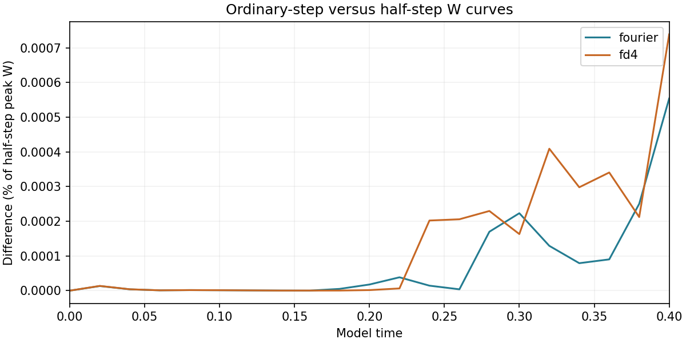
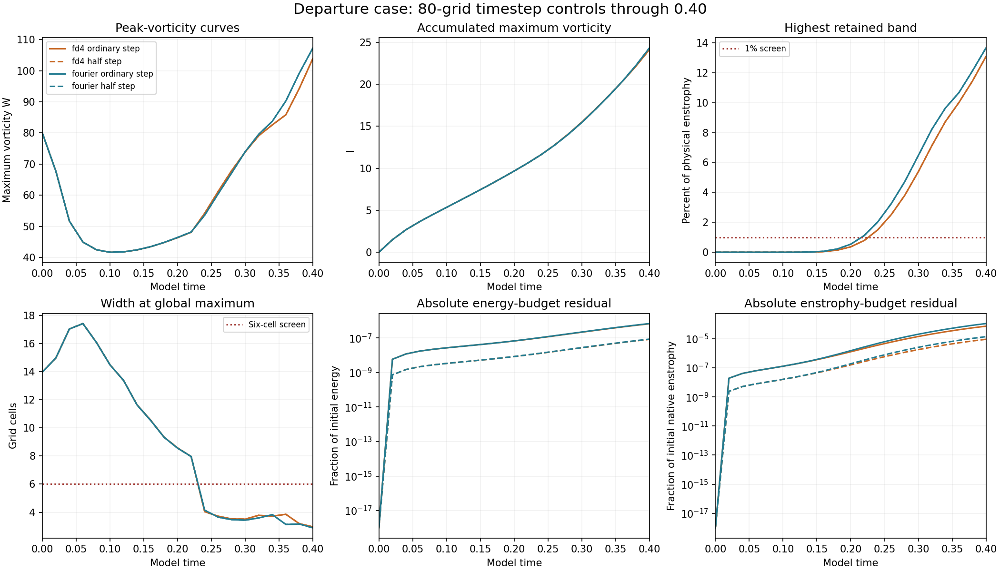

# Departure case: completed 80-grid half-step controls

Both Fourier and FD4 half-step controls reached **model time 0.40**. Together with their previously verified ordinary-step runs, these four records measure timestep sensitivity at grid 80. The vortex matrix now has **40/48 verified completed runs published**; the 112- and 160-grid departure controls remain in progress or queued.

## Timestep agreement

| Method | Maximum W-curve difference | Endpoint velocity L2 difference |
| --- | --- | --- |
| fourier | 0.0005540% | 0.0016243% |
| fd4 | 0.0007389% | 0.0013054% |

Each W percentage is the maximum saved curve difference divided by the half-step run's maximum saved W. Velocity errors use the half-step field's L2 norm. Both runs use the same 80-grid retained modes. Ordinary dt is 0.0008; half dt is 0.0004.

## Endpoint measurements and spatial limits

| Half-step run | Final W | Final I | High-band enstrophy | Global width (cells) | Maximum absolute relative energy-budget residual |
| --- | --- | --- | --- | --- | --- |
| fourier | 107.313533 | 24.334094 | 13.6539% | 2.8910 | 8.6423e-08 |
| fd4 | 103.953153 | 24.139344 | 13.0789% | 2.9649 | 8.35349e-08 |

The timestep differences are small, while both half-step runs still fail the spatial-resolution screens. Their endpoint global widths are below three cells, compared with the six-cell screen; more than 13% of enstrophy is in the highest retained band, compared with the 1% screen. These controls support timestep consistency at this grid and do not establish spatial convergence.

## Verification and preserved model

All **10 newly retained fields**, at t=0, 0.1, 0.2, 0.3 and 0.4 for each half-step run, were independently checked for physical-space W, energy, native and Fourier enstrophy, finite arrays, mean and budget consistency. Frozen diagnostics reproduce endpoint widths, strain and spectra. The previous ordinary-step audits were reused after matching both result and source hashes. Initial arrays are identical within each pair. Eight saved-time velocity comparisons were independently recomputed from physical-space arrays. No trajectory was rerun.

The departure starting field, domain side 6, viscosity 0.001, zero force and SSP RK3 remain unchanged. Fourier and FD4 share FFT pressure/filter infrastructure and the displayed Fourier-curl W diagnostic. Integrated I and budget rates use saved RK-stage accumulations. The separate matched-stretch study retains its supplied raw strain with nonsmooth periodic joins and initial maxima outside the central tube.

[Measurements](measurements.json) · [Comparisons](comparisons.json) · [Verification](verification.json) · [Summary](summary.json) · [Earlier ordinary-step audit](../completed-departure-coarse/verification.json) · [Study index](../README.md)

## Reproduction

The existing [solver](../solver.py), [runner](../run_study.py), [initial construction](../initial_design.py) and [protocol](../protocol.json) provide the runnable study. Raw saved arrays remain local and their SHA-256 hashes are recorded in the audit. With NumPy and SciPy, audit these two completed runs using:

    python verify.py /path/to/adversarial-vortex-study

Rebuild both charts from the bundled JSON with NumPy and Matplotlib:

    python plot.py
