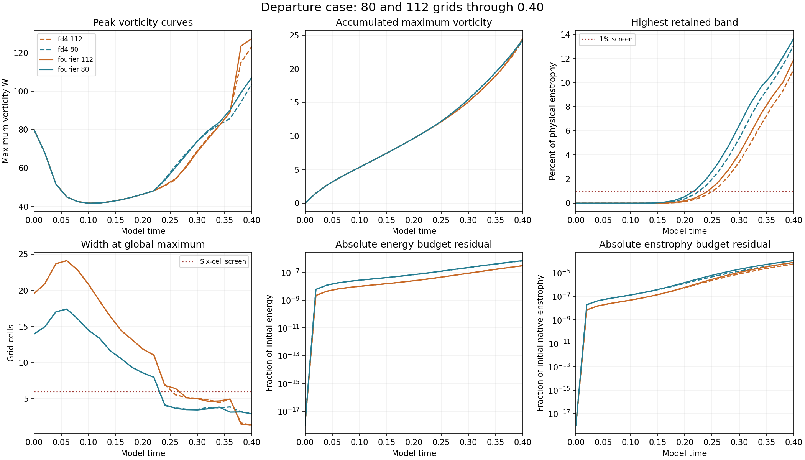

# Departure case: completed 112-grid ordinary-step results

**2 new run(s)** completed through **model time 0.40**: exodus-fourier-n112-base, exodus-fd4-n112-base. There are now **42/48 verified completed vortex results published**. Remaining authorized controls continue.

## Endpoint measurements

| Method | Final W | Final I | High-band enstrophy | Global width (cells) | Maximum absolute relative energy-budget residual |
| --- | --- | --- | --- | --- | --- |
| fourier | 127.453011 | 24.511915 | 11.9218% | 1.3733 | 2.99072e-07 |
| fd4 | 123.504488 | 24.270216 | 11.0946% | 1.3160 | 3.01309e-07 |

## Grid comparison

| Method | 64 to 80 W-curve difference | 80 to 112 W-curve difference |
| --- | --- | --- |
| fourier | 4.3466% | 19.1009% |
| fd4 | 6.1552% | 16.6786% |

Each percentage is the maximum saved W-curve difference divided by the finer run's maximum saved W, over t=0 to 0.40. The differences increase on this next refinement. The 112-grid endpoints still fail the spectral and width screens. The small timestep differences already observed at grid 80 do not establish spatial convergence. Half-step controls at grid 112 and the remaining grid-160 controls are still required by the existing matrix.

## Verification and scope

All **10 newly retained fields**, at t=0, 0.1, 0.2, 0.3 and 0.4, passed independent physical-space checks of W, energy, native and Fourier enstrophy. Source hashes, finite arrays, mean, CFL and energy-budget gates pass. Frozen diagnostics reproduce endpoint widths, strain and spectra. The earlier 80-grid field audits were reused after verifying unchanged result and source hashes. W, I and energy curve differences were recomputed from the saved records. The additional field comparisons bundled in JSON use the reporter's restriction to common retained modes, which excludes fine-only modes. No trajectory was rerun; integrated I and budget rates retain saved RK-stage accumulations.

The prescribed departure start, domain side 6, viscosity 0.001, zero force and SSP RK3 remain unchanged. Fourier and FD4 share FFT pressure/filter infrastructure and the displayed Fourier-curl W diagnostic. The separate matched-stretch study retains its supplied raw strain with nonsmooth periodic joins and initial maxima outside the central tube. The mathematical model remains under examination.

[Measurements](measurements.json) · [Summary](summary.json) · [Verification](verification.json) · [Comparisons](comparisons.json) · [Earlier 80-grid audit](../completed-departure-coarse/verification.json) · [80-grid timestep controls](../completed-departure-half80/README.md) · [Study index](../README.md)

## Reproduction

Use the existing [runner](../run_study.py), [solver](../solver.py), [initial construction](../initial_design.py) and [protocol](../protocol.json). Raw fields remain local; hashes are recorded. Audit completed 112-grid ordinary-step records with NumPy and SciPy:

    python verify.py /path/to/adversarial-vortex-study

Rebuild the chart from bundled JSON with NumPy and Matplotlib:

    python plot.py
