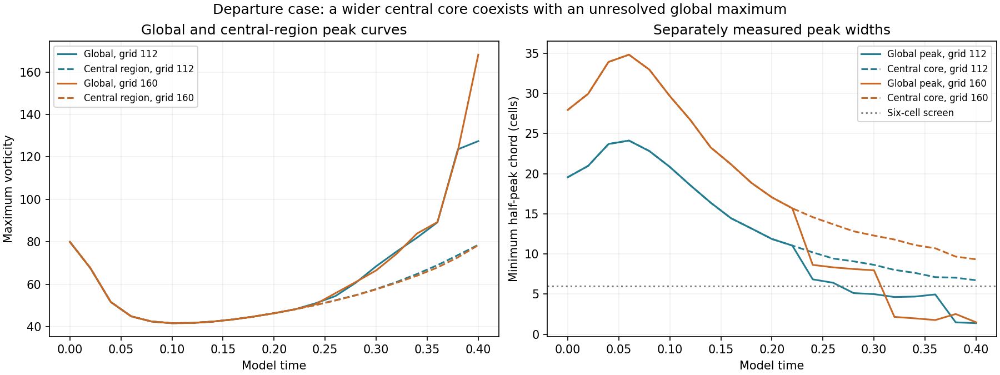
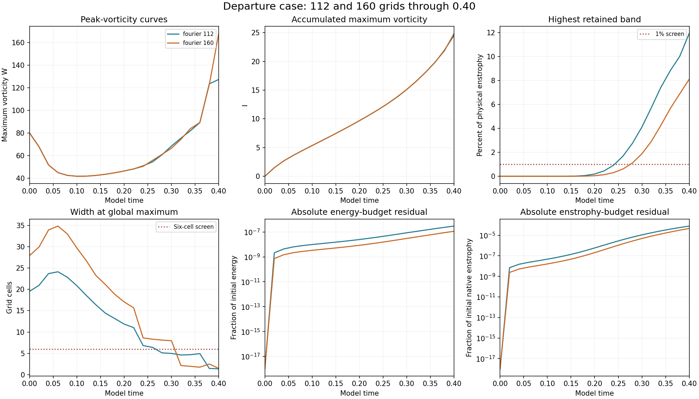

# Departure case: completed 160-grid Fourier ordinary-step run

The **Fourier ordinary-step** run reached **model time 0.40**, bringing the vortex study to **45/48 completed results verified and published**. The paired FD4 ordinary-step run is still active. Both 160-grid half-step controls remain in the authorized queue.

## Global and central peaks respond differently to refinement

The maximum saved W-curve difference from grid 112 to 160 is **24.2055%**, compared with **19.1009%** from grid 80 to 112. The difference increases, so these global-peak curves do not establish spatial convergence.

The central-region peak curve differs by **1.3768%** between grids 112 and 160. Each percentage divides the largest absolute curve difference by that diagnostic's largest saved value on the finer grid. These diagnostics have different normalization scales and measure different parts of the flow.

At t=0.40 the 160-grid global peak is at **(0, -3, 0.1875)**, on a periodic face. Its transverse half-peak chord spans only **1.4811 cells**. The separately measured central core spans **9.3267 cells**. A wider central core does not resolve the narrower whole-domain maximum.

## Endpoint measurements

| Measurement | Grid 112 | Grid 160 |
| --- | ---: | ---: |
| Final global W | 127.45301 | 168.15608 |
| Final central-region W | 78.628418 | 78.46496 |
| Final I | 24.511915 | 24.855359 |
| High-band enstrophy (%) | 11.921786 | 8.0987532 |
| Global peak width (cells) | 1.373261 | 1.481137 |
| Central core width (cells) | 6.7183699 | 9.3266664 |

The endpoint spectral tail is **8.0988%**, above the 1% screen; the global peak width fails the six-cell screen. The maximum absolute relative energy-budget residual is **1.14538e-07**, and the final relative enstrophy-budget residual is **-4.60306e-05**. Budget consistency does not establish adequate spatial resolution.

The bundled common-mode velocity comparison gives an endpoint L2 difference of **3.0671%**. It restricts both fields to the coarser retained Fourier modes and excludes fine-only modes; it is not a full fine-grid error. This value comes from the existing reporter. W, central W, I, energy and two strain-related curve differences were independently recalculated from saved records.

## Verification and preserved model

All **five new retained fields**, at t=0, 0.1, 0.2, 0.3 and 0.4, passed independent physical-space summation checks of W, energy and native/Fourier enstrophy. Source and settings hashes, finite arrays, mean, CFL and energy-budget gates pass. Frozen endpoint diagnostics reproduce widths, strain, central-region W and spectra. The prior 112-grid audit was reused after confirming unchanged result and source hashes. No trajectory was rerun; I and budget integrals retain recorded RK-stage accumulations.

The separate prescribed departure start, domain side 6, viscosity 0.001, zero mean, zero force and SSP RK3 remain unchanged. The ordinary step is 0.0004. This starting field differs from the matched-stretch field, whose raw strain is not smooth across periodic joins and whose initial maxima lie outside its central tube. A peak on a periodic face in this separate study does not establish the same initial-field defect. The mathematical model remains under examination.

[Measurements](measurements.json) · [Summary](summary.json) · [Verification and field hashes](verification.json) · [Comparisons](comparisons.json) · [Earlier 112-grid audit](../completed-departure112-base/verification.json) · [112-grid timestep controls](../completed-departure-112-half/README.md) · [Study index](../README.md)

## Reproduction

Use the preserved [runner](../run_study.py), [solver](../solver.py), [initial construction](../initial_design.py) and [protocol](../protocol.json). Raw fields remain local; hashes are recorded. With NumPy and SciPy, run `python verify.py /path/to/adversarial-vortex-study` to audit these saved fields. With NumPy and Matplotlib, run `python plot.py` to rebuild both figures from the bundled JSON.
