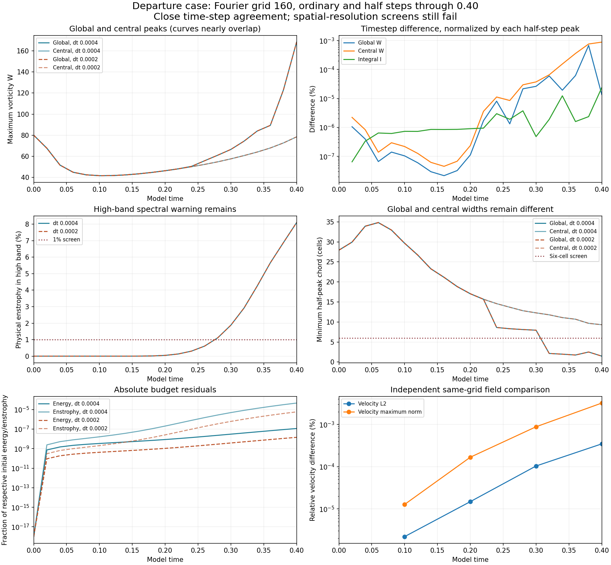

# Departure case: Fourier 160 half-step control complete

Verified publication: October 9, 2026. **47/48 vortex runs are now complete, verified and published through model time 0.40.** The FD4 160 half-step control is the only remaining vortex job. The separate matched-stretch matrix remains at 28/48.

## Very close time-step agreement, unresolved spatial peak

The ordinary and half-step runs start from **bitwise-identical saved Fourier fields** and differ only in time step: 0.0004 versus 0.0002. Across their 21 saved observations, the maximum global-W curve difference is **0.000677226%**, normalized by the half-step curve's maximum. The central-region W difference is **0.000882424%**, and the I difference is **0.000023569%**, each with its own half-step normalization.

At t=0.40 the independent full same-grid velocity comparison gives **0.000347068% in L2** and **0.003220597% in maximum vector norm**, normalized by the half-step field. The stored fields occupy the same retained band, so no fine-only modes are excluded in this same-grid comparison. This establishes the measured sensitivity to this step halving on this grid and interval; it does not establish continuum accuracy.

The half-step endpoint still puts **8.099358%** of Fourier enstrophy in the highest retained band, above the 1% warning screen. The global peak has a minimum half-peak chord of **1.481144 cells**, below the six-cell screen. These screens first fail at saved times **0.28** and **0.32**, respectively. The central core is wider, **9.326553 cells**. Subcell interpolation measures a width; it adds no resolution.

The existing ordinary-step 112-to-160 global-W curve difference remains **24.205529%**. Small time-step differences do not remove that spatial-convergence failure. The final global peak is at **(0, -3, 0.1875)**, on a periodic face, and differs from the fixed central-region peak.

## Endpoint values and verification

| At t=0.40 | Ordinary step 0.0004 | Half step 0.0002 |
| --- | ---: | ---: |
| Global W | 168.1560808 | 168.1560578 |
| Central-region W | 78.46495963 | 78.46566557 |
| Integral I | 24.85535878 | 24.85535292 |
| Energy | 1823.152218 | 1823.152373 |
| High-band enstrophy (%) | 8.098753174 | 8.099358229 |
| Global width (cells) | 1.481137003 | 1.4811445 |
| Central core width (cells) | 9.326666409 | 9.326553467 |
| Relative energy-budget residual | -1.145380632e-07 | -1.432345914e-08 |
| Relative enstrophy-budget residual | -4.603057033e-05 | -5.772055291e-06 |

All five new saved half-step fields, at t=0, 0.1, 0.2, 0.3 and 0.4, passed independent physical-space checks of W, energy and Fourier/native enstrophy. The audit checks finite arrays, source/settings hashes, mean and recorded budget identities. Endpoint widths, spectra, central W and strain were remeasured with the frozen diagnostic code. Maximum recorded stage CFL is **0.138410690**, below the declared 0.75 gate. The final checkpoint's SHA-256 equals the archived final-field SHA-256.

The previous five-field audit of the ordinary run was reused after all five field hashes, its result hash and the source hashes matched. Five field pairs were compared independently, using weighted RFFT Parseval summation and physical-space L2/maximum norms. Seven scalar curve differences were independently recalculated. No trajectory was rerun. I and budget integrals retain their saved RK-stage accumulations; their agreement is not a mathematical upper bound on the continuum supremum.

The prescribed smooth periodic departure construction, box side 6, viscosity 0.001, zero mean/force, strict Fourier cutoff and SSP RK3 remain unchanged. This is a different starting field and solver from the matched-stretch study, whose raw strain is nonsmooth across periodic joins and whose initial maxima lie outside its central tube. The mathematical model remains under examination. Close timestep agreement and a narrow global peak do not establish a physical singularity, persistent recurrence or an asymptotic Lyapunov exponent.

[Measurements](measurements.json) · [Summary](summary.json) · [Field audit and hashes](verification.json) · [Independent comparisons](comparison-verification.json) · [Reporter comparison](comparisons.json) · [Earlier grid comparison](../completed-departure160-base/README.md) · [Study index](../README.md)

## Reproduction

The raw fields remain local; their hashes are recorded. Use the unchanged [solver](../solver.py), [runner](../run_study.py), [initial construction](../initial_design.py) and [protocol](../protocol.json). With the study's NumPy/SciPy environment, `python verify.py /path/to/adversarial-vortex-study` audits the half-step fields; `python compare.py /path/to/adversarial-vortex-study` compares both saved runs. With Matplotlib, `python plot.py` rebuilds the figure from the bundled JSON. These commands inspect saved results and do not launch simulations.
