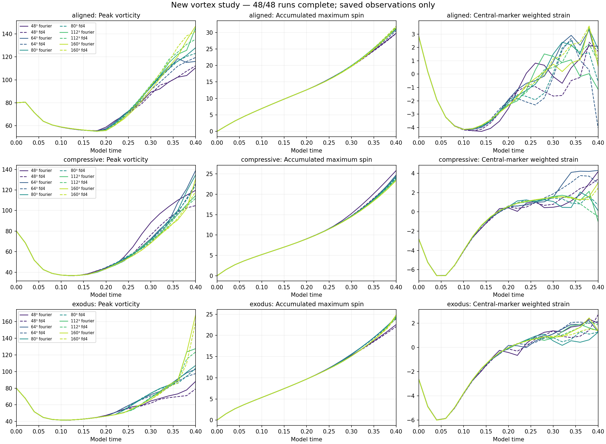
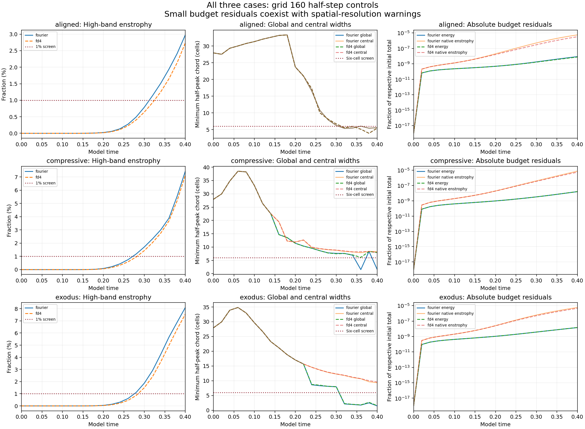
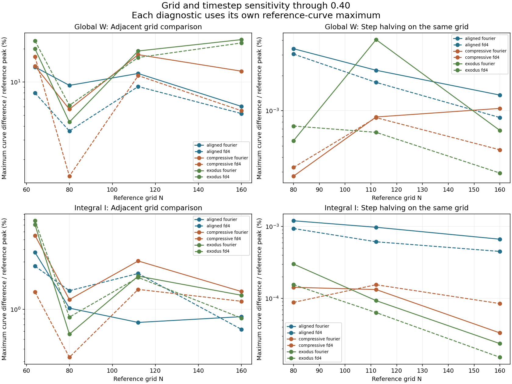
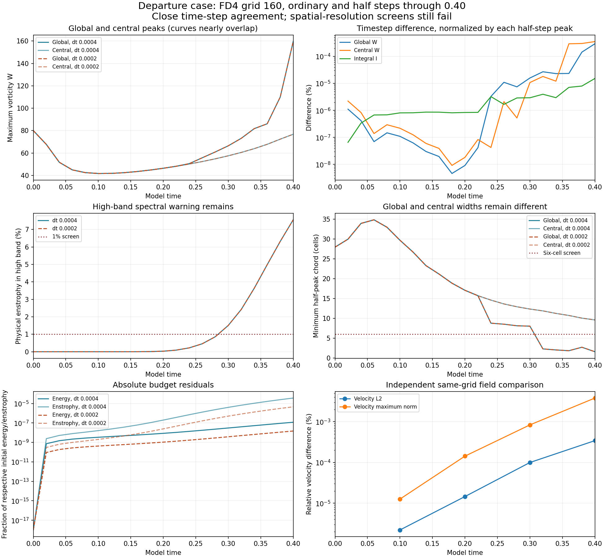
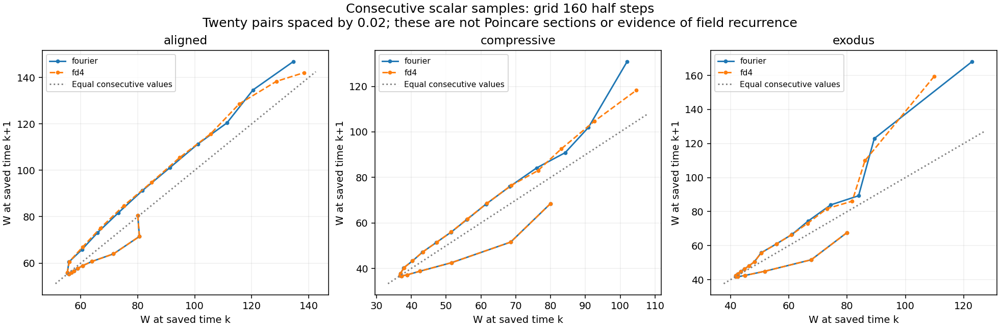

# Final vortex matrix: 48 of 48 complete

Verified October 10, 2026 (UTC). **All 48 authorized runs reached model time 0.40. No hard numerical failures were recorded.** The final FD4 160 half-step departure control and the complete comparison tables are now included. No trajectory, time interval or matrix was added.

## What the completed matrix establishes

The three prescribed surroundings produce different saved responses. The aligned case has the largest central-region maximum at the finest grid. The departure case has the largest global maximum, at a different location from its central peak. Initial compression and initial outward motion do not enforce later decay or dispersal.

**The maximum-vorticity curves remain sensitive to spatial resolution.** All six ordinary-step 112-to-160 global-W comparisons exceed the protocol's 5% screening level: 5.19% to 24.21%. Meanwhile, all six 160-grid step-halving W differences are below 0.0014%. This supports small measured timestep sensitivity on the tested grid and interval; it does not establish spatial convergence or continuum accuracy. All six finest half-step endpoints exceed the 1% high-band enstrophy warning.

## Finest-grid endpoints

These values use the 160-grid half-step runs at t=0.40. W is the shared Fourier-curl diagnostic; the central region is a fixed radius-one cylinder, not an automatic vortex identity tracker.

| Case | Method | Global W | Central W | I | High-band enstrophy | Global width, cells | Central width, cells |
| --- | --- | ---: | ---: | ---: | ---: | ---: | ---: |
| aligned | fourier | 146.869586 | 146.869586 | 31.463254 | 2.9780% | 5.5701 | 5.5701 |
| aligned | fd4 | 142.058935 | 142.058935 | 31.944204 | 2.7330% | 5.4291 | 5.4291 |
| compressive | fourier | 130.912848 | 117.372366 | 23.403305 | 7.4408% | 1.5816 | 8.3059 |
| compressive | fd4 | 118.312690 | 118.312690 | 23.469241 | 7.1413% | 7.9327 | 7.9327 |
| exodus | fourier | 168.156058 | 78.465666 | 24.855353 | 8.0994% | 1.4811 | 9.3266 |
| exodus | fd4 | 159.510941 | 76.766644 | 24.361571 | 7.5529% | 1.5625 | 9.5747 |

The departure case's global half-peak width is only about 1.5 cells. Its central core spans about 9.3 to 9.6 cells. The aligned peak also falls below the six-cell screen; the compressive Fourier run has a narrow off-central global peak while its FD4 global peak remains central. A width measured by subcell interpolation does not add resolution.

## Grid, time and method comparisons

Differences below are the maximum absolute difference over 21 common saved times, divided by the reference curve's own maximum. Grid comparisons use ordinary steps and reference grid 160; time comparisons use the half-step run as reference. They are finite comparisons, not convergence orders or rigorous error bounds.

| Case | Method | 112 to 160: W | 112 to 160: I | Grid 160 step halving: W |
| --- | --- | ---: | ---: | ---: |
| aligned | fourier | 6.023496% | 0.842336% | 0.001359390% |
| aligned | fd4 | 5.191469% | 0.628813% | 0.000873442% |
| compressive | fourier | 12.545694% | 1.506850% | 0.001045774% |
| compressive | fd4 | 5.507222% | 1.202353% | 0.000462593% |
| exodus | fourier | 24.205529% | 1.381771% | 0.000677226% |
| exodus | fd4 | 22.572803% | 0.815972% | 0.000292663% |

The [complete comparison file](comparisons.json) includes 24 adjacent-grid, 18 timestep, 15 method and 20 configuration comparisons. Full-field grid comparisons restrict both fields to the coarser retained Fourier modes; fine-only modes are excluded and must be read alongside spectral warnings. Same-grid time comparisons cover the common full retained band. FD4 independently discretizes momentum transport and viscosity, but shares FFT pressure infrastructure, filtering, RK3 and diagnostics with the Fourier method. Its initial projection changes the analytic velocity by the recorded amount. Native discrete divergence is the constrained quantity; its interpolated Fourier divergence need not vanish.

## Final FD4 control: independent verification

The last run, `exodus-fd4-n160-half`, uses step 0.0002, compared with 0.0004 in the ordinary control. Their saved starting fields are bitwise identical. The W curve difference is **0.000292663%** and the final full same-grid velocity L2 difference is **0.000342970%**. The final velocity maximum-norm difference is **0.003810402%**. These small differences leave the spatial limitations above in place.

All five new saved fields (t=0, 0.1, 0.2, 0.3, 0.4) passed independent physical-space sums for W, energy and Fourier/native enstrophy. Endpoint widths, spectra and strain were remeasured with frozen diagnostics. The five ordinary fields were reused after their earlier audit hashes matched. Seven scalar differences and five field pairs were independently checked using weighted RFFT Parseval and physical-space norms. The final checkpoint hash equals the archived final-field hash.

## Budgets, movement and recurrence limits

Across all 48 runs, the largest absolute relative energy-budget residual is **2.07617e-06**, below the declared 0.005 gate. The largest absolute native-enstrophy-budget residual is **0.000149835**. Energy, native divergence, stage CFL and finite recorded values satisfy their numerical gates. The small budget residuals measure consistency with the discretized evolution, and do not remove the spatial-resolution warnings. I and budget integrals use recorded RK-stage accumulations; I is not a continuum supremum bound.

At grid 160 with half steps, the departure construction's smallest outer-to-central marker distance rises from about 1.5005 initially to 1.5525 (Fourier) or 1.5536 (FD4) at the endpoint. This endpoint increase does not establish sustained separation: the saved intermediate distances and changing strain remain in the records. Material markers are not vorticity identity trackers in a viscous flow. The aligned origin strain changes sign by the endpoint, and the compressive origin strain becomes positive; the names describe initial conditions.

The [summary](matrix-summary.json) retains successive W pairs and strict interior sampled peak times for each run. There are only 21 samples, 0.02 apart, over a transient interval. These plots are not Poincare sections and do not establish a periodic orbit, field recurrence or chaos. No asymptotic Lyapunov exponent is inferred.

## Scope and audit trail

The smooth periodic starting construction, box side 6, viscosity 0.001, zero mean/force, strict retained Fourier cutoff and SSP RK3 method are unchanged. This is a different field and solver from the matched-stretch study. Matched-stretch remains ongoing; its raw strain is nonsmooth across periodic joins and initial maxima lie outside the central tube. Its finite-time perturbation rates must not be interpreted as asymptotic Lyapunov exponents. The supplied q remains a passive signed record, E is unsigned, fitted-q and cubic-feedback models are separate tests, and mirror averaging is an explicit intervention. The mathematical model remains under examination.

The final audit checks all 48 result records against the protocol, verifies their 1,008 saved observations and all 48 final checkpoint identities, and recomputes 539 scalar comparisons across 77 pairs. The previous 47 records match their already verified published blob hashes. Historical intake reviews, rejected pilot evidence and earlier batch audits remain unchanged. This report does not claim that every field was independently remeasured again: the new five-field physical audit covers the final FD4 run, with prior audits reused as documented.

- [Final matrix verification and checkpoint hashes](matrix-verification.json)
- [Final FD4 and ordinary-run field hashes](verification.json) · [Independent pair comparison](comparison-verification.json)
- [All 48 run summaries, warnings and scalar diagnostics](matrix-summary.json) · [All comparisons](comparisons.json)
- [All result records](../runs/) · [Protocol](../protocol.json) · [Initial checks](../preflight.json) · [Final queue state](../task-state.json)
- [Earlier Fourier half-step audit](../completed-departure160-fourier-half/README.md) · [Earlier grid-160 comparison](../completed-departure160-base/README.md)
- [Study index](../README.md) · [Separate matched-stretch study](../../matched-stretch/README.md)

`matrix_plot.py` rebuilds its three charts from this folder and `../runs`; `plot.py` rebuilds the FD4 chart from the two bundled measurement records. `verify.py`, `compare.py` and `matrix_audit.py` accept the original local study directory as their first argument for saved-array verification. Large restart arrays remain in the local workspace. No new numerical runs are required to rebuild these reports.

**Remaining in this vortex matrix: none.** Further spatial refinements or longer intervals would require a separately authorized design. The separate matched-stretch matrix and its final publication remain unfinished.
