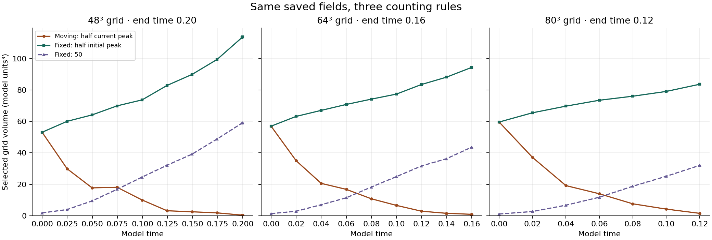

# Fixed and moving vorticity cutoffs

The original 48, 64 and 80 cubed runs have been replayed to their supplied endpoints. All uploaded reference measurements were reproduced. The vorticity and threshold counts were independently recomputed from every saved velocity field.

**The volume grows under the fixed initial cutoff and shrinks under the moving half-peak cutoff in all three runs.** Raising the cutoff changes which cells count as the high-spin region.

| Grid | End time | Fixed cutoff | Initial volume | Final fixed volume | Final moving volume |
| --- | ---: | ---: | ---: | ---: | ---: |
| 48 cubed | 0.20 | 30.09918 | 53.107 | 113.705 | 0.426 |
| 64 cubed | 0.16 | 29.63998 | 56.975 | 94.329 | 0.925 |
| 80 cubed | 0.12 | 29.37564 | 59.611 | 83.651 | 1.549 |

Volumes are in model length units cubed. Each fixed cutoff is half that grid’s initial maximum vorticity. The moving cutoff is half its current maximum. The additional fixed cutoff of 50 is also plotted. End times differ; this table is not a comparison at a shared final time.

This is an exact accounting of the thresholded measurement. It does not identify the forces that caused the fluid to change, and it does not establish spatial convergence. The supplied raw matched-strain field has a periodic-join limitation; no replacement starting field was substituted.

[Verification and field hashes](verification.json) · [48-grid data](n48/result.json) · [64-grid data](n64/result.json) · [80-grid data](n80/result.json) · [Original source](source/grids_compared.py)
