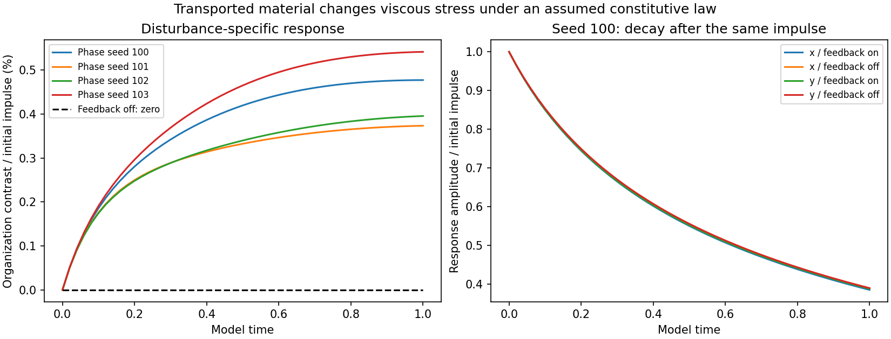
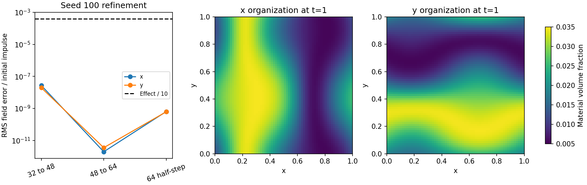

# Does material organization change the fluid's response?

**Yes within this specified coupled model.** At fixed initial fluid velocity, total material amount and initial concentration histogram, rearranging the material changes the velocity response to the same disturbance. Disabling the material-to-viscosity coupling makes that organization contrast exactly zero in the saved calculations. All **30 paired comparisons (60 trajectories)** reached model time **1.0** and passed the recorded numerical screens.

This is a controlled computational mechanism test. The viscosity law is an input assumption, not a coefficient fitted to biological measurements. It supports a conditional claim about this model, not a claim that an actual bacterial sample has the measured effect below.

## The connection and its limits

The [parent study](../README.md) already connected material transport with response to stress, but its transported particles did not change the prescribed stirring flow. This addition closes a specific feedback loop:

**fluid velocity → material transport → spatially varying viscous stress → fluid velocity.**

It also uses the disturbance-specific observable highlighted by the [fluid-organization pilot](../../fluid-organization-pilot/README.md): subtract each disturbed trajectory's own baseline before comparing organizations. A difference in the undisturbed flows alone would not answer the question.

The new result does not establish a force depending on past organization. It does not separate the contribution of continued material transport from that of a frozen heterogeneous viscosity field. The original particle-transport and freezing calculations remain separate models; this test does not couple nucleation, active swimming, chemistry or phase change to momentum.

## Model and fixed assumptions

All quantities in this addition are dimensionless. On the periodic unit square, the equations are

\[
\partial_t u+u\cdot\nabla u=-\nabla p+\nabla\cdot[\nu(\phi)(\nabla u+\nabla u^T)],\qquad \nabla\cdot u=0,
\]

\[
\partial_t\phi+u\cdot\nabla\phi=0.001\Delta\phi,\qquad
\nu(\phi)=0.01(1+2.5\phi).
\]

The factor 2.5 is the parent study's illustrative dilute passive-sphere assumption. There is no organism-specific calibration. Mean volume fraction is **0.02**, with a sinusoidal amplitude **0.015**: the initial range is **0.005–0.035**. These concentrations are deliberately much higher than the parent's illustrative million-spheres-per-mL example; the effect sizes must not be transferred to that example. The chosen diffusivity and viscosity are not calibrated to water and bacterial transport.

The two organizations are stripes varying along x or along y, with identical discrete histograms and mass. Both have the same concentration at the disturbance center. Every within-seed comparison has identical initial velocity and the same localized divergence-free velocity impulse. There is no subsequent external force. The impulse is a fixed Fourier polynomial across all grids. Its orientation is held fixed, so the comparison tests organization relative to that particular disturbance.

Feedback-off controls replace the viscosity by its constant value at the mean fraction, **0.0105**, while continuing to transport the material. Uniform-material feedback-on and feedback-off controls test the constant-viscosity limit. Each arm has its own baseline and disturbed run; each of those runs evolves its own concentration field.

The momentum equation retains inertia. RK4, a strict 2/3 Fourier cutoff and pressure projection integrate the equations. Viscous stress includes gradients of viscosity; simply multiplying the velocity Laplacian by local viscosity would omit a term. The solver is isolated from the existing matched-stretch and adversarial-vortex sources and does not alter their methods, fields or time intervals.

## Frozen comparison plan

- Primary comparisons: 48² grid, step 0.004, four phase seeds (100–103), two organizations, feedback on/off: 16 pairs.
- Seed 100 controls: 32² and 64² at step 0.004, plus 64² at step 0.002, each with both organizations and feedback settings: 12 pairs.
- Uniform-material controls: 48², seed 100, feedback on/off: 2 pairs.
- Duration 1.0; observations every 0.02. Four phases are sensitivity checks, not independent biological replicates. Grid/time refinement covers seed 100 only.

The [protocol](protocol.json) was saved before the production matrix. A single preliminary 32² x/on pair checked runtime and numerical health. No cases were added in response to the measured organization effect.

Define \(\delta u=u_{\mathrm{disturbed}}-u_{\mathrm{baseline}}\). The primary metric is the RMS over the 51 recorded times of

\[
C(t)=\frac{\|\delta u_x(t)-\delta u_y(t)\|_{L^2}}{\|\delta u(0)\|_{L^2}}.
\]

Here x/y label material arrangements, not vector components. It measures the difference in the response fields, including direction and spatial pattern, rather than only their scalar amplitudes.

## Results

| Starting phase seed | Time-RMS organization contrast | Contrast at time 1 |
|---|---:|---:|
| 100 | 0.38963% | 0.47733% |
| 101 | 0.31141% | 0.37347% |
| 102 | 0.32126% | 0.39558% |
| 103 | 0.43332% | 0.54153% |

All percentages use the **initial impulse norm** as denominator. They are not percentages of total fluid speed or material concentration. The feedback-off organization contrast and uniform-material on/off contrast are both exactly zero in these saved outputs. Both response amplitudes decay; a nonzero organization contrast does not imply amplification or an instability.



For seed 100, the largest RMS disturbance-field differences, in the same normalization, are **2.74e-8** for 32²→48², **3.54e-12** for 48²→64² and **6.39e-10** on halving the 64² timestep. The primary contrast changes by **4.36e-10 relative** between 48²/0.004 and 64²/0.002. The effect exceeds the larger fine-grid/half-step difference by about **6.1 million**. These are observed refinement differences, not rigorous error bounds or statistical confidence levels.



Maximum recorded mass error is **6.94e-18**, maximum divergence is **4.44e-16**, and volume fractions stay within **0.005–0.035** at saved observations. The largest relative kinetic-energy budget residual using RK4 dissipation quadrature is **3.76e-12**. A separate trapezoid check using only the coarser saved times has residual up to **7.51e-5**, consistent with its lower quadrature accuracy; it is not the RK4 gate. Six automated checks cover initialization, stress gradients, the semidiscrete energy identity, exact shear decay, feedback-off/uniform nulls and common initial fields across grids.

## What the supplied bifurcation pages contribute

The supplied laser, overdamped bead, saddle-node and cusp pages motivate keeping distinct claims distinct. Feedback can change a response without changing equilibrium stability. A first-order reduction needs a justified timescale limit; no such reduction is made here. A saddle-node or cusp claim would require equilibrium branches and their stability as parameters vary. This finite-time impulse comparison supplies none of that evidence and claims no bifurcation. The textbook examples are conceptual references, not fluid constitutive measurements or additional authorized simulation matrices.

## Reproduce and verify

With Python 3.12, run from this directory:

```text
python -m pip install -r requirements.txt
python -m pytest test_coupled.py -q
python verify_coupled.py
python run_coupled.py --out reproduction
python analyze_coupled.py --out reproduction
python verify_coupled.py --actual reproduction
```

The workflow in PR #3 runs the tests, all 30 pairs, saved-field analysis and numerical comparison to this package. `run_coupled.py` preserves completed cases, checks their file hashes before reuse and rejects changes to recorded solver, protocol or runner sources or the recorded Python/NumPy versions in an existing output folder.

Published [diagnostic curves](data/results.json), [analysis and gates](data/analysis.json), [all final fields](data/final-fields.npz), [source/environment record](data/provenance.json) and [test record](tests.xml) are covered by [SHA-256 hashes](manifest.json). Full trajectories at every saved time are retained locally; the reproduction command regenerates them and audits all 3,060 saved baseline/disturbed fields. They are excluded from the compact publication. The endpoint archive and diagnostic curves are sufficient for the delivered-package checks, while reproducing intermediate field contrasts requires the rerun. Numeric arrays, rather than ZIP timestamps, are compared for reproduction.

Remaining scientific work is empirical calibration and testing alternative constitutive mechanisms. A frozen-heterogeneity control would isolate what continued transport adds. A true history-dependent claim would require controls separating past organization from present material and velocity state. These are clearly separate follow-ups, not conclusions of this completed test.
