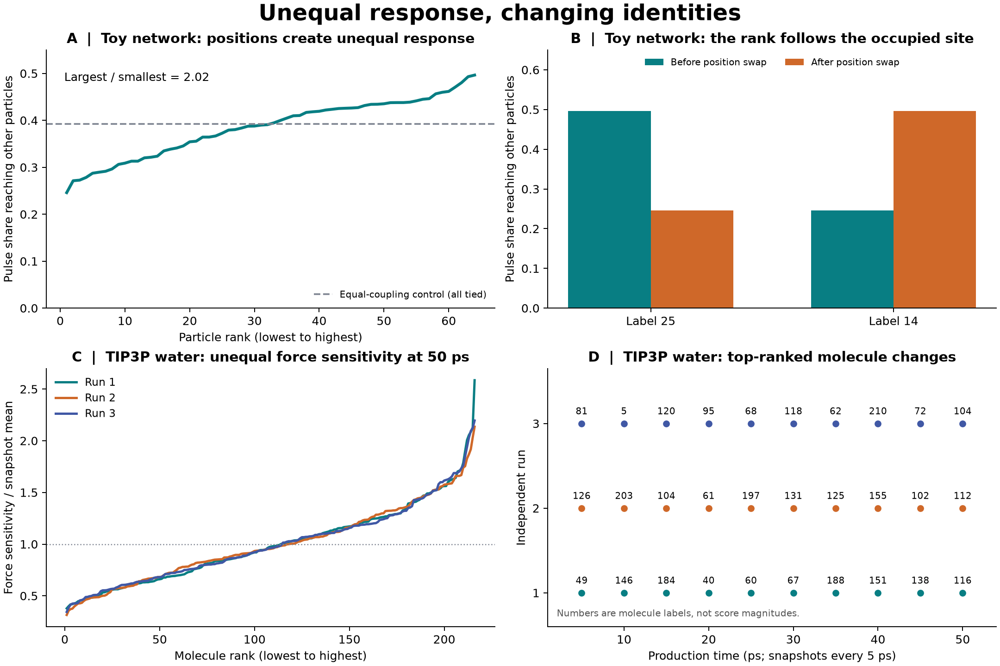

# Positional influence among identical water molecules

A reproducible experiment asking whether identical molecules can acquire unequal, temporary influence scores solely through their positions and interactions.

**Result:** unequal response scores emerged, and the highest-scoring identity changed with position exchanges and molecular motion. These results describe reciprocal coupling and transient roles; they do not establish a permanent or directional hierarchy.



## Damping and overdamped motion

[The damping extension](damping-extension/README.md) adds adjustable drag, a literal damped leapfrog solver, analytic spring checks, and the rotating hoop's equilibrium and fast–slow tests. In 2,592 additional perturbed water trajectories from one matched state, drag rates of 5 and 50 ps⁻¹ reduce the mean 200-fs response to 45.0% and 3.38% of the undamped value. The water implementation uses constrained velocity Verlet with drag; friction-only probes cool and are not equilibrium liquid-water simulations.

## Finite-time impulse follow-up

[The follow-up experiment](response-extension/README.md) runs 3,888 perturbed trajectories to test whether the snapshot force ranking predicts later motion. The original force leaders fall to ranks **104, 69 and 209 out of 216** by 200 femtoseconds in the three tested states. Includes complete saved response measurements, numerical controls, reproducible code and limitations.

## What was actually run

1. **Toy network:** 64 identical stationary point particles in a periodic cube, symmetric distance-dependent interactions, and an equal unit pulse applied to each particle in turn. The response is solved with a matrix exponential. This is not a water model.
2. **Classical molecular dynamics:** three runs of 216 identical rigid TIP3P water molecules at a target 300 K and imposed density 0.997 g/cm³. Each run has 20 ps equilibration and 50 ps production. A separate force evaluation measures how an equal tiny translation changes forces on other molecules.

## Main numerical results

| Test | Recorded result |
| --- | --- |
| Toy strongest/weakest pulse-response score | 2.018 |
| Exchange strongest and weakest toy positions | Leading label 25 → 14 |
| Random toy position permutations | Leader changed in 985/1,000 trials; all scores followed their sites |
| Periodic lattice and equal-coupling controls | All particles tied |
| Water median strongest/weakest force-score ratios | 6.39, 7.22, 7.98 across the three runs |
| Water leader turnover at 5 ps spacing | Changed in 27/27 adjacent within-run comparisons |
| Complete water-coordinate permutation | Leading label 116 → 59, exactly as predicted |

Molecule labels are zero-based. In the table, the water ratios are medians over ten snapshots per run; 27 comparisons does not mean 27 statistically independent observations.

**Important interpretation:** exchanging complete states of identical molecules is equivalent to relabeling the same physical arrangement. The permutation result checks the implementation, rather than independently proving leadership. The water score measures instantaneous force sensitivity, not long-time causal control. TIP3P is a rigid, fixed-charge approximation, and these small, short simulations do not establish a universal property of real water.

## Report and files

- [Full report](report.html): methods, equations, controls, numerical validation, limitations, and next validation steps. Download and open this self-contained HTML file in a browser; GitHub normally displays its source.
- [Main figure](results.png) and [diagnostic figure](diagnostics.png).
- [Experiment](experiment.py): toy calculation, water simulation, and trajectory analysis.
- [Recorded protocol](data/md_protocol.json), [toy results](data/toy_results.json), and [water results](data/md_results.json).
- [Permutation/precision check](data/md_permutation_control.json) and [saved-data audit](data/verification.json).
- `data/`: complete saved trajectories, force scores, two force Jacobians, serialized system, starting topology, equilibrated states, and CSV summaries.
- [Original file hashes](manifest_sha256.json): SHA-256 hashes for the original experiment deliverables. Repository packaging files such as this README are not included in that manifest.

## Reproduce

Use Python 3.12 and preferably an isolated environment. Run these commands from `reports/water-molecule-influence/`:

```sh
python -m pip install -r requirements.txt

# Fast toy experiment, writing to a separate directory:
python experiment.py --mode toy --out reproduced

# Full experiment using portable CPU execution:
python experiment.py --mode all --platform CPU --out reproduced

# Recorded hardware route: OpenCL with double-precision support for force probes:
python experiment.py --mode all --platform OpenCL --out reproduced

# Reanalyze the delivered trajectories without rerunning molecular dynamics:
python experiment.py --mode analyze --out data
python verify_outputs.py
python make_figures.py
python build_report.py
```

CPU runs use OpenMM's Reference platform for force probes and can be substantially slower. Seeded molecular trajectories are not guaranteed to be bitwise identical across hardware or reruns. The delivered trajectories preserve the exact input to the reported structural analysis. Regenerating compressed arrays may change their file hashes even when their numeric contents agree.

The recorded environment was Python 3.12.14, NumPy 2.5.3, SciPy 1.18.1, Matplotlib 3.11.2, and OpenMM 8.6.1 on Windows. Dependencies are pinned in `requirements.txt`.

## Data conventions

- `md_replica_0.npz` through `md_replica_2.npz`: 500 frames each, shape `(500, 216, 3, 3)`, molecule/atom/Cartesian order; atoms are O, H, H and positions are in nm.
- Frames cover production times 0.1–50 ps, every 0.1 ps. Force scores are stored at 5, 10, …, 50 ps.
- `md_control_arrays.npz` contains original/permuted force Jacobians and the permutation mapping.
- File suffixes 0–2 correspond to figure labels Run 1–3.
- The physical force-sensitivity score has units kJ mol⁻¹ nm⁻². The toy score is dimensionless.

## Next validation

Repeat with longer trajectories, larger boxes, alternate water models, and independent-run uncertainty estimates. The [finite-time follow-up](response-extension/README.md) now tests paired, momentum-balanced impulses over 5–200 fs; repeat this validation over more independent states and thermal velocity draws. Separate translational and rotational effects, and test cutoff and timestep sensitivity.

## References

- [OpenMM simulation guide](https://docs.openmm.org/latest/userguide/application/02_running_sims.html)
- [OpenMM Langevin integrator and random-seed behavior](https://docs.openmm.org/latest/api-python/generated/openmm.openmm.LangevinMiddleIntegrator.html)
- [Ozkanlar, Zhou & Clark (2014): hydrogen-bond network definitions](https://pubmed.ncbi.nlm.nih.gov/25481129/)
- [Vega et al. (2009): comparison of water models](https://arxiv.org/abs/0901.1803)
