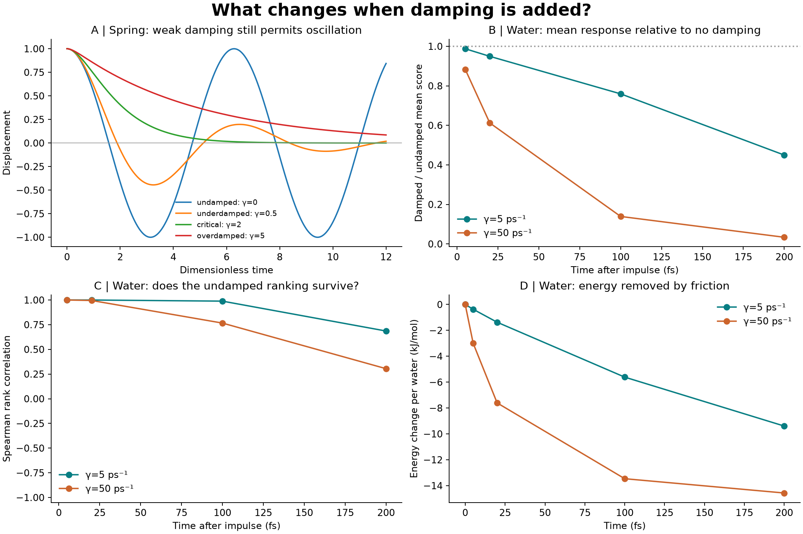
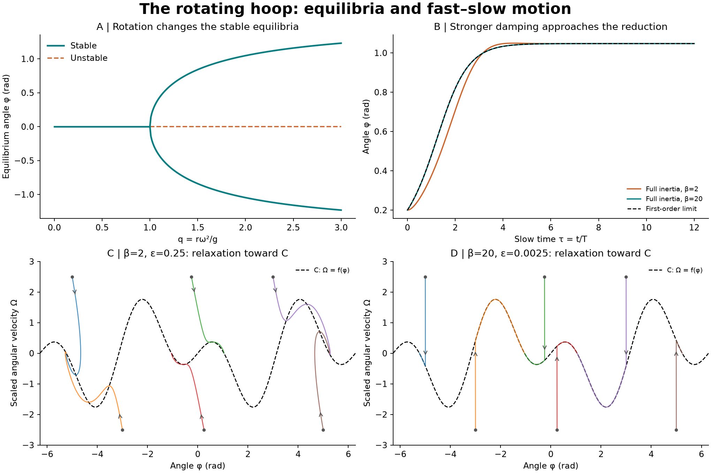

# Damping added to leapfrog and the water-response experiment

Implements velocity-proportional drag, validates it against an exact spring solution, and follows the supplied rotating-hoop pages through equilibrium, scaling and fast–slow phase-space tests.



## Water results

The water experiment uses one saved 216-molecule TIP3P state, with exactly the same positions and velocities as run 1 of the preceding impulse study. It tests every source molecule with paired ±0.01 nm/ps kicks on all three axes, at γ=5, 50 ps⁻¹: 2,592 primary perturbed trajectories plus controls. Each trajectory lasts 200 fs, with 1 fs time steps and 10⁻⁸ rigid-constraint tolerance. The no-damping scores come from the preceding experiment and are rechecked on 4 selected sources. Friction acts equally on every atom as −mγv. No random force or thermal bath is added: positive damping deliberately dissipates energy and is not equilibrium water at 300 K.

| Drag γ (ps⁻¹) | Mean response / undamped at 200 fs | Rank correlation with undamped | Leading molecule | Original force leader rank |
| --- | --- | --- | --- | --- |
| 5 | 0.4497 | 0.686 | 129 | 94 |
| 50 | 0.0338 | 0.305 | 204 | 39 |

The leading ID is zero based; ranks run from 1 to 216. These are model-dependent responses, not permanent leaders.

## Two clearly identified numerical methods

The literal leapfrog code stores velocity at half time steps. With h=Δt, a=(1−γh/2)/(1+γh/2), c=h/(1+γh/2), its update is v[n+1/2]=a v[n−1/2]+c F(x[n])/m; x[n+1]=x[n]+h v[n+1/2]. Initialize v[−1/2]=(1+γh/2)v[0]−hF(x[0])/(2m). This centers the drag force and is second order. A large time step can still introduce numerical oscillations: γh>2 makes a negative, so damping is not a replacement for time-step validation.

The water code retains the previously corrected, synchronized velocity-Verlet/RATTLE integrator, rather than reintroducing mismatched half-step velocities. It adds exact half drag steps v←exp(−γh/2)v before and after each constrained Verlet step. Both implementations approximate m ẍ=F−mγẋ. They are separate second-order schemes, not asserted to be identical at finite h. At γ=0 the water integrator reproduces the previous undamped calculation.

The compensating kicks also decay, so subtracting the old ballistic displacement t would create a false response. We replace t by Gγ,h(t)=h exp(−γh/2)[1−exp(−γt)]/[1−exp(−γh)], the exact free-translation response of this split integrator. Its continuous-time limit is [1−exp(−γt)]/γ; its γ=0 limit is t. The reported score remains the sum of Frobenius norms of other molecules’ corrected COM derivatives, in ps; it is not an energy-transfer fraction.

## The rotating hoop from the supplied pages



Using the book’s tangential-force convention, mr φ̈+b φ̇=mg sinφ(q cosφ−1), with q=rω²/g. Choose T=b/(mg), τ=t/T and ε=m²gr/b²=1/β², where β=b/(m√(gr)). Then ε φ″+φ′=f(φ), f(φ)=sinφ(q cosφ−1). With Ω=φ′, the phase equations are φ′=Ω and εΩ′=f(φ)−Ω. The curve C: Ω=f(φ) is the zero-angular-acceleration curve (a nullcline); it is not exactly invariant for finite ε. Small ε produces rapid velocity relaxation followed by slower angular motion near C, away from problematic scalings and after the initial transient.

For positive damping, the bottom φ=0 is stable for q<1 and unstable for q>1; the top φ=π is unstable. Two stable equilibria ±arccos(1/q) appear for q>1 (angles modulo 2π). At q=1 the bottom is nonhyperbolic and nonlinearly stable. Damping does not move these equilibria: it changes the approach to them. The symmetric branches form a supercritical pitchfork. These are properties of the hoop model, not evidence of a phase transition in the water experiment.

At q=2 and the same initial angle 0.2 rad, zero physical angular velocity, the maximum angle disagreement with the first-order model over slow time 0–12 is 0.132265 rad at β=2, versus 0.001527 rad at β=20. Halving the latter simulation’s step changes the full second-order angle by at most 1.73e-06 rad. The phase portraits use six additional initial states at q=2.

## Validation

- Spring tests cover undamped, underdamped, critical and overdamped cases. Halving the step reduces position error approximately fourfold for both implementations.
- The actual OpenMM integrator reproduces free exponential velocity decay and its discrete displacement to within 8.88e-16 in the tested numerical units.
- γ=5: half-step L2 difference at 200 fs 0.1496%; at 5 fs 3.00%. Half-kick L2 difference at 200 fs 0.0339%; maximum individual half-kick change over all checked times 0.06%. No-interaction residual 8.08e-10 ps; largest per-time permutation L2 error 6.87e-09. γ=50: half-step L2 difference at 200 fs 0.0330%; at 5 fs 3.00%. Half-kick L2 difference at 200 fs 0.0087%; maximum individual half-kick change over all checked times 0.03%. No-interaction residual 1.87e-10 ps; largest per-time permutation L2 error 3.65e-09.

## Reproduce

Install the parent experiment’s pinned `requirements.txt`; run from `reports/water-molecule-influence/`:

```sh
python damping-extension/damped_leapfrog.py
python damping-extension/rotating_hoop.py
python damping-extension/validate_integrator.py
python damping-extension/damped_water.py --gamma 5 50 --platform OpenCL
python damping-extension/build_report.py
```

Use `--platform Reference` for slower portable water execution. `damped_water.py` accepts `--gamma`, `--replica` (0–2), and `--out`. A separate `--out` avoids replacing the delivered water data; report generation reads this folder’s `data/` by default. The literal spring integrator is the reusable `leapfrog(force, x0, v0, gamma, dt, steps, mass)` function in `damped_leapfrog.py`.

[Full self-contained report](report.html) · [Protocol](data/protocol.json) · [Water measurements](data/results.json) · [Hoop measurements](data/hoop.json) · [Checksums](manifest_sha256.json)

## Limits and next steps

One conditional water microstate cannot establish ensemble behavior. The two drag rates are sensitivity tests; “stronger damping” does not prove every molecular mode is overdamped. They correspond to free-velocity decay times of 200 and 20 fs, but interacting motions have additional timescales. Four selected sources receive half-step, half-kick, no-interaction and permutation controls; full-ranking convergence remains untested. Saved norm matrices support score reanalysis, but signed response blocks and every perturbed trajectory frame are not retained. Next checks are more independent states, full-ranking convergence, a range of mode-dependent damping scales, and—if equilibrium liquid water is the goal—Langevin noise matched to friction, with coupled noise for paired trajectories.

## Sources

The spring and rotating-hoop equations are derived from the user-supplied textbook excerpts; the original scanned pages are not redistributed. The computational constraint implementation follows [OpenMM CustomIntegrator documentation](https://docs.openmm.org/latest/api-python/generated/openmm.openmm.CustomIntegrator.html). The distinction between friction-only dynamics and thermal Langevin dynamics is documented in the [OpenMM integrator guide](https://docs.openmm.org/latest/userguide/theory/04_integrators.html).

[Original experiment](../README.md) · [Undamped finite-time study](../response-extension/README.md)
