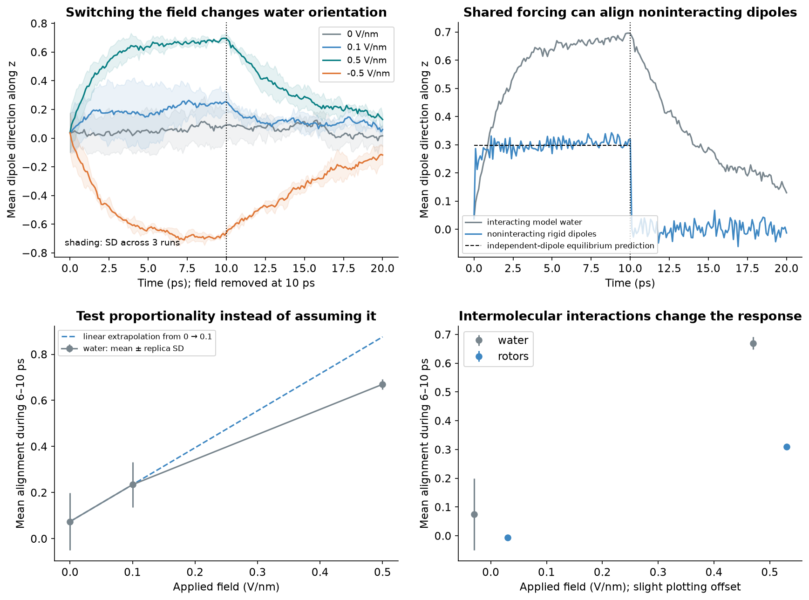
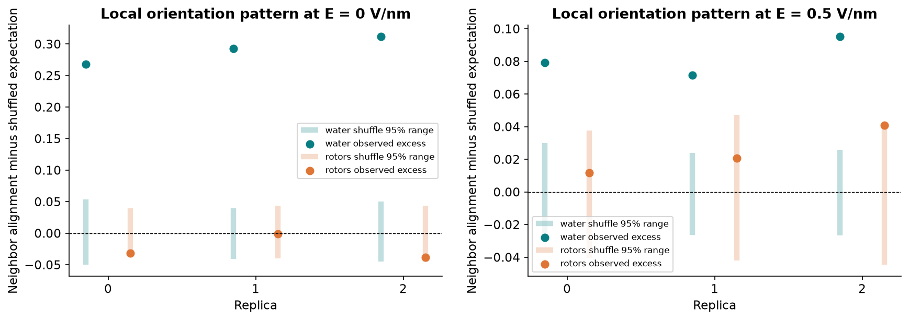
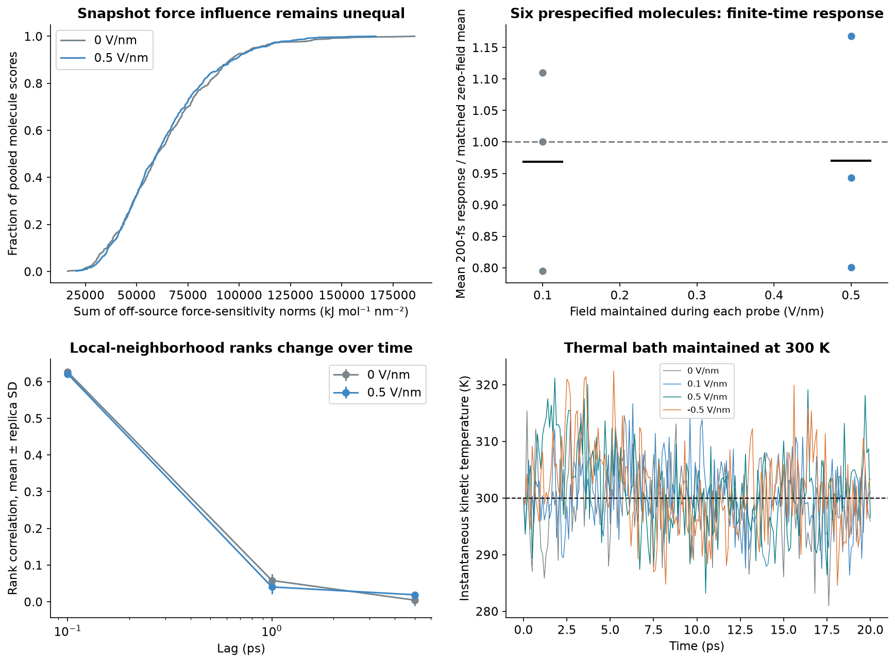
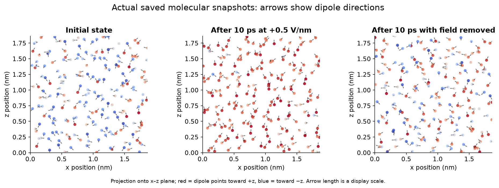

# Making identical model water respond differently

A reproducible electric-field pulse test with interaction, thermal, numerical, and identity controls.

| Field (V/nm) | On-window Pz (mean ± SD) | Recovery-window Pz | On-window temperature (K) |
| --- | --- | --- | --- |
| 0 | 0.0742 ± 0.1247 | 0.0252 ± 0.0770 | 300.9092 ± 5.8508 |
| 0.1 | 0.2344 ± 0.0980 | 0.1013 ± 0.0316 | 302.7842 ± 3.7875 |
| 0.5 | 0.6697 ± 0.0220 | 0.1924 ± 0.0379 | 298.5715 ± 4.5295 |
| -0.5 | -0.6830 ± 0.0164 | -0.1913 ± 0.0618 | 297.7989 ± 4.6413 |

## What changed

This experiment changes the conditions experienced by actual simulated water molecules. All 216 molecules retain identical masses, rigid geometry, charges and pair interactions. A uniform electric field couples to those charges for 10 ps and is removed for the next 10 ps. We compare 0, +0.1, +0.5 and −0.5 V/nm, from three previously saved water states each, with a 300 K Langevin bath. All trajectories are retained.

## What alignment means

Let uᵢ be the unit vector along each molecular dipole and Pz=mean(uᵢ,z). Pz ranges from −1 to +1. It describes average orientation, not a fraction of molecules, a leader score, or intent. Window means during 6–10 ps are 0.0742 ± 0.1247 at zero field and 0.6697 ± 0.0220 at +0.5 V/nm. Values after ± are sample standard deviations across three replica means.



## A direct nonlinearity test

If the mean field-induced alignment were proportional to the applied field, ΔP(0.5) would equal 5ΔP(0.1), where ΔP(E)=P(E)−P(0). The measured contrast ΔP(0.5)−5ΔP(0.1) is -0.2058 ± 0.9079; its exploratory 95% t interval is [-2.4613, 2.0496]. The exploratory interval does not resolve a sublinear response; more replicas are needed. This tests the observed response curve. It does not make every individual molecular interaction proportional at weak field.

## Shared forcing versus interaction

Noninteracting rigid dipoles also align: at +0.5 V/nm their window mean is 0.3097 ± 0.0041. The independent-dipole equilibrium prediction is 0.2977. The interacting-minus-noninteracting difference is 0.3599 ± 0.0184. This distinguishes the shared external stimulus from the effect of intermolecular interactions. The noninteracting control contains overlapping ghost particles and is not liquid water. Alignment alone is insufficient evidence of cooperation.

## Do neighbors form an additional orientation pattern?

At each saved initial, field-on-end and recovery-end snapshot, we hold oxygen positions fixed and randomly reassign the existing dipole directions 200 times. This preserves the complete overall orientation distribution. For O–O pairs closer than 0.35 nm, we compare the observed mean dipole dot product with that spatially shuffled null. At the +0.5 V/nm endpoint, the three interacting-water excesses are 0.0793, 0.0714, 0.0952. 3 of three exceed their own 97.5th-percentile shuffle value. The plot also shows zero-field and noninteracting controls. This tests a spatial association beyond shared global alignment; the shuffled states are a statistical reference, not physical water trajectories. It does not demonstrate intent or a long-lived collective domain.



## Does the change persist?

The field is turned off at 10 ps. During 16–20 ps, the +0.5-minus-zero-field alignment difference is 0.1672 ± 0.0946. This is a measured recovery-window residual. Twenty picoseconds cannot establish permanent memory, metastability, or hysteresis. A memory claim would require much longer field-free runs, repeated histories, and comparison of distinct stable states under the same final conditions.

## Influence without privileged identities

At the 10 ps endpoints for E=0 and E=0.5, we calculate the full translational force Jacobian for all 216 molecules, as in the original study. Snapshot influence is the sum of off-source 3×3 block norms. It remains a reciprocal, geometry-dependent sensitivity, not a directional hierarchy. Permuting complete molecular states moves the leading label from 150 to 52, exactly the expected relabeling; relative score error is 4.18e-11. Leader changes between separately evolved trajectories also occur from ordinary molecular motion, so such changes alone cannot be attributed to the field.



## Finite-time intervention, with a limited scope

We probe source IDs 0,43,86,129,172,215, chosen before seeing outcomes, using paired ±0.01 nm/ps kicks along all three axes. Each source kick is balanced by compensating kicks to the other molecules. Target center-of-mass response is corrected for that direct compensation; score is summed off-source response-block norms in ps. The field remains on during these deterministic 0.2 ps probes, with no thermostat. The source positions are taken from the 10 ps endpoint; fresh constrained Maxwell velocities at 300 K define each conditional probe. At +0.5 V/nm the mean ratio of six-source 200-fs response to the matching zero-field mean is 0.9705 ± 0.1853. Six sources do not identify the global finite-time leader, and this short-horizon ratio is not an energy-transfer fraction.

## Numerical controls

The field force agrees with qE to 1.81e-10 kJ mol⁻¹ nm⁻¹. A periodic-image shift changes its energy by 0.00e+00 kJ/mol. On the selected +0.5 V/nm replica, halving the probe step changes 200-fs scores by 0.0456% in relative L2 norm; the largest half-kick difference over measured times is 0.0375%. The no-interaction impulse score is at most 1.20e-09 ps. Permutation, finite-array and stated acceptance checks pass. These deterministic checks do not substitute for full stochastic-ensemble time-step convergence.

## Methods and uncertainty

The existing OpenMM TIP3P model is rigid and nonpolarizable, in a cubic periodic box of side 1.864446 nm at fixed density 0.997 g/cm³. Sampling uses 1 fs steps, friction 1 ps⁻¹, constraint tolerance 10⁻⁸ and 0.1 ps saved observations. Each condition starts from the same saved state within a replica but uses a separately specified thermostat seed. Frames and molecules are correlated; each replica window mean is one observation. Three initial states provide an exploratory ensemble. The t intervals assume approximately normal replica means; no independent-frame p-values are reported. Hydrogen-bond counts use O–O <0.35 nm and donor O–H within 30° of donor-to-acceptor O–O. Connected neighbor orientation subtracts squared global mean orientation from the pair-average dot product for O–O <0.35 nm; it is descriptive, not a causal cooperation score.

## What this says about water

Within this molecular model, changing the environment changes the collective behavior of otherwise identical water molecules. This is a water-specific test rather than a borrowed oscillator example. The conclusion remains bounded by the model: fixed charges cannot respond electronically, rigid molecules cannot vibrate internally or break bonds, and the box has no electrodes, interfaces, ions or chemical reactions. The applied fields are strong model probes, not a claim of experimentally validated behavior at those field strengths. These results do not assign molecules needs, decisions, or permanent roles.



## Next validation

Increase the replica count, box size and observation duration; repeat with a second water model and a polarizable model; vary bath friction and integration step; map weaker fields and repeated on/off histories; and probe every molecule if a complete finite-time ranking is needed. Persistent-state switching would require showing two reproducible states under the same final conditions, beyond the direct field-imposed alignment.

## Relation to the supplied heteroclinic-network diagram

The supplied caption describes nine saddle states connected by heteroclinic paths. In a water interpretation, each node would represent a collective configuration of the entire system, rather than one molecule. Our driven trajectories and spatial orientation correlations do not identify saddle invariant states or their connecting manifolds. Repeated switching under one fixed set of conditions, well-defined collective coordinates, stability analysis around candidate states, and transition-path evidence would be needed to test that hypothesis. An on/off response created by changing the external field is not evidence of a heteroclinic network.

## Relation to the supplied oscillator-network equation

The supplied equation is dθᵢ/dt = ω + ε Σⱼ wᵢⱼ H(θᵢ−θⱼ). Identical ω makes the uncoupled oscillators identical; collective patterns depend on the interaction weights wᵢⱼ, coupling strength ε, function H and initial phases. The retrieved source article supplies H(θ)=sin(θ−α)−r sin(2θ). This equation provides a possible reduced description, but using it for water requires defining a measurable molecular or collective phase and deriving or fitting its interactions from molecular dynamics. We have not assigned an arbitrary intrinsic clock to every water molecule or claimed that this equation alone produces the pictured heteroclinic network. A future phase model should predict held-out molecular trajectories and retain an explicit comparison with zero coupling.

## Chunking and the new reaction–diffusion equation

The newest excerpts motivate a stronger target: slow switching between groups with faster changes inside each group. A reduced model can summarize many molecular coordinates by fewer collective variables, but a useful reduction must preserve predictive behavior. The supplied candidate is ∂t Aᵢ=δ∇²Aᵢ+σAᵢ−γAᵢ²−Σⱼ≠ᵢρᵢⱼAᵢAⱼ+η|ξᵢ(t)|. Its activity variables, competition matrix, diffusion, and noise are not molecular forces. The cited Figure 5 assigns one unit a pacemaker role, so it cannot by itself demonstrate leadership emerging among equivalent units. Our present water drive is uniform and assigns no molecular leader. The accompanying NEXT_TEST.md sets out how to test nested collective patterns and any proposed reduced model without imposing the desired result.

## Field removal as a relaxation test

Motivated by the supplied quench discussion, we measure the first drop below half of Pz at field removal for each +0.5 V/nm trajectory. The first crossing falls in 2.0–2.1 ps, 3.9–4.0 ps, 3.8–3.9 ps for the three interacting-water runs, and 0.0–0.1 ps, 0.0–0.1 ps, 0.0–0.1 ps for the noninteracting controls. Brackets come directly from 0.1 ps sampling; we do not interpolate beyond that resolution or assume exponential decay. This shows the observed relaxation timescale of an orientational response. It does not establish a bifurcation quench, underdamped oscillations, learning, or permanent storage. The latest learning excerpt motivates a separate training-then-free-recall protocol, specified in NEXT_TEST.md; that proposed learning test has not been run.

## Reproduce

Python 3.12; run from the parent experiment folder. Requires the earlier saved response-extension/data files and data/md_protocol.json. Input hashes are recorded in the protocol.

```sh
python -m pip install -r driven-water-extension/requirements.txt
python driven-water-extension/drive_water.py --platform OpenCL
python driven-water-extension/analyze_water.py
python driven-water-extension/build_report.py
```

Use `--platform Reference` for a slower portable calculation. `--out PATH` saves trajectories elsewhere; analysis/builders read this extension’s data folder. The simulation skips existing run archives for resumption; use a fresh output directory for new parameter choices.

[Report](report.html) · [Protocol](data/protocol.json) · [All numerical results and controls](data/results.json) · [Checksums](manifest_sha256.json)

## Implementation references

- [Heteroclinic networks for brain dynamics — source of the supplied network figures](https://www.frontiersin.org/journals/network-physiology/articles/10.3389/fnetp.2023.1276401/full)
- [OpenMM CustomCompoundBondForce](https://docs.openmm.org/latest/api-python/generated/openmm.openmm.CustomCompoundBondForce.html)
- [OpenMM LangevinMiddleIntegrator](https://docs.openmm.org/latest/api-python/generated/openmm.openmm.LangevinMiddleIntegrator.html)
- [OpenMM water-model setup](https://docs.openmm.org/latest/userguide/application/03_model_building_editing.html)

The custom potential uses documented coordinate expressions and global parameters; the thermal bath uses OpenMM’s documented Langevin integrator. Field and dipole formulas are derived explicitly in the protocol and code.

[Original water study](../README.md) · [Earlier oscillator tests](../oscillator-extension/README.md)
