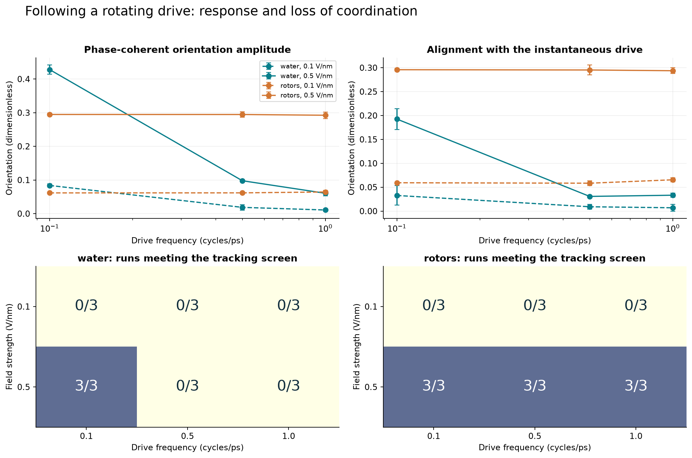
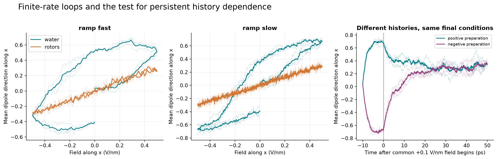
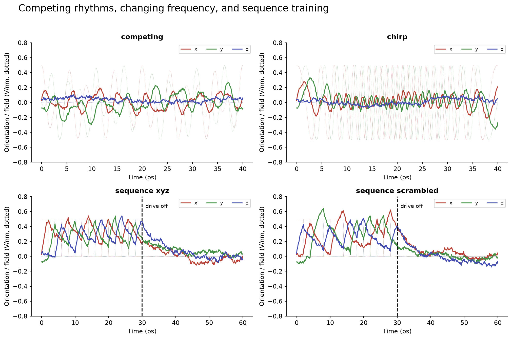
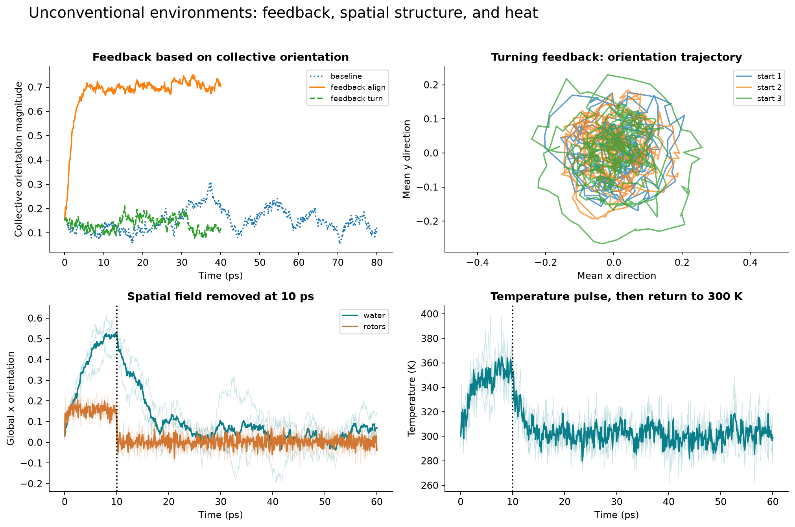
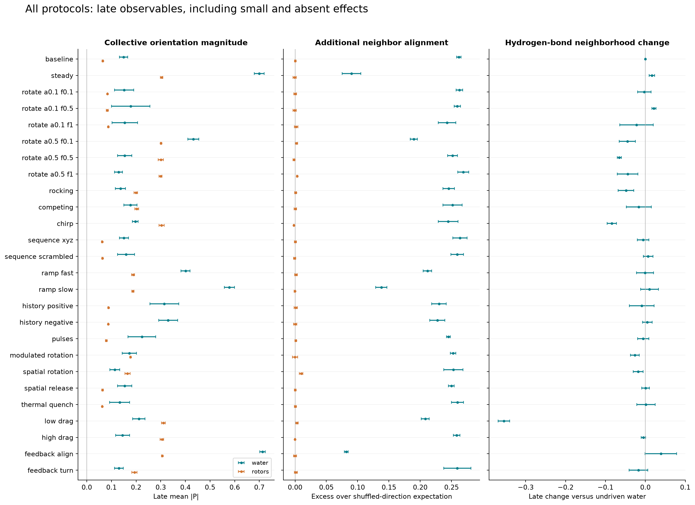
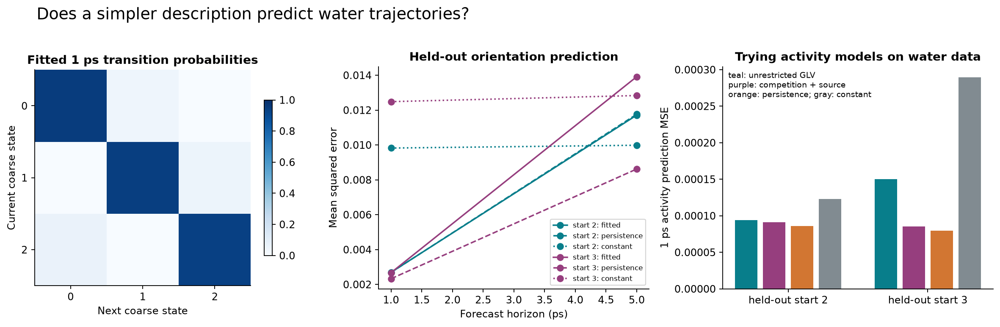
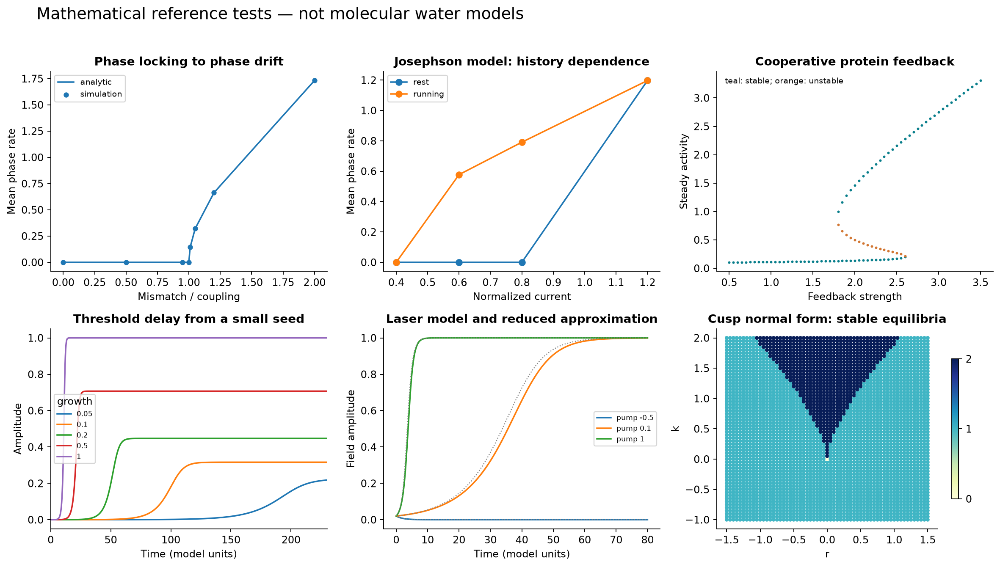
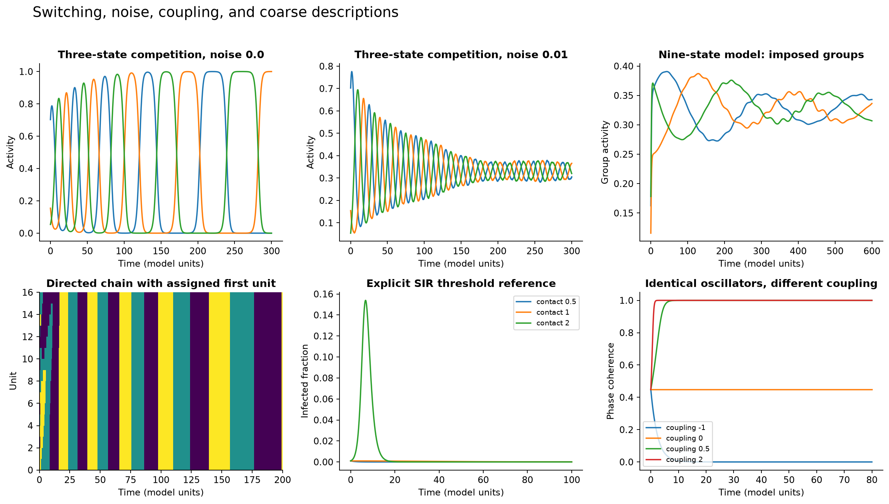
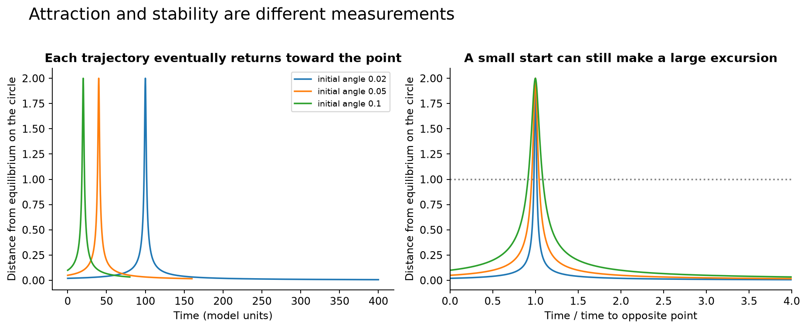

# A broad search for collective behavior in identical water

156 of 156 planned main trajectories are complete. The full design contains 6,204 ps (6.204 ns) of molecular and noninteracting-control dynamics, plus 12 refinement trajectories and short numerical audits.

The six uniform rotating-field settings produce 3 water and 9 noninteracting-control runs meeting the finite-window tracking screen (18 runs per kind when complete). Low collective amplitude makes phase unreliable and is explicitly counted as failing this screen, rather than unwrapped through noise.

With a steady +0.5 V/nm field along x, late alignment is 0.695 ± 0.022 in water and 0.299 ± 0.006 without intermolecular interactions. Rotating-drive responses can differ in the opposite direction; the figures and every condition are retained.

The steady-versus-rotating contrast holds in all three matched configurations at 0.5 V/nm. At the slowest rotation, water has a larger coherent response than the noninteracting control (0.428 versus 0.295), but lags the field by 62.2–63.7 degrees. Thus lower instantaneous alignment does not always mean weaker collective order. At the two faster rates the coherent water response also falls. This supports delayed collective response within this model; removing all interactions is not a sweep of coupling strength.

The low-drag rotating runs reach 390–395 K despite a 300 K bath target. Drag changes both dissipation and temperature here, so those runs cannot isolate the effect of friction at a common temperature.

After opposite preparation histories and 50 ps under the same +0.1 V/nm field, the late water alignment difference is 0.002 ± 0.081, with nominal 95% t interval [-0.199, 0.203]. This finite-duration, three-start comparison does not establish equilibrium bistability.

The slow-minus-fast absolute water loop area is -0.215 ± 0.059 (orientation × V/nm). Rate-dependent loops can arise from ordinary relaxation; a loop by itself is not proof of two stable water states.

Teacher-off six-ps directional coherence (normalized Fourier amplitude): sequence xyz: 0.134; sequence scrambled: 0.126; baseline: 0.118. Correct tracking during training is not teacher-off recall; these are explicit control comparisons, not a learning claim.

Alignment feedback gives late water |P|=0.713 ± 0.011, versus 0.131 ± 0.018 for turning feedback and 0.149 ± 0.016 without a drive. The alignment controller specifies no preferred spatial direction, but it deliberately supplies global feedback. The result belongs to that engineered water–controller system.

The refined runs retain the original tracking decision in 12 of 12 comparisons. Response magnitudes and kinetic temperatures are recorded separately; stochastic trajectories are not expected to coincide point by point.

Three principal components explain 49.3% of the training variance in 24 local orientation features. Coarse states are fitted on one trajectory and assessed on two held-out trajectories; the forecast plot includes persistence and constant baselines. The GLV fit is a deliberately speculative, axis-dependent mapping Aᵢ=Pᵢ², and poor predictions are retained.

The attempted competition-model forecast has 1.10×, 1.89× the error of simply holding the last observed activity constant on the two held-out water trajectories. Ratios above one mean that this particular model attempt did worse than the simple baseline.

The unrestricted GLV fit also has negative interaction coefficients, so it cannot be interpreted as pure competition. A separate fit enforces nonnegative competition and adds a nonnegative constant source; both comparisons remain exploratory, and both are reported.

The chosen nine-state modular reference model also failed to reproduce pronounced chunks: the late fractions with one group holding more than 80% of activity are 0.000, 0.000, 0.000. Its weaker group fluctuations are retained rather than retuned until they resemble the source figure.

## Following up the steady-versus-rotating contrast

All rows use a 0.5 V/nm rotating field and the same phase-analysis window within each run; entries are means over three configurations. In-phase alignment is the real part of the rotating response; its magnitude measures coherent amplitude. Lag is the angle of this averaged response, not a claim of reliable instantaneous phase when amplitude is small. The steady-field values above use the last third of each run.

| Frequency (cycles/ps) | Water in-phase alignment | Water coherent amplitude | Water lag (degrees) | Control in-phase alignment | Control coherent amplitude | Control lag (degrees) |
| --- | --- | --- | --- | --- | --- | --- |
| 0.1 | 0.194 | 0.428 | 63.1 | 0.295 | 0.295 | 0.3 |
| 0.5 | 0.031 | 0.098 | 71.6 | 0.294 | 0.295 | 1.9 |
| 1 | 0.028 | 0.060 | 62.5 | 0.292 | 0.292 | 3.6 |

## Every condition

| Condition | Water \|P\|, mean ± SD | Control \|P\|, mean ± SD | Water temperature (K) | Water tracking screen |
| --- | --- | --- | --- | --- |
| baseline | 0.149 ± 0.016 | 0.064 ± 0.002 | 301.900 ± 0.704 | not applicable |
| steady | 0.699 ± 0.020 | 0.304 ± 0.005 | 299.669 ± 3.262 | not applicable |
| rotate a0.1 f0.1 | 0.152 ± 0.039 | 0.084 ± 0.001 | 301.813 ± 2.476 | 0/3 |
| rotate a0.1 f0.5 | 0.178 ± 0.078 | 0.083 ± 0.004 | 297.616 ± 2.271 | 0/3 |
| rotate a0.1 f1 | 0.154 ± 0.052 | 0.087 ± 0.002 | 302.674 ± 3.904 | 0/3 |
| rotate a0.5 f0.1 | 0.432 ± 0.022 | 0.301 ± 0.003 | 309.806 ± 4.863 | 3/3 |
| rotate a0.5 f0.5 | 0.154 ± 0.029 | 0.300 ± 0.011 | 315.270 ± 1.303 | 0/3 |
| rotate a0.5 f1 | 0.129 ± 0.016 | 0.299 ± 0.006 | 311.755 ± 3.507 | 0/3 |
| rocking | 0.136 ± 0.020 | 0.199 ± 0.008 | 309.972 ± 2.145 | not applicable |
| competing | 0.177 ± 0.026 | 0.203 ± 0.008 | 304.447 ± 4.721 | not applicable |
| chirp | 0.197 ± 0.012 | 0.303 ± 0.011 | 315.414 ± 0.692 | not applicable |
| sequence xyz | 0.151 ± 0.018 | 0.062 ± 0.002 | 303.291 ± 0.750 | not applicable |
| sequence scrambled | 0.159 ± 0.034 | 0.063 ± 0.002 | 301.410 ± 2.693 | not applicable |
| ramp fast | 0.401 ± 0.018 | 0.188 ± 0.006 | 301.704 ± 3.550 | not applicable |
| ramp slow | 0.578 ± 0.021 | 0.187 ± 0.004 | 301.169 ± 2.217 | not applicable |
| history positive | 0.314 ± 0.058 | 0.088 ± 0.002 | 302.689 ± 3.923 | not applicable |
| history negative | 0.330 ± 0.039 | 0.087 ± 0.001 | 300.241 ± 3.348 | not applicable |
| pulses | 0.223 ± 0.056 | 0.079 ± 0.004 | 301.878 ± 1.921 | not applicable |
| modulated rotation | 0.173 ± 0.029 | 0.177 ± 0.002 | 303.135 ± 0.591 | not applicable |
| spatial rotation | 0.114 ± 0.020 | 0.165 ± 0.010 | 304.683 ± 3.348 | 0/3 |
| spatial release | 0.154 ± 0.028 | 0.064 ± 0.003 | 300.791 ± 1.473 | not applicable |
| thermal quench | 0.133 ± 0.041 | 0.062 ± 0.001 | 300.593 ± 2.021 | not applicable |
| low drag | 0.211 ± 0.025 | 0.311 ± 0.008 | 393.587 ± 2.711 | 0/3 |
| high drag | 0.145 ± 0.028 | 0.305 ± 0.007 | 301.128 ± 1.921 | 0/3 |
| feedback align | 0.713 ± 0.011 | 0.306 ± 0.003 | 297.466 ± 4.890 | not applicable |
| feedback turn | 0.131 ± 0.018 | 0.193 ± 0.010 | 305.711 ± 6.871 | not applicable |

## Following a rotating drive: response and loss of coordination



## Finite-rate loops and the test for persistent history dependence



## Competing rhythms, changing frequency, and sequence training



## Unconventional environments: feedback, spatial structure, and heat



## All protocols: late observables, including small and absent effects



## Does a simpler description predict water trajectories?



## Mathematical reference tests — not molecular water models



## Switching, noise, coupling, and coarse descriptions



## Attraction and stability are different measurements



## What was changed

All 216 TIP3P molecules retain identical masses, charges, rigid geometry and pair interactions. The environment changes through uniform or spatially patterned fields, field histories, temperature or bath friction. The two feedback cases add an external controller based on collective orientation; they are engineered dynamical systems, not newly discovered intrinsic molecular laws.

## Controls and uncertainty

Each condition uses the same three saved starting configurations and separately seeded Langevin trajectories. Removing intermolecular forces gives overlapping rigid ghost dipoles, not a second water model. Frames and molecules are correlated; means and SD are across three run summaries. The intervals are exploratory, unadjusted for this broad search, and do not treat hundreds of frames as independent evidence.

## Driving can also heat the model

The bath target is 300 K except during the explicit 350 K pulse. Under continuous forcing, measured kinetic temperatures can exceed the bath target. The table reports them rather than assuming perfect thermal matching. Interaction changes can therefore alter both motion and heating; the present comparisons do not isolate these effects with a temperature-matched ensemble.

## Local structure

Additional neighbor alignment subtracts the exact expected dipole dot product after randomly reassigning the observed directions to the fixed oxygen positions: (N|P|²−1)/(N−1). It preserves the entire global orientation distribution. The resulting excess is a spatial association, not proof of causal cooperation. Neighbors use O–O<0.35 nm; hydrogen bonds also require a donor O–H angle within 30° of the donor-to-acceptor direction. Error bars in the all-protocols plot are between-run SD; all quantities there use the last third of each run, which may be a recovery window.

## Phase and waveform measurement

The rotating-field analysis begins after the larger of one period and one-quarter of the run. It requires |Pxy|≥0.15 on at least 95% of frames, a sufficiently long contiguous valid segment, phase concentration≥0.9, relative drift≤0.05 and phase excursion<π. Thresholds 0.1 and 0.2 are also reported. A failed screen can mean weak response, noisy orientation or phase slipping; it does not prove absence of every form of synchronization. Crossing this analysis cutoff is not a demonstrated saddle-node bifurcation: response amplitude may decrease smoothly with frequency. Field arrays report the nominal target at observation times; the implemented drive is its documented midpoint hold.

## History, sequence, and memory

Opposite preparations lead to the same final field for 50 ps. Fast and slow field loops use the same field range. Repeating x→y→z training is compared with an equally long scrambled sequence and a field-free control. External forcing is removed before recall measurement. The model has no changing molecular parameters or learned synaptic weights; finite residues, transients and imposed sequences are not permanent memory.

## Spatial and feedback experiments

The spatial envelope is (1+cos(2πx/L))/2, evaluated at each oxygen. The dipole potential includes the corresponding gradient force, so this test changes translational forcing as well as torque. No molecule ID is given a privileged role. Feedback applies E=clip(2P,0.5 V/nm) or E=clip(2[-Py,Px,0],0.5 V/nm), updated every 0.1 ps. Any collective rotation or ordering in these cases belongs to the coupled water–controller system.

## Recurrence and reduced equations

The analysis tries 2, 3, 4 and 6 coarse states without calling them saddles. It fits on baseline start 1 and evaluates starts 2 and 3. A transition matrix, PCA reduction or recurring state label does not demonstrate a heteroclinic network. Such a claim needs invariant saddle states, their stable/unstable directions, and connecting trajectories in a validated dynamical description.

## Numerical validation

The field-gradient and permutation checks pass. In a separate 0.2 ps deterministic audit, halving the MD step and field update gives coarse/fine error ratios 5.02 and 5.02 relative to a finer reference. External work–energy residuals are recorded rather than forced to zero; the largest is 3.14e-05 of initial total energy. Twelve stochastic refinement trajectories compare ensemble summaries. They are not expected to reproduce pointwise paths.

## What the mathematical examples establish

The 12-family reference suite tests Adler entrainment, the capacitive Josephson equation, protein feedback, cusp geometry, delayed onset, attraction versus Lyapunov stability, Maxwell–Bloch reduction, SIR thresholds, identical phase oscillators, three-state heteroclinic competition, engineered nine-state groups, and spatial activity coupling. The circle example has θ′=1−cosθ: trajectories approach the same point eventually, while arbitrarily close initial points can first travel far away. Parameters and group structure in these examples are explicitly chosen. They test mechanisms and analysis behavior; they do not demonstrate those mechanisms in water.

## Scope

This is a finite exploratory battery in a small, periodic, rigid fixed-charge model. It contains no electronic polarization, chemical reactions, interfaces, electrodes or superconducting degrees of freedom. Strong applied fields are model probes. Stable molecular identities, permanent hierarchy, biological agency and quantum coherence are not inferred. A weak or absent effect is part of the result.

## Earlier completed tests

- [Positional sensitivity and finite-time impulses](../response-extension/README.md)
- [Drag, integration and rotating hoop](../damping-extension/README.md)
- [Switching and phase models](../switching-extension/README.md)
- [Linear phase portraits, stability and reversibility](../stability-extension/README.md)
- [Pendulum, parametric swing, Van der Pol, Duffing, Hopf and pitchfork](../oscillator-extension/README.md)
- [Static electric-field water experiment](../driven-water-extension/README.md)

## Reproduce and inspect

Run from the parent experiment folder with the versions in requirements.txt. The three saved response-extension inputs and original system are required; hashes and seeds are embedded in every run archive. Resume checks reject mismatched configurations.

```sh
python exploratory-water-extension/water_battery.py
python exploratory-water-extension/water_battery.py --refinements
python exploratory-water-extension/model_benchmarks.py
python exploratory-water-extension/numerical_validation.py
python exploratory-water-extension/analyze_battery.py
python exploratory-water-extension/build_report.py
```

[Protocol](data/protocol.json) · [All results](data/results.json) · [Run summary CSV](data/run_summary.csv) · [Model results](data/model_results.json) · [Numerical audit](data/integration_validation.json) · [Checksums](manifest_sha256.json)

The NPZ files retain 0.1 ps collective/local observables, 0.5 ps molecular orientations, five spatial snapshots and final positions/velocities. They are reduced recorded trajectories, not every integration step.

## References

The supplied screenshots motivate the reference equations. [Heteroclinic networks for brain dynamics](https://www.frontiersin.org/journals/network-physiology/articles/10.3389/fnetp.2023.1276401/full) provides the network context; our coefficients and water mappings are explicitly specified experiments. [OpenMM platform documentation](https://docs.openmm.org/latest/userguide/library/04_platform_specifics.html) describes the numerical precision settings. All production runs here use OpenCL double precision.
