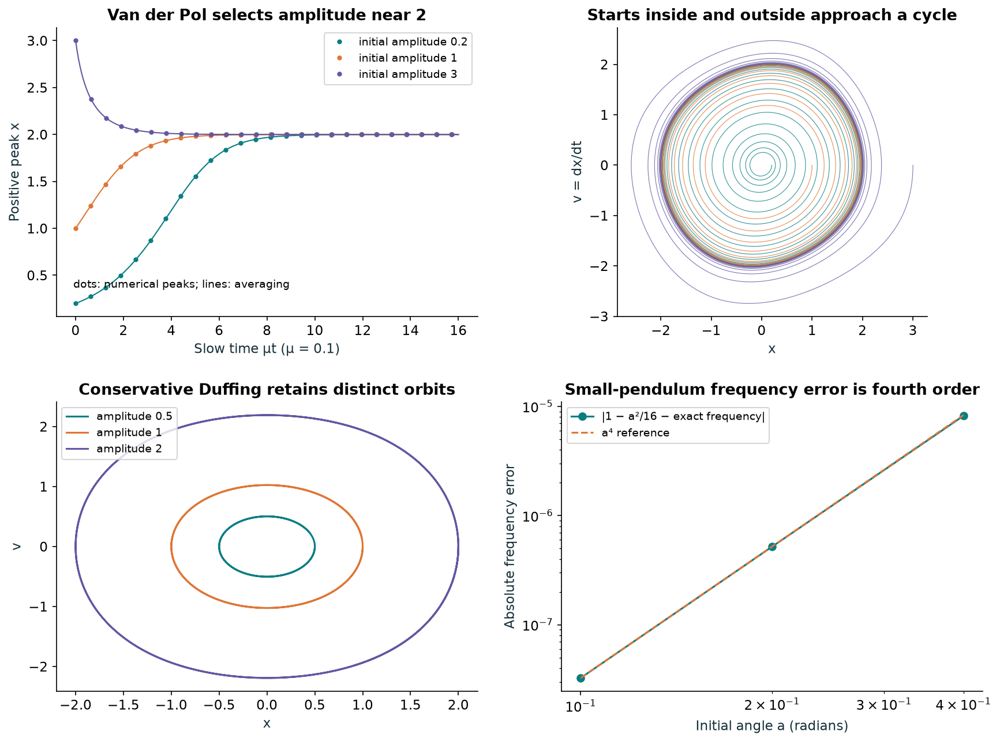
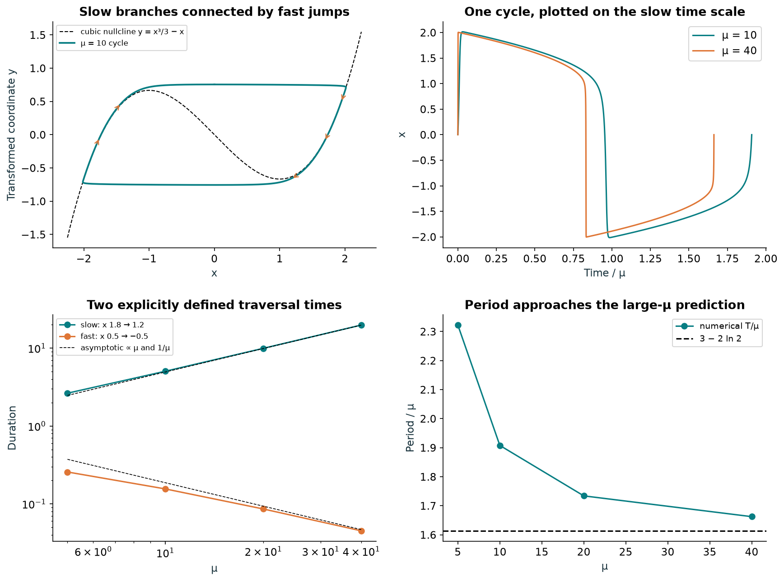
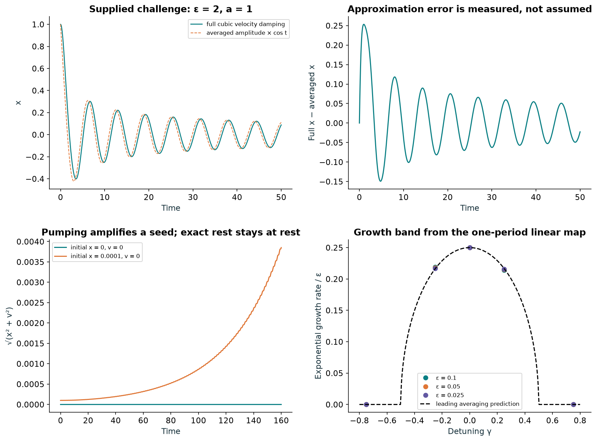
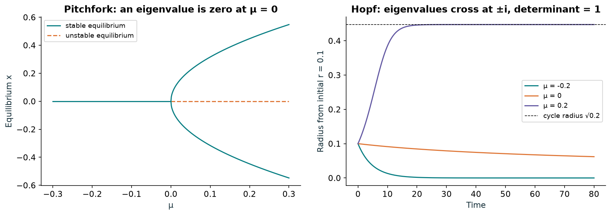

# Oscillators, damping, and bifurcations: controlled numerical tests

| Test | Recorded result |
| --- | --- |
| Weak van der Pol, μ=0.1 | Three initial amplitudes (0.2, 1, 3) give last positive peaks 2.000089–2.000104 by μt≈16. |
| Relaxation at μ=40 | Slow interval 19.815963; central jump 0.045108; ratio 439.30. |
| Large-μ period | T=66.501369, compared with μ(3−2 ln 2)=64.548226; 3.026% asymptotic error. |
| Conservative Duffing | Three distinct amplitudes persist. Largest relative energy error over t≤200: 5.76e-12. |
| Cubic velocity damping, ε=2 | Over 0≤t≤50, averaged-waveform maximum error 0.253284, RMS error 0.074459. |
| Pumped swing | Exact rest stays zero. A 0.0001 seed reaches radius 0.003851 at t=160, ε=0.1, γ=0. |
| Numerical controls | RK4 observed orders 3.9959, 3.9981; stiff-solver tolerance refinement and a second solver agree. |

## Test design

| Stage | Measurement | Control |
| --- | --- | --- |
| Amplitude selection | 3 μ values × 3 initial amplitudes; positive-peak events through μt=16. | Compare analytic averaged envelope; last peaks within 0.01 of 2; spread below 0.002. |
| Fast–slow separation | μ=5,10,20,40; final full cycle after t up to 12μ+40. | Refine Radau tolerance; compare DOP853 at μ=10; use fixed traversal thresholds. |
| Conservation and damping | Duffing ε=0.1; cubic velocity damping ε=0.1,0.2,2. | Energy quadrature or accumulated loss; no assumed agreement outside small ε. |
| Small-angle prediction | Pendulum a=0.1,0.2,0.4. | Exact elliptic period; omitted frequency term scales as a⁴. |
| Parametric growth | Swing ε=0.1,0.05,0.025; γ=−0.75,−0.25,0,0.25,0.75. | One-period linear map; determinant=1; nonlinear zero/seed controls. |
| Bifurcation mechanism | Explicit pitchfork and supercritical Hopf normal forms. | Eigenvalues, determinant, exact radius evolution; do not infer missing equations. |

## Question and scope

Can the same van der Pol equation show weak amplitude selection and strong fast–slow relaxation, and do the controls separate a stable limit cycle, conserved closed orbits, damping, parametric growth, and a Hopf bifurcation? These are dimensionless mathematical benchmarks. They add no molecular-dynamics measurements and establish no water-molecule agency or hierarchy.

## Equations and coordinate conventions

The supplied van der Pol equation is x″+μ(x²−1)x′+x=0. For weak μ we integrate (x,v), with v=x′. For large μ, set F(x)=x³/3−x and y=F(x)+v/μ; then x′=μ[y−F(x)] and y′=−x/μ. Thus the plotted y is not velocity. The relaxation tests begin at (x,y)=(2,0), corresponding to v=−2μ/3; the weak tests begin at v=0.

## Weak van der Pol: a testable amplitude prediction

Averaging gives dr/dt=(μr/2)(1−r²/4), so r(t)=2/[1+(4/r₀²−1)e^(−μt)]^(1/2). We compare this envelope with event-located positive maxima, not with the rapidly oscillating signed x. Use μ=0.05, 0.1, 0.2; r₀=0.2, 1, 3; run until μt=16. At μ=0.05 the largest peak-envelope discrepancy is 0.000549. Finite-μ cycles are not exactly circles, and their peaks are not exactly 2.



## Green’s-theorem check of the approximate radius

In (x,v), the van der Pol field has divergence μ(1−x²). A periodic orbit has zero net outward flow through its boundary. Approximating its enclosed region by a disk of radius r gives integral μ π r²(1−r²/4), whose nonzero root is r=2. The numerical area integrals for r=1,2,3 agree with this expression. The disk assumption is approximate; zero flux alone does not prove existence or attraction of a periodic orbit.

## What is fast, and what is slow?

The outer cubic branches |x|>1 attract fast horizontal motion because the fast x derivative is μ(1−x²)<0. On the slow portion, x′≈−x/[μ(x²−1)], so traversal takes O(μ). Away from the folds, y−F(x) is O(μ⁻²), not exactly zero. During the central part of a jump, x′ is O(μ), giving an O(μ⁻¹) traversal time. Near a fold these simple approximations need a boundary-layer analysis.

## Precisely defined time-scale measurements

Within the last converged cycle, measure the descending outer-branch segment x=1.8→1.2 and the descending central jump x=0.5→−0.5. These are portions of the motion, not the complete slow leg or the complete jump including departure from the fold. Event times come from bracketed roots of the dense solution. The asymptotic constants are slow time/μ=0.9−ln(1.5)=0.494535, and μ×fast time=1.869813. At μ=40 the measured values are 0.495399 and 1.804316. The median slow-branch nullcline offset falls from 0.041745 at μ=5 to 0.00066592 at μ=40.

## Relaxation period and solver controls

Integrating the singular-limit slow branches gives T≈μ(3−2 ln 2). Its error decreases from 43.92% at μ=5 to 3.03% at μ=40. Each case is solved with Radau at relative tolerances 10⁻⁹ and 10⁻¹¹; periods and consecutive late cycles must agree within 10⁻⁶ relative. An independent DOP853 solution at μ=10 agrees along the sampled final cycle within 5.51e-10. This separates asymptotic-model error from observed solver disagreement. It does not certify every value to all printed digits.



## Duffing control: periodic does not mean attracting

For the supplied x″+x+εx³=0, E=v²/2+x²/2+εx⁴/4 is conserved. With ε=0.1 and initial amplitudes 0.5,1,2, the trajectories retain their distinct amplitudes through t=200. Positive-peak periods agree with an independent energy quadrature to 3.98e-13 relative. First-order averaging predicts frequency 1+3εa²/8; its error increases with εa². These nested closed orbits are not attracting limit cycles.

## Pendulum frequency control

For x″+sin x=0, the leading small-angle frequency is 1−a²/16. Test a=0.1,0.2,0.4 against the exact period 4K(sin²(a/2)), where K uses the elliptic parameter convention. The frequency errors are 3.252e-08, 5.188e-07, 8.204e-06. Their measured amplitude-scaling orders are 3.996, 3.983, consistent with the omitted fourth-order term.

## The ε=2 exercise is cubic velocity damping

The printed equation is x″+ε(x′)³+x=0, not the conservative Duffing equation. With x(0)=a, v(0)=0, first-order averaging gives r(t)=a/[1+3εa²t/4]^(1/2), and x(t)≈r(t)cos t. We test a=1, ε=0.1,0.2,2 through t=50. At ε=2 the initial energy 0.5 falls to 0.006500. The independently accumulated loss ∫εv⁴dt closes the energy balance to 1.54e-14. The waveform comparison is plotted and its actual errors are reported; ε=2 is outside a controlled small-ε expansion. The leading approximation also has an O(ε) initial-velocity mismatch from its decaying envelope.

## Swing: a push and an instability are different

For x″+[1+εγ+ε cos(2t)]sin x=0, x=v=0 is an exact solution. Linearizing at rest and averaging with slow time T=εt gives dr/dT=r sin(2φ)/4 and dφ/dT=[γ+cos(2φ)/2]/2. The leading instability band is |γ|<1/2, with physical-time growth ε sqrt(1−4γ²)/4. We integrate the 2×2 fundamental matrix over the forcing period π and measure the eigenvalue growth. At ε=0.1, γ=0 the numerical exponent is 0.02499268, compared with 0.025 from averaging. Cases γ=±0.75 remain outside the sampled growth band. Finite-ε band boundaries can shift; these sampled points do not locate the exact boundaries. In the full nonlinear model, a tiny seed grows while exact rest remains zero. Real disturbances supply seeds, but no noise was added here.



## Zero eigenvalue versus Hopf bifurcation

The latest cropped phase portrait does not specify a complete equation, so we use two explicitly chosen normal forms. Pitchfork: x′=μx−x³, y′=−y, with eigenvalues (μ,−1) at the origin. Hopf: x′=μx−y−xr², y′=x+μy−yr², r²=x²+y², with eigenvalues μ±i. At the Hopf threshold μ=0, determinant=1: neither eigenvalue is zero. In polar coordinates r′=μr−r³, θ′=1. For μ>0 the stable cycle has radius sqrt(μ) and period 2π. Numerical trajectories for μ=−0.2,0,0.2 and initial radii 0.1,1 agree with exact radial solutions within 1.49e-12. At μ=0 the cubic term still makes the origin asymptotically stable. This is a supercritical example, not a claim that every Hopf bifurcation creates a stable cycle.



## Limitations and next validation

These finite integrations test stated equations, chosen starting states and explicit numerical controls. They do not prove global behavior for arbitrary models. Next tests: estimate a return-map multiplier for van der Pol attraction; resolve fold departure with larger μ; locate finite-ε swing instability boundaries; add controlled noise and quantify phase diffusion; and supply the full equation for any cropped diagram to test that particular system. Linking any oscillator model to water would require a separately specified physical mechanism and molecular validation.

## Relaxation measurements

| μ | Period | Asymptotic error | Slow time | Fast time | Ratio |
| --- | --- | --- | --- | --- | --- |
| 5 | 11.612231 | 43.920% | 2.640032 | 0.257039 | 10.27 |
| 10 | 19.078370 | 18.227% | 5.057128 | 0.155699 | 32.48 |
| 20 | 34.682323 | 7.462% | 9.955781 | 0.086052 | 115.70 |
| 40 | 66.501369 | 3.026% | 19.815963 | 0.045108 | 439.30 |

## Reproduce

Use Python 3.12, from the parent experiment folder:

```sh
python -m pip install -r oscillator-extension/requirements.txt
python oscillator-extension/test_oscillators.py
python oscillator-extension/test_pendulum_swing.py
python oscillator-extension/test_bifurcations.py
python oscillator-extension/build_report.py
```

No random seed is needed. The scripts save numeric JSON and compressed trajectory arrays, stop on failed numerical acceptance checks, and rebuild these original figures and reports. Small differences across numerical-library versions are expected.

[Full report](report.html) · [Protocol](data/protocol.json) · [Oscillator results](data/results.json) · [Exercise results](data/exercises.json) · [Bifurcation results](data/bifurcations.json) · [Checksums](manifest_sha256.json)

Equations are transcribed from the supplied excerpts, except the clearly labeled chosen normal forms. The scanned book pages are not redistributed. [Earlier stability tests](../stability-extension/README.md) · [Original water study](../README.md)
