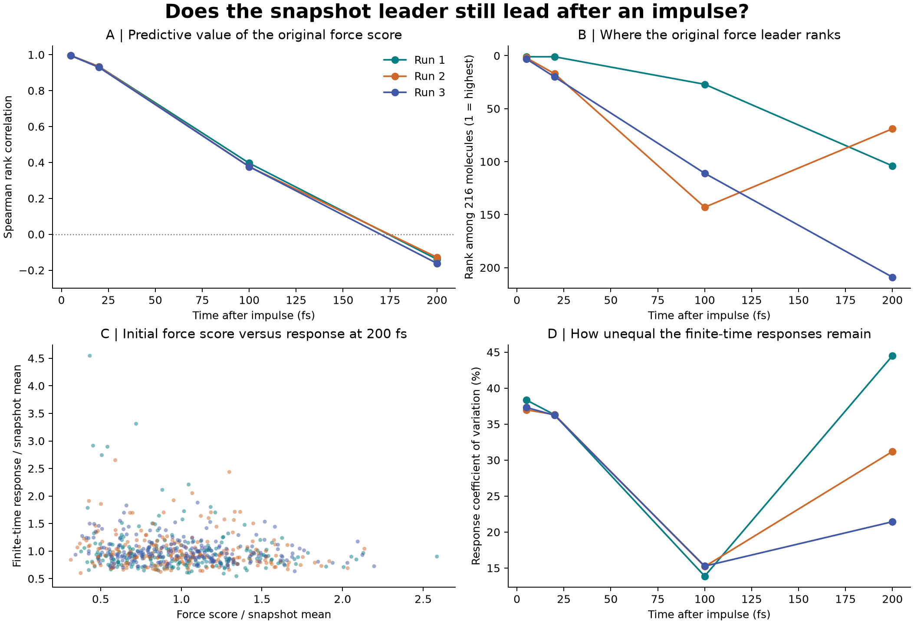

# Finite-time response: does the snapshot leader stay influential?

This follow-up tests all 216 molecules in each of three saved water states with paired, momentum-balanced velocity impulses. It follows the motion of the other molecules for 5–200 femtoseconds.

**Finding:** the original force ranking predicts the very early response, but loses predictive value over the measured interval. The original force leaders rank **104, 69, 209 out of 216** by 200 fs. This supports temporary, observation-time-dependent roles, not a permanent hierarchy.



| Time | Force/response Spearman correlations, runs 1–3 | Original force leader ranks |
| --- | --- | --- |
| 5 fs | 0.996, 0.995, 0.995 | 1, 2, 3 |
| 20 fs | 0.934, 0.934, 0.929 | 1, 17, 20 |
| 100 fs | 0.396, 0.377, 0.376 | 27, 143, 111 |
| 200 fs | -0.139, -0.128, -0.162 | 104, 69, 209 |

## Methods and checks

- 3,888 primary perturbed trajectories: 216 sources × 3 axes × 2 signs × 3 microstates.
- Rigid TIP3P, short NVE trajectories, double precision, 1 fs steps, constrained velocity Verlet with velocities and positions at the same time.
- Source kick: ±0.01 nm/ps, with compensating kicks to keep total added momentum zero. The direct compensating ballistic motion is removed analytically.
- Score: sum of Frobenius norms of other molecules' center-of-mass velocity-to-position responses; units are ps, not energy fraction.
- Half-kick controls: largest aggregate relative L2 difference 0.1170% on ten selected sources per state; largest individual change 2.78% at 5 fs.
- Half-timestep controls: largest aggregate relative L2 difference 0.072% on three selected sources per state. The earliest 5 fs amplitude has up to 3.00% L2 discretization sensitivity.
- With interactions removed, the largest corrected score was 1.13e-09 ps.
- Complete-state relabeling agreed to relative L2 error 4.80e-09 for the three checked sources.

Read the [full report](report.html) for definitions, numerical controls, energy checks, limitations and next validation steps. Download the HTML file and open it in a browser; GitHub displays its source.

## Reproduce

From the parent experiment directory, after installing its `requirements.txt`:

```sh
python response-extension/impulse_response.py --platform OpenCL
python response-extension/analyze_response.py
python response-extension/build_followup.py
```

Use `--platform Reference` for portable, slower execution. Use `--out reproduced-response` to keep a new run separate from the delivered data. Plotting and report generation use `response-extension/data` by default.

See [protocol](data/protocol.json), [numeric results](data/results.csv), [controls](data/controls.json), and [analysis diagnostics](data/analysis.json). The saved response arrays contain initial states and all source/target norm matrices, so the reported scores and figures can be independently reanalyzed.

## Limits

Three conditional microstates are not a long-time ensemble. Finite-time influence depends on initial velocities as well as positions. Convergence controls cover selected sources; full-ranking convergence, larger boxes, other water models, more thermal velocity draws and longer horizons remain to be tested. Molecules and time samples are correlated; no independent-sample p-value is claimed.

An initial exploratory leapfrog run was replaced because its time-step-dependent velocity convention did not provide matching physical starting states. The delivered results use corrected on-step velocities. Implementation follows the [OpenMM constrained velocity-Verlet documentation](https://docs.openmm.org/latest/api-python/generated/openmm.openmm.CustomIntegrator.html).

[Return to the original experiment](../README.md).
