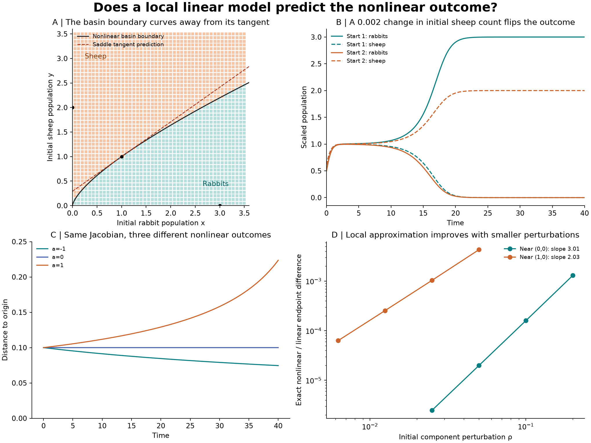
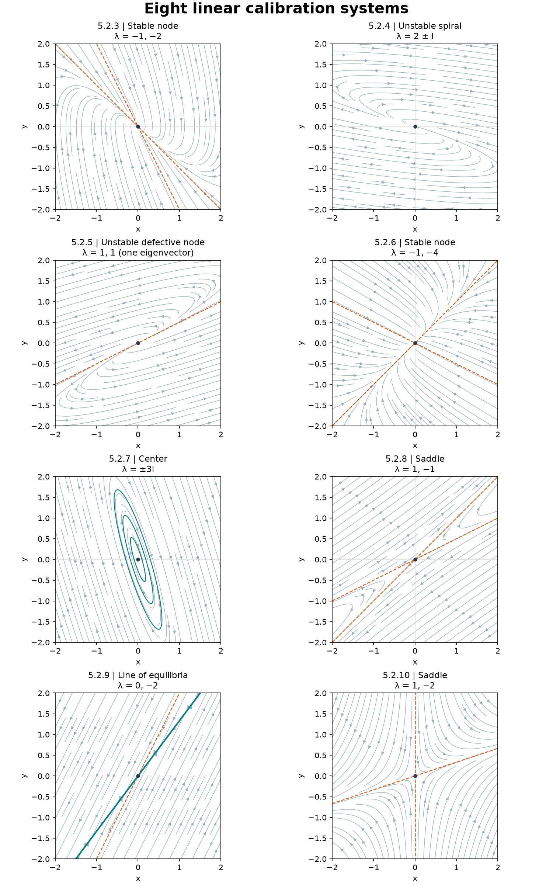
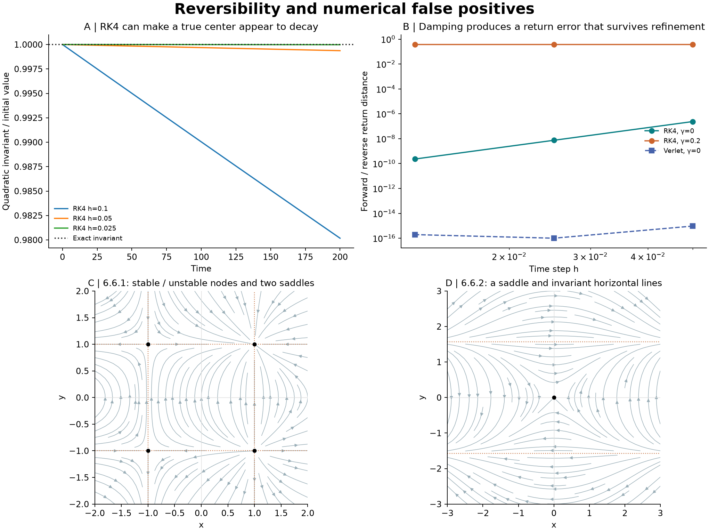

# Stability, phase portraits, and reversibility: a reproducible test

Designed and executed from the supplied textbook models. Main question: **how far can a local linearization predict nonlinear behavior?**

| Check | Recorded result |
| --- | --- |
| Population grid | 2209 initial states: 898 rabbit outcomes, 1311 sheep outcomes; 0 unresolved. |
| RK4 step-halving control | 0 outcome changes between h=0.02 and h=0.01. |
| Local saddle-tangent prediction | 0/33 errors within radius 0.25; 64/2,209 errors across the complete grid. |
| Near-boundary switch | At x₀=0.5, boundary y₀≈0.614814. Starts 0.001 below/above approach (3,0)/(0,2). |
| Linear numerical calibration | Maximum finest-step relative error 2.05e-07; observed orders 3.847–4.121. |
| False decay in a center | The exact quadratic invariant falls numerically by 1.9823% at h=0.1, versus 0.001976% at h=0.025 after T=200. |
| Mechanical velocity-reversal test | RK4 return defect: 2.38×10⁻⁷ → 2.33×10⁻¹⁰ as h halves twice without drag; ≈0.373029 with drag. |

## Test design

| Stage | Measurement | Acceptance/control |
| --- | --- | --- |
| 1. Calibrate RK4 | Eight supplied linear systems; two fixed initial vectors each; compare at T=1 with exp(At). | Steps 0.05, 0.025, 0.0125; require finest relative error <10⁻⁵ and observed order 3.5–4.5. |
| 2. Test local approximation | Supplied cubic system near (0,0) and (1,0); shrink perturbations fourfold in stages. | Use its exact solution. Check that linearization error decreases with the expected leading nonlinear term. |
| 3. Challenge center inference | Three explicitly chosen radial systems with the same Jacobian and eigenvalues ±i. | Compare radius with the exact formula; test stable, neutral and unstable cases separately. |
| 4. Predict population outcomes | Supplied rabbit–sheep model on a 47×47 initial-condition grid. | Compare the saddle tangent with full dynamics; halve RK4 step; independently check two trajectories near the basin boundary. |
| 5. Test reversibility | Evolve, apply the stated reversal R, evolve forward again, then apply R again. | Compare undamped and damped mechanics, RK4 and symmetric Verlet; also test both supplied reversible exercises. |



## Eight linear calibration cases

| Exercise | Matrix A | Eigenvalues | Classification | Real eigenvectors |
| --- | --- | --- | --- | --- |
| 5.2.3 | [[0,1],[-2,-3]] | −1, −2 | Stable node | (1,−1), (1,−2) |
| 5.2.4 | [[5,10],[-1,-1]] | 2±i | Unstable spiral | No real eigenvectors |
| 5.2.5 | [[3,-4],[1,-1]] | 1, 1 | Unstable defective node | Only (2,1); generalized vector (1,0) |
| 5.2.6 | [[-3,2],[1,-2]] | −1, −4 | Stable node | (1,1), (2,−1) |
| 5.2.7 | [[5,2],[-17,-5]] | ±3i | Center; stable, not attracting | No real eigenvectors |
| 5.2.8 | [[-3,4],[-2,3]] | 1, −1 | Saddle | (1,1), (2,1) |
| 5.2.9 | [[4,-3],[8,-6]] | 0, −2 | Line of equilibria y=4x/3 | (3,4), (1,2) |
| 5.2.10 | [[1,0],[1,-2]] | 1, −2 | Saddle | (3,1), (0,1) |



## Question and interpretation

Can a local linearization predict stability and long-time outcome, and can numerical artifacts make the prediction appear better or worse? This is a controlled mathematical benchmark, not a biological experiment or a new water simulation. Exact solutions and known invariants provide reference answers.

## Stability definitions

Lyapunov stability means that for every allowed distance ε, a sufficiently small initial distance δ keeps the trajectory within ε for all future time. Attraction means nearby trajectories converge to the equilibrium. Asymptotic stability requires both. Remaining close for one finite observation interval does not prove stability; approaching a point in one plotted trajectory does not establish attraction of a whole neighborhood.

## What linearization does and does not establish

For a smooth system z′=F(z), J=DF(z*) describes the first-order perturbation dynamics near an equilibrium. Negative real parts establish local asymptotic stability; a positive real part establishes instability. Hyperbolic saddles and nodes retain their local qualitative behavior under nonlinear terms. Zero real parts are inconclusive for a nonlinear system. A local saddle tangent is not generally a global basin boundary.

## Linear calibration details

The real eigenvectors in the table correspond to the listed real eigenvalues, in order. Exercise 5.2.5 has a repeated eigenvalue with only one independent eigenvector: (A−I)(1,0)=(2,1). Exercise 5.2.9 is not an isolated fixed point: every point on y=4x/3 is an equilibrium. Its limit is Pz₀ with P=I+A/2, so the line attracts transversely, while an individual point does not attract a two-dimensional neighborhood. The origin is Lyapunov stable in this linear system.

## An invariant separates a center from attraction

For 5.2.7, Q=[[17,5],[5,2]] is positive definite and AᵀQ+QA=0. Thus V=zᵀQz is constant and its level curves are closed ellipses. The bound ‖z(t)‖≤6.171293‖z(0)‖ proves Lyapunov stability, but a nonzero orbit does not converge to the origin. RK4 introduces a small artificial decrease in this invariant; reducing the step exposes the numerical origin of the apparent attraction. The invariant is a mathematical quadratic form, not a measured molecular energy.

## Nonlinear test from the supplied Jacobian

The supplied Jacobian diag(−1+3x²,−2), together with the stated equilibria, determines x′=−x+x³ and y′=−2y. The origin is a stable node; (±1,0) are saddles. The origin’s basin is the strip −1<x<1. Within the solution’s domain, x(t)=x₀e⁻ᵗ/√(1−x₀²+x₀²e⁻²ᵗ) and y(t)=y₀e⁻²ᵗ. We compare full and linearized solutions at T=1 near the origin and T=0.25 near (1,0). The measured perturbation-error exponents are approximately 3.01 and 2.03, consistent with cubic leading error at the origin and quadratic leading error at the saddle.

## Same Jacobian, different nonlinear stability

For the cropped radial figure, the complete equation is not visible. We explicitly choose x′=−y+a x(x²+y²), y′=x+a y(x²+y²), rather than claiming to transcribe that figure. All values of a give J=[[0,−1],[1,0]] at the origin. In polar coordinates, r′=a r³ and θ′=1, so r(t)=r₀/√(1−2a r₀²t). For a<0 the origin is asymptotically stable, for a=0 it is a stable center, and for a>0 it is unstable. These classifications follow analytically; the RK4 traces check the implementation.

## A short observation can miss instability

For a=1, leaving the ball r<ε takes T_exit=(r₀⁻²−ε⁻²)/2. With ε=0.5, starting radii 0.2, 0.1 and 0.05 give exit times 10.5, 48 and 198. A run ending at T=40 would miss two of these escapes. Both h=0.05 and h=0.025 resolve the exits; the finest interpolated exit estimates differ from the exact values by at most 7.46×10⁻⁶. Every simulation is stopped before the mathematical finite-time blow-up.

## Rabbit–sheep test design

The supplied model is x′=x(3−x−2y), y′=y(2−x−y), restricted to x,y≥0. Its equilibria are (0,0), (0,2), (3,0), and (1,1). The first is an unstable node; the next two are stable nodes; (1,1) is a saddle with eigenvalues −1±√2. Its stable eigenvector is (√2,1), so the local dividing line is y=1+(x−1)/√2. The stable manifold is computed by integrating backward from two small offsets along this direction; forward trajectories on opposite sides test the predicted basins.

## Population controls and limits

We integrated a fixed, inclusive 47×47 grid on [0.05,3.5]² to T=80. A trajectory is assigned to a stable equilibrium only if the final distance is below 10⁻⁵; otherwise it is unresolved. No sampled outcomes changed on step halving. Changing the manifold starting offset from 10⁻⁵ to 10⁻⁶ changed interpolated boundary values by at most 1.21e-06 at six specified x values. Two near-boundary RK4 paths agree with independent DOP853 trajectories to maximum distance 5.41e-08. The 898/1,311 counts describe this chosen grid, not ecological survival probabilities. Exact boundary points tend to the saddle; finite precision makes such trajectories particularly delicate.

## Reversibility is a separate property

A time-reversing involution R satisfies F(Rz)=−R F(z). For mechanical x′=v, v′=x−x³−γv, velocity reversal is R(x,v)=(x,−v). At γ=0 the equations are reversible and conserve H=v²/2−x²/2+x⁴/4. At γ>0, dH/dt=−γv² and this velocity-flip symmetry is lost. Starting from (0.5,0.2), we integrate for 5, flip velocity, integrate forward for 5, flip again, and compare with the initial state. This is not the same as numerically integrating a dissipative equation backward in time.

## Integrator versus physical reversibility

Undamped RK4 return errors decrease on refinement. Undamped symmetric velocity Verlet returns within 10⁻¹⁵ in these runs, even though it has nonzero energy error at intermediate times. Reversibility of an integration method does not mean exact conservation of the physical energy. With γ=0.2, both methods converge to a return defect near 0.373029: refinement does not remove the effect of physical drag. In the logarithmic plot, exact numerical zeros are displayed at 10⁻¹⁶; the stored data retain the actual zeros.

## The two supplied reversible exercises

Exercise 6.6.1 is x′=y(1−x²), y′=1−y². Under R(x,y)=(x,−y), (1,1), a stable node, maps to (1,−1), an unstable node; (−1,±1) are saddles. The lines x=±1 and y=±1 are invariant. Exercise 6.6.2 is x′=y, y′=x cos y. The origin is a saddle with eigenvalues ±1; the lines y=(k+1/2)π are invariant, with horizontal motion x′=y. Both satisfy the reversal identity exactly. At h=0.005, the measured return defects are 9.69×10⁻¹³ and 4.07×10⁻¹⁴. The first is also checked against its analytic solution for the selected initial state; both are checked against DOP853.

## Why reversibility does not imply conservation

The explicitly chosen auxiliary model x′=1−x², y′=−xy satisfies reversal with R=−I. It has a source at (−1,0), a sink at (1,0), and divergence −3x: phase area expands near one and contracts near the other. This illustrates the distinction in the supplied page. It is not a claimed reconstruction of an unidentified cropped example, and no globally smooth mechanical energy is assumed.

## Limitations and next validation

Finite grids and finite observation times are evidence about sampled trajectories, not proofs of global stability. Here, exact formulas, eigenvalues and invariants establish the benchmark classifications. Near a separatrix, refine starting positions and time steps together. Next useful tests are adaptive sampling close to the curved population boundary, longer-duration invariant checks, perturbation/noise sensitivity, and explicit equations for the remaining cropped sketches. No conclusions about agency, persistent leadership, or biological memory of water follow from these models.



## Reproduce

Use Python 3.12, from the parent experiment directory:

```sh
python -m pip install -r stability-extension/requirements.txt
python stability-extension/test_stability.py
python stability-extension/test_reversibility.py
python stability-extension/make_figures.py
python stability-extension/build_report.py
```

`test_stability.py --out PATH` saves its results separately; the other builders read the delivered data folder by default. No random seed is needed.

[Full illustrated report](report.html) · [Test design](TEST_DESIGN.md) · [Protocol](data/protocol.json) · [Numeric results](data/results.json) · [Reversibility results](data/reversibility.json) · [Checksums](manifest_sha256.json)

Equations transcribed or reconstructed from the supplied excerpts are labeled explicitly. Auxiliary models are stated in full; missing equations are not inferred from sketches. The original scanned pages are not redistributed.

[Original experiment](../README.md) · [Switching and synchronization](../switching-extension/README.md)
