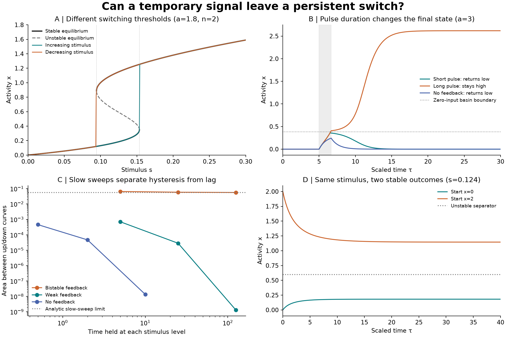
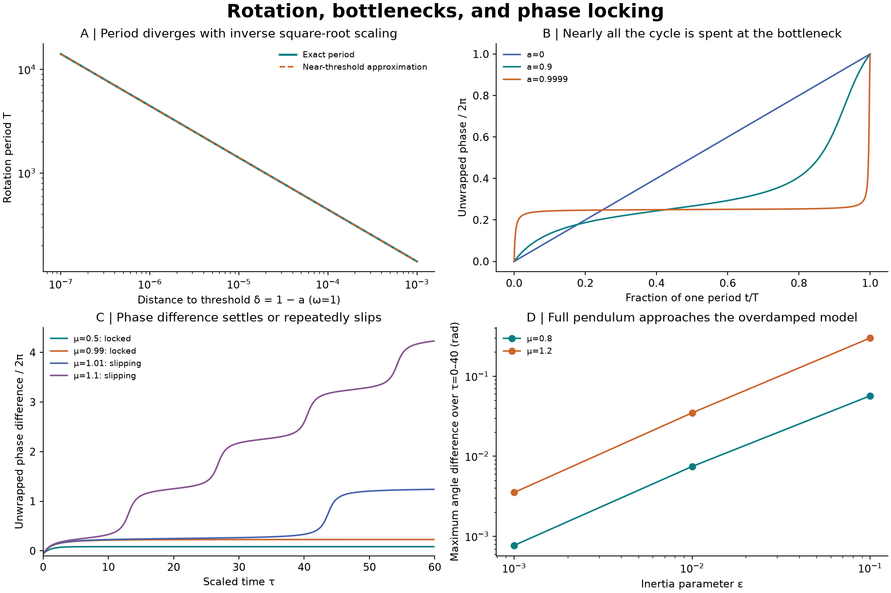

# Reproducible switching, hysteresis, and phase-locking tests

Tests the supplied biochemical positive-feedback equation and the later oscillator, pendulum and firefly examples. **These are illustrative ODE models, distinct from the earlier water molecular dynamics.**

| Model | State measured | What was tested |
| --- | --- | --- |
| Biochemical switch | Activity x = Aₚ/K | Two stable states at the same stimulus; switching depends on history. |
| Phase oscillator | Angle or phase difference on a circle | Rotation, locking and repeated slips; the basic locking model has one stable phase per cycle. |
| Earlier water experiment | Response score of each molecule | Transient influence rankings under a chosen force field; these ODE tests do not establish water memory or synchrony. |

## Hysteresis and pulse switching



| Test | Recorded result |
| --- | --- |
| Slow-sweep switch on, a=1.8 | s = 0.153563 |
| Slow-sweep switch off, a=1.8 | s = 0.094405 |
| Same-input stable activity levels | 0.181215 and 1.145477 at s=0.123984 |
| Critical pulse duration, a=3, s=0.3 | τ = 1.586549 |
| Short pulse | τ=1.507222: returns below 10⁻⁹ |
| Long pulse | τ=1.665877: settles at x=2.618034 |

### Model and assumptions

The supplied equation is dAₚ/dt = kₚ S A + β Aₚⁿ/(Kⁿ+Aₚⁿ) − k_d Aₚ. The excerpt does not specify an equation or conservation law for A, so this implementation treats A as a fixed reservoir. Set x=Aₚ/K, τ=k_d t, s=kₚSA/(k_dK), and a=β/(k_dK). Then x′=s+a xⁿ/(1+xⁿ)−x. All reported switch parameters are illustrative and dimensionless; no concentrations, reaction rates or physical times were fitted.

For n=2, equilibria solve x³−(s+a)x²+x−s=0, and stability follows from f′(x)=2ax/(1+x²)²−1. A fold additionally satisfies (1+x²)²=2ax. The feedback needed for any fold pair is a>8/(3√3)≈1.539601; whether both thresholds lie at nonnegative stimulus depends on a. At a=1.8 the two stable branches coexist for 0.094405<s<0.153563. Starting on different sides of the unstable middle root at the same s=0.123984 yields stable activities 0.181215 and 1.145477.

At a=3, n=2 and zero stimulus, x=0 and x=(3+√5)/2≈2.618034 are stable, separated by the unstable x=(3−√5)/2≈0.381966. A rectangular s=0.3 pulse from x=0 crosses this boundary only if it lasts longer than τ*=1.586549. We compute τ* independently by integrating dx/f(x;s=0.3) up to the separator, then check it with ODE integration. Pulses of 0.95τ* and 1.05τ* land in opposite basins and remain distinct after 100 further units at s=0. The mathematical lower fold is at negative s; merely returning a nonnegative stimulus to zero therefore does not force the high state off. Turning feedback off resets the state, so this is persistence under fixed model conditions, not thermodynamic irreversibility.

### Controls against false memory

The sweep uses 601 equally spaced stimulus levels from 0 to 0.3 and back. For a=1.8, increasing the dwell per level from 5 to 25 to 125 gives loop areas 0.065049, 0.058563 and 0.056232, approaching the independently calculated quasistatic area 0.055583. Finite-rate switching brackets differ slightly from exact folds because relaxation slows near the threshold; the numerical slowest loop still differs in area by about 1.17%. For a=1.4, below the fold threshold, the apparent loop shrinks to 1.33×10⁻⁹ at dwell 125. With feedback removed, the numerical relaxation agrees with its exact exponential solution and the loop shrinks toward zero. These controls distinguish slow response from bistability.

A second control is deliberately subtle: changing the Hill exponent to n=1 while keeping a=3 still permits persistent high activity after a pulse, but x=0 is now unstable (f′(0)=2). Even a 10⁻⁶ seed grows to x=2 without a stimulus. There are not two stable zero-input states. A persistent trace alone is therefore insufficient evidence of bistable memory. In contrast, the same tiny seed decays to zero for the n=2 bistable case.

## Rotation and synchronization



| Test | Recorded result |
| --- | --- |
| Uniform runners, T₁=60 s and T₂=75 s | First lapping time: 300 s |
| Nonuniform oscillator, ω=1, a=0 | T = 6.283185 |
| Near bottleneck, ω=1, a=0.9999 | T = 444.299401 |
| Time spent within θ=π/2 ± 0.2 rad | 95.52% of a cycle at a=0.9999 |
| Period divergence exponent | -0.499986 (predicted −1/2) |
| Stable firefly phase locking | \|Ω−ω\| < A; marginal threshold at equality |
| Full/reduced pendulum, μ=1.2 | Maximum angle error falls from 0.299112 to 0.003528 rad as ε falls from 0.1 to 0.001 |

Uniform phases obey θ̇₁=2π/T₁ and θ̇₂=2π/T₂. Their difference advances by 2π after T_lap=T₁T₂/(T₂−T₁), assuming T₂>T₁ and equal initial phases. For a nonuniform oscillator θ̇=ω−a sinθ with 0≤a<ω, a full turn takes T=2π/√(ω²−a²). Expanding near a=ω from below gives T≈π√(2/ω)(ω−a)⁻¹ᐟ². The bottleneck is near θ=π/2, where speed is smallest. At the threshold the period diverges and a degenerate equilibrium appears; beyond it, fixed phases replace positive circulation.

For the supplied firefly model Θ̇=Ω and θ̇=ω+A sin(Θ−θ), define φ=Θ−θ, τ=At and μ=(Ω−ω)/A, with A>0. Then φ′=μ−sinφ. When |μ|<1, the stable phase is arcsinμ modulo 2π; the other equilibrium is unstable. Phase locking means a constant phase difference, which need not be zero. Equality |μ|=1 is a degenerate threshold, not robust exponential locking. For |μ|>1, the phase slips repeatedly, with period 2π/√(μ²−1). We measure complete cycles; an average over a short window containing fractional cycles can differ noticeably from the asymptotic drift. Exact unstable initial equilibria are exceptions to attraction.

The mechanical equation is Iθ̈+bθ̇+mgL sinθ=Γ with I=mL². Using τ=(mgL/b)t, μ=Γ/(mgL) and ε=I mgL/b² gives εθ″+θ′=μ−sinθ. The first-order limit is the same phase equation. We compare ε=0.1, 0.01 and 0.001 at μ=0.8 and 1.2 from θ=0 and zero physical angular velocity, on 0≤τ≤40. The full model has an initial velocity-relaxation layer. Decreasing ε improves the angle agreement in both tested cases; this does not justify dropping inertia for arbitrary damping, torque or initial velocity.

### How the examples connect

The shared mechanism is sensitivity near a threshold: a saddle-node can destroy an equilibrium and leave a slow bottleneck. This can delay a switch or greatly lengthen a rotation period. The outcomes still differ. A first-order autonomous flow on a line cannot have a nonconstant periodic orbit; a phase variable lives on a circle and can circulate continuously. A scalar activity can have two stable equilibria, while the basic first-order phase-locking equation has one stable fixed phase per cycle. Neither observation identifies a permanent leading molecule.

## Reproduce

Use Python 3.12. From the parent experiment directory:

```sh
python -m pip install -r switching-extension/requirements.txt
python switching-extension/switching_test.py
python switching-extension/phase_tests.py
python switching-extension/make_figures.py
python switching-extension/build_report.py
```

Both simulation scripts accept `--out PATH` to save a new run separately. Figure and report scripts read this folder’s `data/` by default. The scripts are deterministic; no random seed is required. The report labels use x=Aₚ/K and τ=k_d t, not physical concentration or seconds, except the explicitly labeled runner example.

DOP853 integrations use rtol=10⁻¹⁰ and atol=10⁻¹² for switching; pulse discontinuities are integrated as separate segments. Radau with tighter tolerances agrees with the two near-threshold pulse traces to within 2.34e-09 in x. Independent fixed-step RK4 endpoint errors decrease on halving the step and remain below 3×10⁻¹⁰ in these tests. ODE rotation periods agree with analytic values to relative error at most 4.42e-14; complete phase-slip intervals agree to 2.46e-11. These are observed numerical errors for the recorded parameter choices, not general solver guarantees. The pendulum uses Radau for its stiff velocity dynamics. All saved arrays were checked for finite values; loop areas and final pulse states were reconstructed from them.

[Full self-contained report](report.html) · [Switch protocol](data/protocol.json) · [Switch measurements](data/results.json) · [Phase protocol](data/phase_protocol.json) · [Phase measurements](data/phase_results.json) · [Saved switching trajectories](data/trajectories.npz) · [Saved phase trajectories](data/phase_trajectories.npz) · [Checksums](manifest_sha256.json)

## Limitations and next validation

These are deterministic phenomenological ODE tests. A clamped A pool does not enforce conservation of A+Aₚ, and the Hill term is not a full phosphorylation reaction mechanism. Noise, finite molecule numbers, ATP supply, spatial transport and measured kinetics are absent. Persistent states may switch under noise or changed parameters. The magnetization excerpt concerns collective order, a different observable from individual influence rank. None of the present simulations demonstrates phosphorylation, hysteresis or synchronization in the earlier rigid-water system. Useful next steps are a specified conserved-pool reaction model, calibrated rates, stochastic switching-lifetime tests, and sensitivity to parameter and sweep-rate uncertainty.

## Sources and provenance

The model equations and examples come from the user-supplied textbook excerpts. The choices of fixed A, parameters, numerical protocols and new figures are explicit additions in this experiment; the cropped original exercises are not claimed to be fully solved. The scanned pages are not redistributed. For the broader distinction between positive feedback and verified bistability, see the primary research paper [Angeli, Ferrell and Sontag (2004)](https://pmc.ncbi.nlm.nih.gov/articles/PMC357011/).

[Original water experiment](../README.md) · [Damping and rotating-hoop tests](../damping-extension/README.md)
